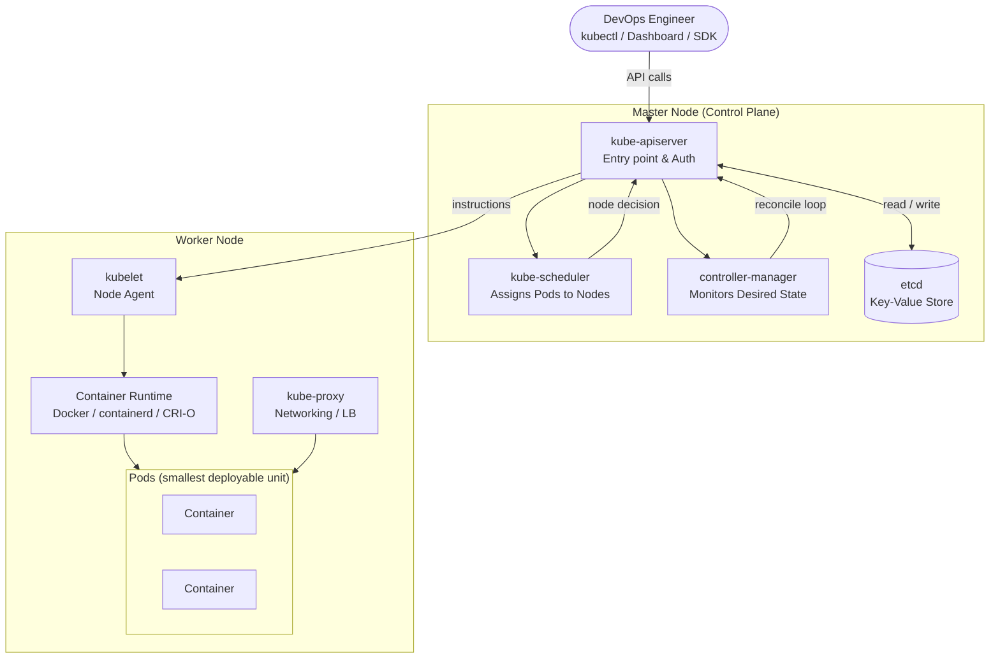
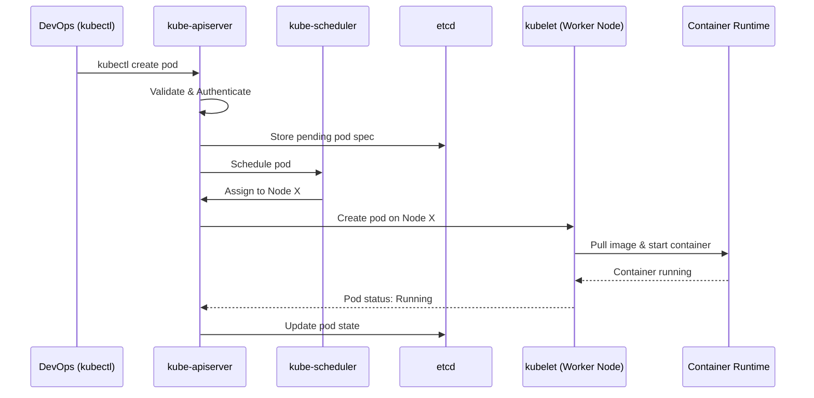

# Kubernetes Architecture

A concise reference guide to Kubernetes cluster architecture, its components, and how they interact.

---

## Cluster Overview

A Kubernetes cluster is made up of two types of nodes:

| Node Type | Responsibility |
|-----------|---------------|
| **Master Node** (Control Plane) | Manages everything inside the cluster |
| **Worker Node** | Runs application containers |

You can create a cluster:
- **Locally** — `minikube`, `kubeadm`
- **Cloud** — EKS (AWS), AKS (Azure), GKE (Google Cloud)

---

## Architecture Diagram

---

## Worker Node Components

Worker nodes are responsible for running application workloads. Each component plays a specific role:

### Pod
- Smallest deployable unit in Kubernetes.
- Can hold **one or more containers**.
- A single worker node can run one or many pods.

### kubelet
- An **agent** running on every worker node.
- Receives instructions from the master node (via kube-apiserver).
- Responsible for **creating, managing, and monitoring pods** on its node.

### Container Runtime Interface (CRI)
- Software layer responsible for **creating and deleting containers**.
- Options: `Docker`, `containerd`, `CRI-O`.

### kube-proxy
- Handles **pod-to-pod communication**.
- Provides **load balancing** and service proxying.
- Makes applications **accessible to end users**.

---

## Master Node (Control Plane) Components

The control plane manages the entire cluster through four core components:

### kube-apiserver
- The **entry point** for all operations inside the cluster.
- Validates requests and **authenticates users**.
- All other components communicate exclusively through the API server.
- Accessible via `kubectl`, the Kubernetes Dashboard, or SDKs.

### kube-scheduler
- **Assigns pods to worker nodes** based on available resource capacity.
- When a pod creation request arrives:
  1. Scheduler checks which nodes have sufficient resources.
  2. Communicates the decision back to the API server.
  3. API server instructs the target node's `kubelet` to create the pod.

### controller-manager
- Continuously **monitors the cluster state**.
- Compares **desired state** (manifest files) vs **actual state**.
- If a pod is missing or in error, it instructs the API server to recreate it.
- The API server then invokes the scheduler → kubelet flow again.

### etcd
- A **distributed key-value store**.
- Stores **all cluster data**: running pods, node assignments, configuration, etc.
- Can **only communicate with the kube-apiserver** — no direct access from other components.

---

## Request Flow: Creating a Pod

---

## Component Summary

### Worker Node

| Component | Role |
|-----------|------|
| `kubelet` | Agent; manages pods on the node |
| `kube-proxy` | Networking; pod-to-pod & external access |
| Container Runtime (CRI) | Creates/deletes containers (Docker, containerd) |
| Pods | Wraps one or more application containers |

### Master Node (Control Plane)

| Component | Role |
|-----------|------|
| `kube-apiserver` | Central entry point; auth & request validation |
| `kube-scheduler` | Assigns pods to nodes based on resource capacity |
| `controller-manager` | Reconciles desired state vs actual state |
| `etcd` | Persistent key-value store for all cluster data |

---

## Key Concepts

- **kube-apiserver is the hub** — every component (scheduler, controller-manager, kubelet, etcd) communicates through it.
- **etcd is the source of truth** — all cluster state is persisted there, accessible only via the API server.
- **Desired state vs Actual state** — the controller-manager continuously reconciles the two, triggering corrective actions as needed.
- **Pods are ephemeral** — they can be recreated on any available node; persistent data must be managed via Volumes.
