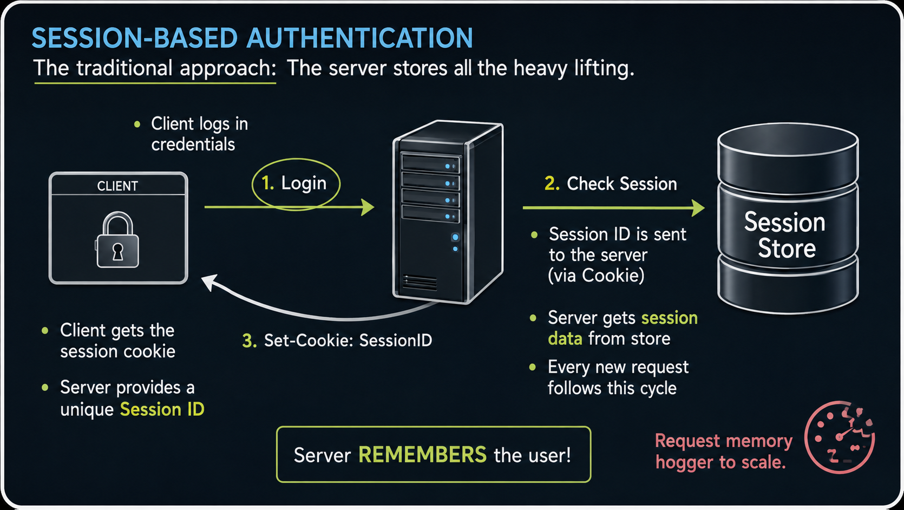

# Session vs Token Based Authentication

Session vs Token Based Authentication — SYSTEM DESIGN FOUNDATION | Interview Question  : https://www.youtube.com/shorts/grzSAdf4-Z4

Every application needs authentication. 

**But should you use Session-Based or Token-Based?** 

Most developers implement one without clearly understanding why — and that lack of clarity shows up immediately in interviews. 
The hotel analogy in this video makes the distinction permanently clear, and the interview answer at the end covers everything a senior engineer expects to hear.

**What we cover:**
- The hotel key card analogy — swiping a card vs calling reception every single time
- What Session-Based Authentication is — server creates and stores session, client sends Session ID in cookie
- How the server looks up the Session ID in memory or database on every request
- Why Session-Based is called Stateful Authentication — server must remember the user
- What Token-Based Authentication is — server issues a signed JWT, client carries it on every request
- Why the server never stores anything — it only verifies the token signature
- Why Token-Based is called Stateless Authentication — user identity travels with the token
- The scaling problem with Session-Based — why sticky sessions or shared session stores are needed across multiple servers
- Why Token-Based scales effortlessly across multiple servers and microservices
- When to use Session-Based — traditional banking websites and legacy web applications
- When to use Token-Based — REST APIs, Mobile Apps, Microservices, React and Next.js applications
- The exact interview answer that gets you selected

> "Session-Based and Token-Based Authentication differ fundamentally in where user state is maintained after login.

## In Session-Based Authentication

after a user logs in successfully, the server creates a session record — typically stored in memory or a database — and sends the client a Session ID via a cookie.
On every subsequent request, the browser automatically sends that Session ID, and the server looks it up in its session store to identify the user.
This is Stateful Authentication — the server must maintain and remember session data for every active user.
The challenge with Session-Based authentication at scale is that if there are multiple servers behind a load balancer,
every request from the same user must reach the same server — called sticky sessions —
or a shared session store like Redis must be used so all servers can access the same session data.

## In Token-Based Authentication
commonly implemented with JWT — after successful login, the server generates a signed token containing the user's identity and claims, and sends it to the client. 
The client stores this token and includes it in the Authorization header of every subsequent request. 
The server does not store any session data. On each request, it simply verifies the token's cryptographic signature and extracts user information directly from the token. 
This is Stateless Authentication — the server is completely memory-free between requests, and any server in a distributed system can handle any request independently.

Session-Based authentication is commonly used in traditional web applications and banking systems where server-side session control is important. 
Token-Based authentication is preferred for modern REST APIs, mobile applications, and microservices architectures 
because it scales horizontally without any shared state between servers."
