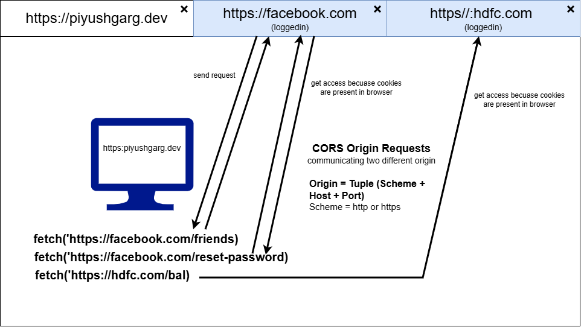

# CORS
Cross-Origin Resource Sharing (CORS) is a browser security feature that restricts web pages from making requests to a different domain than the one that served the page.
It uses HTTP headers to allow servers to explicitly permit cross-origin requests, preventing malicious sites from accessing sensitive data while enabling legitimate API integrations. 



# Why CORS is coming with Browser not Postman 📬?
Postman is not a browser

👉 It:
- ❌ Does NOT enforce Same-Origin Policy
- ❌ Does NOT block responses
- ❌ Does NOT care about CORS headers

So even if backend sends wrong headers:
```
Access-Control-Allow-Origin: *
```
👉 Postman still shows response ✅

| Feature          | Browser | Postman |
| ---------------- | ------- | ------- |
| Enforces CORS    | ✅ Yes   | ❌ No    |
| Blocks response  | ✅ Yes   | ❌ No    |
| Sends preflight  | ✅ Yes   | ❌ No    |
| Security sandbox | ✅ Yes   | ❌ No    |

**⚠️ Important Insight**

- 👉 CORS is not a backend error
- 👉 It’s a browser security feature

Your API is actually working fine — browser is just refusing to give you the response.

## Tutorials
1. CORS Explained - Cross-Origin Resource Sharing : https://www.youtube.com/watch?v=WWnR4xptSRk
2. Cross-Origin Resource Sharing (CORS) : https://developer.mozilla.org/en-US/docs/Web/HTTP/Guides/CORS
3. Cross-Origin Resource Sharing (CORS) : https://http.dev/cors


## Simple requests
Not all cross-origin requests trigger a preflight. A request avoids preflight when all of the following conditions are met:

- Method is GET, HEAD, or POST
- Headers are limited to CORS-safelisted request headers: Accept, Accept-Language, Content-Language, Content-Type, and Range
- Content-Type (if present) is application/x-www-form-urlencoded, multipart/form-data, or text/plain
- No event listeners registered on XMLHttpRequest.upload
- No ReadableStream in the request body

A request meeting these conditions is sent directly. The browser adds the Origin header and checks the response for Access-Control-Allow-Origin.

## Preflight requests
Any cross-origin request not meeting the simple request conditions triggers a preflight, an OPTIONS request sent before the actual request to check whether the server allows the actual request.

Common preflight triggers:
- Methods other than GET, HEAD, POST (e.g., PUT, DELETE, PATCH)
- Non-safelisted headers (e.g., Authorization, custom headers like X-API-Key)
- Content-Type values like application/json or text/xml
## Preflight flow
- The browser detects a cross-origin request requiring preflight
- The browser sends an OPTIONS request with Access-Control-Request-Method and Access-Control-Request-Headers
- The server responds with permission headers (Access-Control-Allow-Origin, Access-Control-Allow-Methods, Access-Control-Allow-Headers)
- If the preflight succeeds, the browser sends the actual request
- If the preflight fails, the browser blocks the actual request entirely (the request is never sent)

**Preflight request**
```
OPTIONS /api/data HTTP/1.1
Host: api.example.re
Origin: https://app.example.re
Access-Control-Request-Method: PUT
Access-Control-Request-Headers: Content-Type, Authorization
```

**Preflight response**
```
HTTP/1.1 204 No Content
Access-Control-Allow-Origin: https://app.example.re
Access-Control-Allow-Methods: GET, PUT, DELETE
Access-Control-Allow-Headers: Content-Type, Authorization
Access-Control-Max-Age: 86400
```

**Actual request (sent after successful preflight)**
```
PUT /api/data HTTP/1.1
Host: api.example.re
Origin: https://app.example.re
Authorization: Bearer eyJhbGciOi...
Content-Type: application/json

{"name": "updated"}
```

The browser maintains a preflight cache separate from the HTTP cache. The Access-Control-Max-Age header controls how long the preflight result is cached, keyed by method and URL.

**Actual response**
```
HTTP/1.1 200 OK
Access-Control-Allow-Origin: https://app.example.re
Content-Type: application/json

{"status": "ok"}
```

## ⚠️ Rule (important)

If:
```
Access-Control-Allow-Credentials: true
```
Then:
```
Access-Control-Allow-Origin ≠ *
```
✔ It must be a specific origin

**🔐 What browser does internally**

Before sending actual request, browser may send:
```
OPTIONS /api
```
This is called preflight request

Then it checks response headers:
```
Access-Control-Allow-Origin
Access-Control-Allow-Credentials
```
👉 If invalid → ❌ browser blocks response

**✅ Correct Fix (Backend)**

❌ Wrong (your current)
```
Access-Control-Allow-Origin: *
Access-Control-Allow-Credentials: true
```
✅ Correct
```
Access-Control-Allow-Origin: http://localhost:4200   // or your frontend URL
Access-Control-Allow-Credentials: true
```

**🔹 FastAPI (your case likely)**
```
from fastapi.middleware.cors import CORSMiddleware

app.add_middleware(
    CORSMiddleware,
    allow_origins=["http://localhost:4200"],  # ❗ NOT "*"
    allow_credentials=True,
    allow_methods=["*"],
    allow_headers=["*"],
)
```

## Key Aspects of CORS
- **Same-Origin Policy (SOP)**: Browsers restrict cross-origin HTTP requests by default to protect user security, such as preventing CSRF (Cross-Site Request Forgery) attacks.
- What is an "Origin"? An origin is defined by the URL scheme (protocol), domain (host), and port. A request from site.com to api.site.com is considered cross-origin.
- How it Works (HTTP Headers):
  - **Access-Control-Allow-Origin**: The main header used by the server to tell the browser which origins are allowed to access its resources.
  - **Access-Control-Allow-Methods**: Specifies which HTTP methods (e.g., GET, POST, PUT) are allowed.
- **Preflight Request (OPTIONS)**: For complex requests (like those with custom headers or JSON data), the browser sends an automatic preflight OPTIONS request to the server to check if it's safe to proceed. 

## Common CORS Errors & Solutions
- **Error**: "Blocked by CORS policy" in the browser console.
- **Solution**: The server hosting the API must be configured to send the appropriate Access-Control-Allow-Origin header, listing the client's domain (or * for public APIs).
- **Tools**: Developers often use libraries like Express CORS Middleware

## Examples
```
Origin = Tuple (Scheme + Host + Port)

Scheme = http or https
```

**Two different origins**
```
https://piyushgarg.dev
https://api.piyushgarg.dev
```


