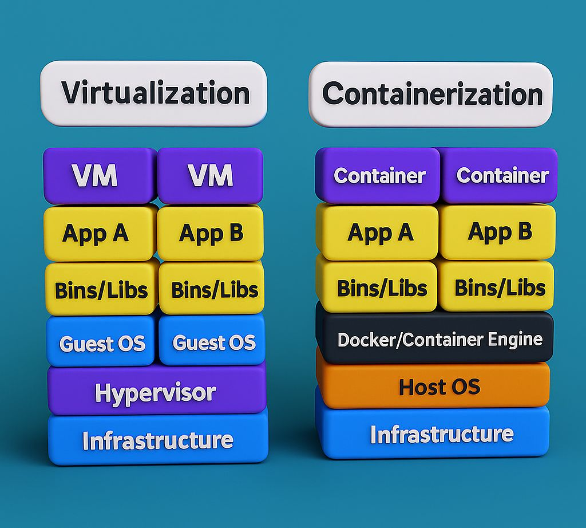

## 🖥️ Virtualization vs 📦 Containerization
Both virtualization and containerization let you run multiple applications on the same hardware—but they do it in very different ways.

🏢 Virtualization = Renting separate apartments (each has its own kitchen, bathroom, etc.)  
🏨 Containerization = Staying in hotel rooms (shared infrastructure, but isolated rooms)  

🔹 Virtualization (VMs)
---------------------------------------------------------
What it is:  
Virtualization uses a hypervisor to create full Virtual Machines (VMs). Each VM has its own OS, libraries, and apps.

Key Components:
- Physical Server
- Hypervisor (like VMware, VirtualBox)
- Guest OS (each VM runs its own OS)

Characteristics:
- 🧱 Heavyweight (each VM includes OS)
- 🐢 Slower boot time (minutes)
- 🔒 Strong isolation
- 💾 High resource usage

Use Cases:
- Running different OS (Linux + Windows together)
- Legacy applications
- Strong security isolation

🔹 Containerization (Containers)
---------------------------------------------------------
**What it is:**  
Containerization packages apps with dependencies but shares the host OS kernel.

**Key Tools:**
- Docker
- Kubernetes

**Characteristics:**
- ⚡ Lightweight (no full OS per app)
- 🚀 Fast startup (seconds)
- 📦 Portable across environments
- 🔓 Slightly weaker isolation than VMs

**Use Cases:**
- Microservices architecture
- CI/CD pipelines
- Cloud-native apps

**⚖️ Key Benefits of Containers Over VMs:**
- 🚀 Faster startup time
- 🧠 Lower memory and CPU usage
- 🔁 Easier to scale and replicate
- 📦 Consistency across dev, test, and prod environments

📌 As the industry shifts toward microservices and cloud-native ecosystems, containers are becoming the go-to solution for modern app development.
💡 But remember: both VMs and containers have their place. It's all about choosing the right tool for the right job!

| Feature        | Virtualization (VMs)   | Containerization      |
| -------------- | ---------------------- | --------------------- |
| OS             | Each VM has its own OS | Shares host OS kernel |
| Size           | Large (GBs)            | Small (MBs)           |
| Startup Time   | Slow                   | Fast                  |
| Performance    | Moderate               | Near-native           |
| Isolation      | Strong                 | Moderate              |
| Resource Usage | High                   | Low                   |
| Portability    | Less flexible          | Highly portable       |

## Container Orchestration
Container orchestration is the automated management of containerized application lifecycles, including deployment, scaling, networking, and health monitoring. 
It simplifies managing hundreds or thousands of containers across diverse environments, with Kubernetes being the industry-standard, open-source platform for this purpose.

> Kubernetes is an open source container orchestration tool that was originally developed and designed by engineers at Google. Google donated the Kubernetes project to the newly formed Cloud Native Computing Foundation in 2015.

**Key aspects of container orchestration include:**
- Automation: Automates provisioning, scheduling, and deployment of containers.
- Scaling & Load Balancing: Dynamically adjusts container counts based on demand and distributes traffic evenly.
- Self-Healing: Automatically restarts, replaces, or reschedules containers that fail or become unhealthy.
- Resource Management: Optimizes infrastructure usage by matching workloads to nodes. 

Popular container orchestration tools include Kubernetes (often managed via services like GKE, EKS, or AKS), Docker Swarm, and Nomad.

## What is container orchestration used for?
Use container orchestration to automate and manage tasks such as:
- Provisioning and deployment
- Configuration and scheduling
- Resource allocation
- Container availability
- Scaling or removing containers based on balancing workloads across your infrastructure
- Load balancing and traffic routing
- Monitoring container health
- Configuring applications based on the container in which they will run
- Keeping interactions between containers secure

