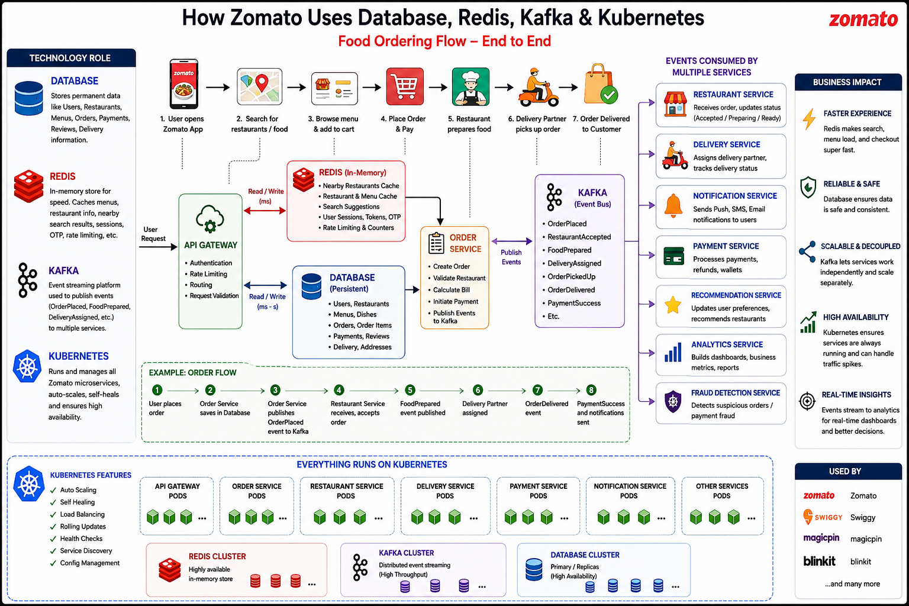
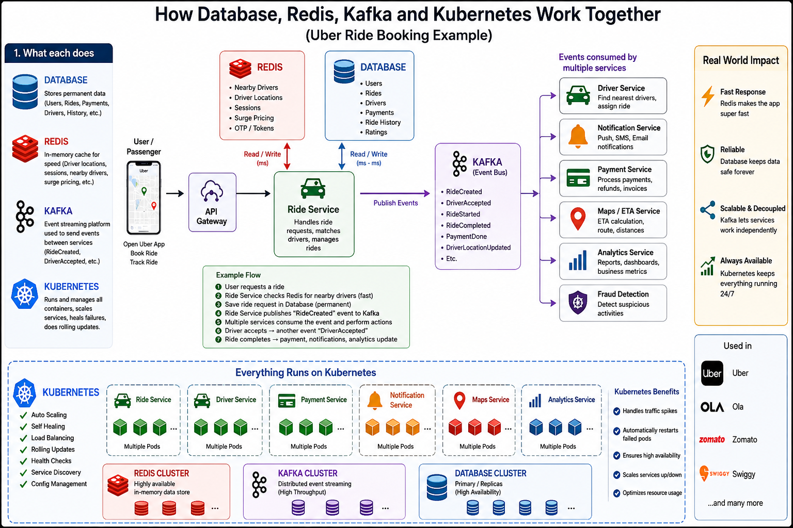

# Database vs Redis vs Kafka vs Kubernetes

Think of a modern application as a company.

✅ Database = Permanent record room  
✅ Redis = Super-fast memory desk  
✅ Kafka = Message delivery/post office  
✅ Kubernetes = Operations manager that runs everything  

They solve different problems and often work together.

## Real-world analogy

1. Database → The company’s filing cabinet that permanently stores records.
2. Redis → The receptionist’s desk with frequently needed information for instant access.
3. Kafka → The company’s internal mailroom that distributes messages to many departments.
4. Kubernetes → The facilities manager that keeps all offices running, replaces broken equipment, and adds more workstations when the company grows.

## Zomato Booking System

## Uber Booking System

