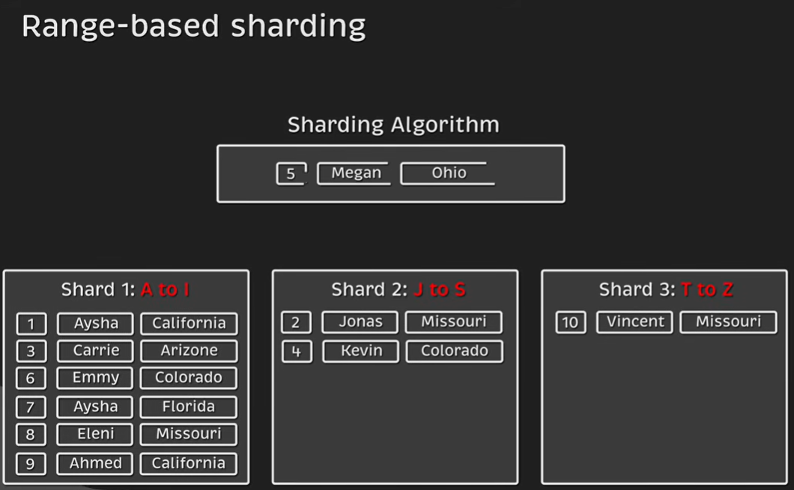
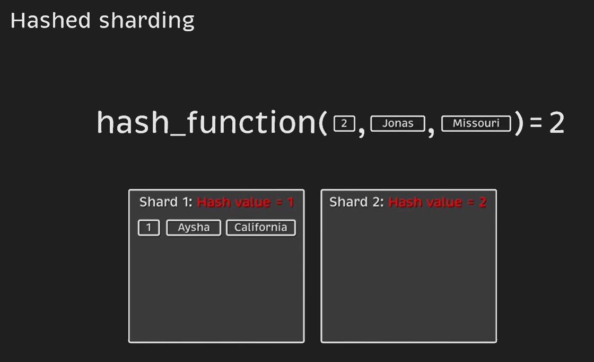
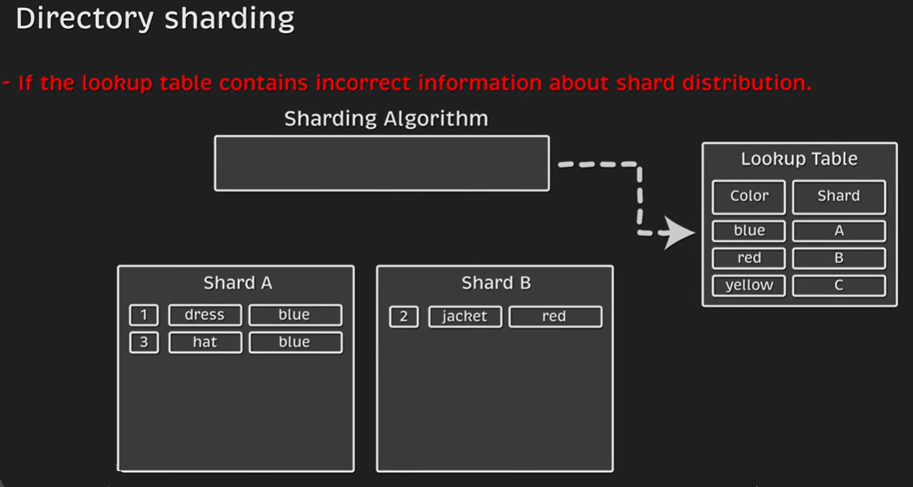
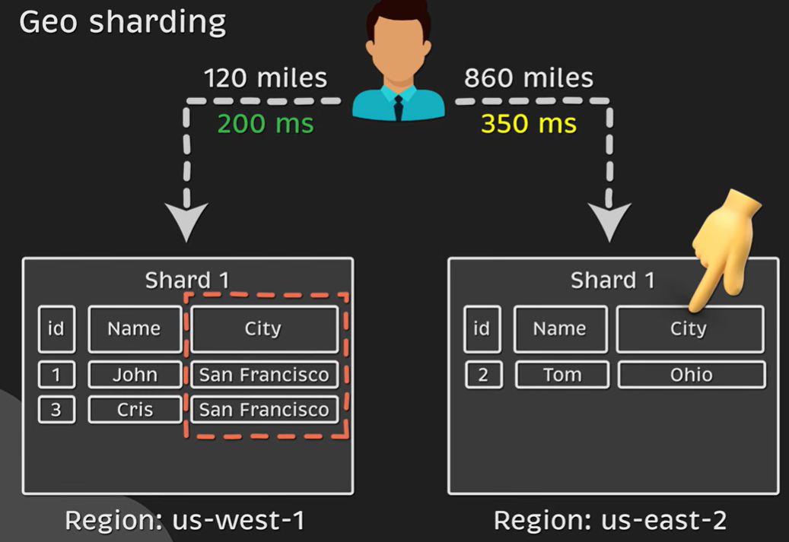

# Sharding
Your app is taking off. Traffic is growing, users are signing up, and your database keeps getting bigger. At first you solve this by upgrading to a larger database instance with more CPU, memory, and storage. That works for a while.
But eventually you hit the ceiling of what a single machine can handle. Queries slow down, writes become a bottleneck, and storage approaches the limit. Even powerful cloud databases like Amazon Aurora max out around 256 TiB.
When a single database can’t keep up anymore, you have only one real option:
Split your data across multiple machines.
This is called sharding. While it is a necessity at scale, it also introduces new challenges.

1. AWS Database Sharding : https://aws.amazon.com/what-is/database-sharding/
2. Shading : https://www.hellointerview.com/learn/system-design/core-concepts/sharding
3. What is Database Sharding? : https://www.youtube.com/watch?v=XP98YCr-iXQ&list=PLiMWaCMwGJXnjNhBQF-vR2Xqal0hN9U2-

## A shard is different from a replica
| Sharding                         | Replication                            |
| -------------------------------- | -------------------------------------- |
| Splits the data horizontally     | Copies the same data                   |
| Each shard has different rows    | Every replica has identical rows       |
| Used to scale writes and storage | Used to improve reads and availability |
| Independent datasets             | Same dataset on multiple servers       |

## 💡 𝐑𝐞𝐩𝐥𝐢𝐜𝐚𝐭𝐢𝐨𝐧 𝐯𝐬. 𝐏𝐚𝐫𝐭𝐢𝐭𝐢𝐨𝐧𝐢𝐧𝐠 𝐯𝐬. 𝐒𝐡𝐚𝐫𝐝𝐢𝐧𝐠
**🟢 𝐑𝐞𝐩𝐥𝐢𝐜𝐚𝐭𝐢𝐨𝐧**   
🟩 Copies the same data across multiple nodes  
🟩 Improves availability and read scalability  
🟩 Common patterns: leader–follower, multi-leader, synchronous/asynchronous  

📘 Example: One primary database with several read replicas behind a load balancer

**🟢 𝐏𝐚𝐫𝐭𝐢𝐭𝐢𝐨𝐧𝐢𝐧𝐠**   
🟩 Splits a large table into smaller, more manageable parts (partitions)  
🟩 Happens within a single database server   
🟩 Enhances performance and simplifies maintenance  

📘 Example: Partitioning a logs table by month in one database instance

**🟢 𝐒𝐡𝐚𝐫𝐝𝐢𝐧𝐠**  
🟩 Distributes portions of the dataset across multiple database servers  
🟩 Each shard stores a subset of the total data  
🟩 Enables horizontal scaling beyond a single machine  

📘 Example: Users are routed to a shard by user_id % N, where N is the number of shards

**💭 In short:**    
 ✅ Replicate → to boost availability and scale reads    
 ✅ Partition → to optimize within one server    
 ✅ Shard → when you must scale out horizontally for both reads and writes    


## What is Sharding?

Sharding is the process of splitting one large database into multiple smaller databases (called shards) that run on different machines.

> Shard is fully independent — its own tables, indexes, RAM, CPU, and storage
> A database shard is a fully independent partition of the database. Each shard stores only a subset of the data and has its own database resources.

```
                 Database Cluster
                        │
        ┌───────────────┼───────────────┐
        │               │               │
   ┌──────────┐    ┌──────────┐    ┌──────────┐
   │ Shard 1  │    │ Shard 2  │    │ Shard 3  │
   ├──────────┤    ├──────────┤    ├──────────┤
   │ Tables   │    │ Tables   │    │ Tables   │
   │ Indexes  │    │ Indexes  │    │ Indexes  │
   │ RAM      │    │ RAM      │    │ RAM      │
   │ CPU      │    │ CPU      │    │ CPU      │
   │ Storage  │    │ Storage  │    │ Storage  │
   └──────────┘    └──────────┘    └──────────┘
```

What "fully independent" means

Each shard has its own:

✅ Tables – stores only its assigned records.  
✅ Indexes – indexes are built only for that shard's data.  
✅ RAM (Memory) – buffer cache and query cache are local.  
✅ CPU – queries execute on that shard's server.  
✅ Storage (Disk/SSD) – data files are physically separate.  
✅ Transaction log – maintains its own write-ahead log or redo log.  
✅ Connections – applications connect to the appropriate shard.  

**Example**

Suppose you have 90 million users.

Instead of storing all users in one database:
```
Shard 1 : User IDs      1 – 30,000,000
Shard 2 : User IDs 30,000,001 – 60,000,000
Shard 3 : User IDs 60,000,001 – 90,000,000
```
If user 45,123,456 logs in:
```
Application
      │
      ▼
Shard Router
      │
      ▼
Shard 2
      │
      ├── users table
      ├── orders table
      ├── indexes
      ├── CPU
      ├── RAM
      └── Storage
```
Only Shard 2 processes the request. The other shards remain unaffected.


Instead of one server storing all the data,

**Before**
```
        Application
             |
      +--------------+
      |   Database   |
      +--------------+
      2 TB Data
```

**After sharding**
```
                Application
                     |
              +--------------+
              | Shard Router |
              +--------------+
          _______|_____|_______
         /         |          \
+------------+ +------------+ +------------+
| Shard A    | | Shard B    | | Shard C    |
| User 1-1M  | |1M-2M Users | |2M-3M Users |
+------------+ +------------+ +------------+
```
Each shard stores only part of the data, allowing the system to scale horizontally.

## Why do we need sharding?

Database sharding is simply splitting a large database into smaller pieces, which we call shards. If you get lucky and attract more and more customers, the amount of data also increases over time. Now, the database becomes a bottleneck if too many users attempt to use the application to read or save data simultaneously. The application slows down, negatively affecting the user experience. So, sharding not only allows you to store more data but also improves performance by reducing latency for each query. This is because you can now push down the query to each individual shard, which has a smaller dataset.

**1. The basic problem**

Imagine your application initially has one database server:
```
Users
  |
  v
Application
  |
  v
+----------------------+
|     Database         |
|  100 million rows    |
+----------------------+
```
As the application becomes popular:
- More users → more data
- More users → more read queries
- More users → more write queries
- Database CPU increases
- Memory usage increases
- Disk I/O increases
- Queries take longer

Eventually, the database becomes the bottleneck.

**2. What does sharding do?**

Instead of keeping everything in one database, we split the data into multiple smaller databases.

For example, suppose we shard users based on user_id:
```
                 Application
                      |
              Sharding Router
                      |
        +-------------+-------------+
        |             |             |
        v             v             v
    Shard 1       Shard 2       Shard 3
   user_id       user_id       user_id
   1 - 1M        1M - 2M       2M - 3M
```
Each shard contains only a portion of the data.

This is called horizontal partitioning.

**3. Why does performance improve?**

Suppose you have 300 million users.

Without sharding:
```
Single Database
-------------------------
300 million users
-------------------------
Query:
Find user_id = 250M

Database searches/indexes
through one huge dataset
```
With sharding:
```
              user_id = 250M
                     |
                     v
               Sharding Router
                     |
                     v
                  Shard 3
             200M - 300M users
```
The query is routed directly to Shard 3.

So each database handles a smaller dataset and less traffic.

**4. Sharding also distributes traffic**

This is one of the most important benefits.

Without sharding:
```
100,000 requests/sec
         |
         v
   +-------------+
   |   Database  |
   |  overloaded |
   +-------------+
```
With sharding:
```
                 100,000 requests/sec
                         |
                    Sharding Layer
                         |
          +--------------+--------------+
          |              |              |
          v              v              v
      Shard 1        Shard 2        Shard 3
      33K/sec        33K/sec        34K/sec
```
The workload is distributed across multiple database servers.

**5. Sharding improves scalability**

This is probably the most important reason to use sharding.

Suppose one database can comfortably handle:
```
10 TB data
50,000 requests/sec
```
You eventually need:
```
30 TB data
150,000 requests/sec
```
Instead of trying to create one extremely powerful machine:
```
              HUGE DATABASE
                   |
          30 TB + 150K req/sec
```
you can distribute the workload:
```
              Sharding Layer
                    |
       +------------+------------+
       |            |            |
       v            v            v
    Shard 1      Shard 2      Shard 3
     10 TB        10 TB        10 TB
    50K req/s    50K req/s    50K req/s
```
You can then add more shards as the system grows.

This is called horizontal scaling.

**6. One important clarification**

The statement:
```
"push down the query to each individual shard"
```
needs a little clarification.

If the application knows which shard contains the required data, the query can be sent only to that shard.

For example:
```
Get user 2500000

        |
        v
Sharding Key = user_id
        |
        v
    Shard 3
        |
        v
SELECT * FROM users
WHERE user_id = 2500000;
```
That's very efficient.

But if the query doesn't contain the sharding key, the system may have to query multiple shards:
```
SELECT * FROM users
WHERE email = 'abc@example.com';

              |
       +------+------+ 
       |      |      |
       v      v      v
    Shard1 Shard2 Shard3
       |      |      |
       +------+------+ 
              |
          Merge results
```
This is called a scatter-gather query, and it can be expensive.

That's why choosing the right shard key is extremely important.

**The key takeaway**

Think of sharding like dividing a huge library into multiple smaller libraries:
```
             HUGE LIBRARY
                  |
             SHARDING
                  |
       +----------+----------+
       |          |          |
       v          v          v
   Library A  Library B  Library C
```
Instead of making one library infinitely bigger, you distribute the books across multiple libraries.

| Problem                    | Sharding solution               |
| -------------------------- | ------------------------------- |
| Too much data              | Distribute data across shards   |
| Too many requests          | Distribute traffic              |
| Database CPU bottleneck    | Multiple database servers       |
| Large dataset              | Smaller datasets per shard      |
| Query latency              | Route queries to relevant shard |
| Growing application        | Add more shards                 |
| Single database limitation | Horizontal scaling              |

## Partitioning vs Sharding

| Partitioning               | Sharding                  |
| -------------------------- | ------------------------- |
| Inside one database        | Across multiple databases |
| One machine                | Multiple machines         |
| Improves query performance | Improves scalability      |
| Doesn't increase hardware  | Adds more hardware        |

**Example**

**Partitioning**
```
One Database

Orders

2022
2023
2024
2025
```
Everything remains on one server.

**Sharding**
```
Server 1
Orders 1-100M

Server 2
Orders 100M-200M

Server 3
Orders 200M-300M
```

## How does sharding work?

Every request needs to know:

**Which shard contains my data?**
```
Request(User 12345)

       |
       v

Hash(UserID)

       |
       v

Shard 3

       |
       v

Database
```
This is called the routing strategy.

## Choosing a Shard Key

The shard key determines how data is distributed.

**Good shard keys:**
- user_id
- tenant_id
- customer_id
- region

**Bad shard keys:**
- current_date
- status
- country (if most users are in one country)

**A good shard key should:**
- Have high cardinality
- Evenly distribute traffic
- Match common query patterns
- Avoid hotspots

## Sharding Strategies
### 1. Range-Based Sharding



```
Shard 1
1-1M Users

Shard 2
1M-2M Users

Shard 3
2M-3M Users
```
Advantages
- Easy
- Range queries are efficient

Disadvantages
- Hotspots if new data falls into one range

Example
```
All today's orders

↓

Shard 3

CPU 100%
```

### 2. Hash-Based Sharding (Most Common)




Hash-based sharding uses a math formula like hash(userId) % 4 to split data into four parts. The result tells the system which database shard to use. For example, a result of 0 goes to Shard A, while 3 goes to Shard D. This spreads data out evenly.
```
hash(key) % number_of_shards

hash(userId) % 4

↓

0 → Shard A
1 → Shard B
2 → Shard C
3 → Shard D
```
```
User ID = 12345

hash(12345) % 4

= 2

→ Shard 2
```
Advantages
- Excellent load distribution
- No hotspot from sequential IDs

Disadvantages
- Range queries become difficult
- Adding shards requires rebalancing unless consistent hashing is used

Used by:
- Cassandra
- MongoDB (hashed shard key)
- DynamoDB (internally similar concepts)

### 3. Directory-Based Sharding



Maintain a lookup table.
```
UserID

100

↓

Lookup Table

↓

Shard 5
```

Advantages
- Flexible
- Easy to move users

Disadvantages
- Extra lookup
- Lookup table can become a bottleneck

### 4. 🌍 Geo Sharding



Geo sharding is a database sharding strategy where data is distributed based on the geographical location of the user or business.

Instead of deciding the shard using something like user_id, we use a geographic attribute such as:
- Country
- Region
- State
- City
- Continent
- Example

Suppose we have a global application with users from India, Europe, and the USA.

Instead of one huge database:
```
                  Application
                       |
                       v
                Single Database
        +---------------------------+
        | India                     |
        | Europe                    |
        | USA                       |
        | Australia                 |
        | ...                       |
        +---------------------------+
```

We can use Geo Sharding:
```
                       Application
                            |
                       Geo Router
                            |
          +-----------------+-----------------+
          |                 |                 |
          v                 v                 v
     India Shard       Europe Shard        USA Shard
     PostgreSQL        PostgreSQL          PostgreSQL
How does it decide the shard?
```

For example:
```
user.country = "IN"
        |
        v
   India Shard

user.country = "US"
        |
        v
   USA Shard

user.country = "DE"
        |
        v
   Europe Shard
```
So a user from India primarily interacts with the India shard.

Geo Sharding in one picture
```
                         GLOBAL APPLICATION
                                |
                           Geo Router
                                |
        +-----------------------+-----------------------+
        |                       |                       |
        v                       v                       v
   🇮🇳 INDIA                🇪🇺 EUROPE               🇺🇸 USA
        |                       |                       |
        v                       v                       v
   India DB                Europe DB                USA DB
        |                       |                       |
   Indian Users            EU Users              US Users
```

Important: Geo sharding is still database sharding. The difference is simply that the shard key is geographic rather than something like user_id or a hash value.


### 5. Consistent Hashing

Consistent hashing minimizes data movement when servers are added or removed.

Normal hashing:
```
hash(key) % N
```

Problem:

Adding one server changes almost every mapping.

Example:
```
4 shards

User 100
↓

Shard 2
```
Add one shard:
```
5 shards

User 100

↓

Shard 4
```
Millions of records move.

Consistent hashing places servers on a hash ring.
```
        S1

   S4        S2

        S3
```
Keys are placed on the ring, and each key maps to the next server clockwise.

When a new server is added:
```
Only nearby keys move.
```
Benefits:
- Minimal rebalancing
- Easier scaling
- Better availability

Used by:
- Cassandra
- Dynamo-style systems
- Redis Cluster (conceptually related)
- Distributed caches

## Benefits of Sharding
- Horizontal scalability
- Higher write throughput
- Larger storage capacity
- Parallel query execution
- Better fault isolation (one shard failure doesn't necessarily stop the whole system)

## Problems Introduced by Sharding

**Cross-Shard Queries**

Instead of querying one database:
```
SELECT *
FROM Orders
```
You now need:
```
Shard 1
Shard 2
Shard 3

↓

Merge Results
```
This is slower.

**Cross-Shard Joins**
```
User → Shard 1

Orders → Shard 3
```
A JOIN now requires multiple databases, making it expensive or unsupported.

**Transactions**
```
Transfer Money

Account A → Shard 1

Account B → Shard 4
```
This requires distributed transactions or patterns like Saga, increasing complexity.

**Hotspots**

If one shard receives much more traffic:
```
Celebrity User

↓

Millions of Requests

↓

Shard 5
```
One shard becomes overloaded while others remain idle.

**Rebalancing**

When a shard grows too large:
```
Shard 2

1 TB

↓

Split

↓

Shard 2
Shard 5
```
Moving large volumes of data takes time and planning.

## When Should You Shard?

Start with:
```
Application
     |
Database
```
Then add:
```
Read Replica
```
Then:
```
Caching
```
Then:
```
Vertical Scaling
```
Only shard when:
- Storage exceeds a single machine's limits.
- Write throughput exceeds one database's capacity.
- Read replicas and caching are no longer sufficient.

## Interview Example

Suppose you're designing Instagram.

**Shard Key:** user_id
```
hash(user_id)%4

↓

Shard 0
Shard 1
Shard 2
Shard 3
```

**Benefits:**
- User profile lookup → one shard
- User posts → one shard
- Followers → one shard

**Trade-off:**
```
Top 100 Trending Posts
```
Requires querying all shards and aggregating results.

## How do you choose a Shard Key?

A shard key determines where data is stored.

**A good shard key should:**
- Distribute data evenly
- Prevent hotspots
- Be immutable
- Match common query patterns
- Have high cardinality

**Good examples:**
- user_id
- customer_id
- tenant_id

**Bad examples:**
- status
- country
- created_today

If 90% of users are from India,
```
country=India
```
would overload one shard.

**Interview one-liner:**
> A good shard key evenly distributes both data and traffic while supporting the application's most common queries.

## What are Cross-Shard Transactions?

A transaction involving multiple shards.

Example:

Transfer ₹100
```
Account A

Shard 1

↓

Account B

Shard 4
```
Now both databases must succeed.

Problems:
- Network failures
- Distributed locking
- Two-Phase Commit overhead
- Reduced performance

Alternatives:
- Saga Pattern
- Event-driven compensation
- Eventual consistency

Interview one-liner:
> Cross-shard transactions require coordination across multiple databases, making them slower and more complex than single-database transactions.

## Why do Hotspots Occur?

A hotspot happens when one shard receives significantly more traffic than others.

Example:
```
Celebrity User

↓

100 Million followers

↓

All requests

↓

Shard 3
```
Although storage may be balanced, traffic is not.

**Causes:**
- Poor shard key
- Sequential IDs
- Viral content
- Time-based keys

**Solutions:**
- Better shard key
- Hash sharding
- Read replicas
- Caching
- Load balancing
- Dynamic re-sharding

Interview one-liner:
> A hotspot occurs when one shard receives disproportionate traffic, becoming a bottleneck.

## How do you Rebalance Shards?

Rebalancing means redistributing data after adding or removing shards.

Example:

**Before:**
```
Shard 1
1 TB

Shard 2
900 GB

Shard 3
950 GB
```
**Add Shard 4:**
```
Move some data

↓

Shard 1
750 GB

Shard 2
700 GB

Shard 3
700 GB

Shard 4
700 GB
```

**Techniques:**
- Consistent hashing
- Online data migration
- Dual writes during migration
- Background copy with cutover
- Automatic balancing

**Challenges:**
- Long-running migrations
- Increased network traffic
- Temporary performance impact

Interview one-liner:
> Rebalancing redistributes data across shards when the cluster changes, ideally with minimal downtime and minimal data movement.


