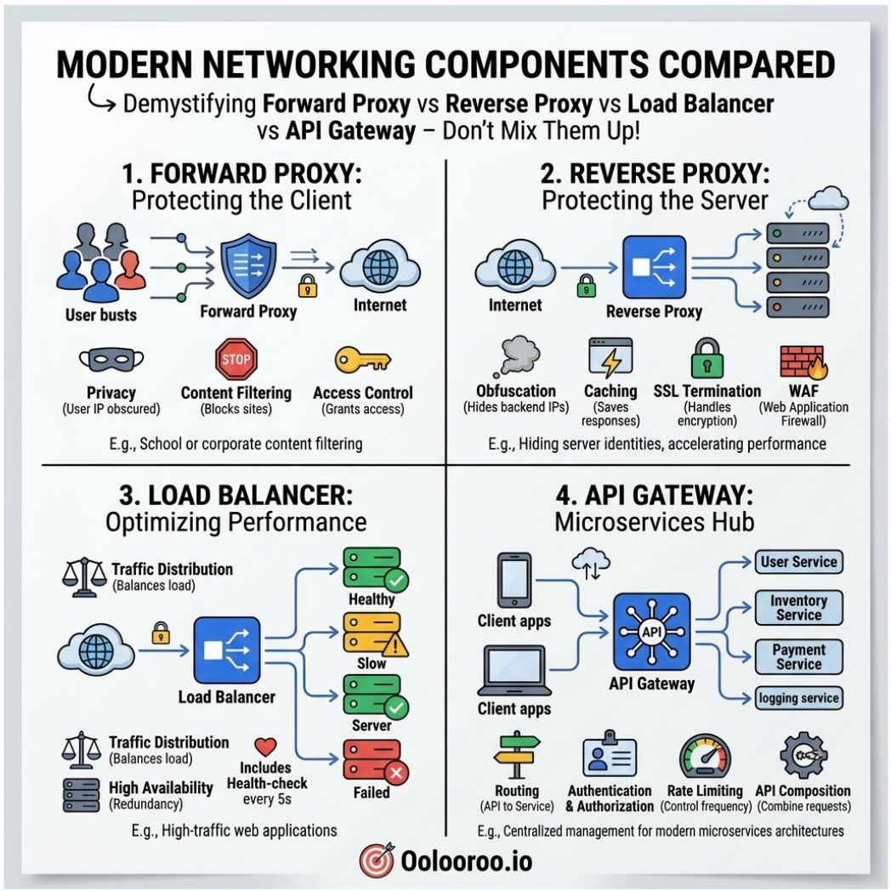

# Forward Proxy, Reverse Proxy, Load Balancer, and API Gateway
Most engineers use Forward Proxy, Reverse Proxy, Load Balancer, and API Gateway interchangeably. They're not interchangeable. 
Each solves a different problem, sits in a different position, and fails differently when misapplied.

## Forward Proxy
Forward Proxy protects the client. Sits between users and the internet — obscuring IPs, filtering content, controlling access. 
The internet never sees the real client. It sees the proxy.

## Reverse Proxy
Reverse Proxy protects the server. Sits between the internet and your backend — hiding server identities, terminating SSL, caching responses, running a WAF. 
The client never sees the real server. Same word as Forward Proxy, opposite direction, completely different job.

## Load Balancer
Load Balancer optimizes performance. Distributes traffic across healthy servers, health checks every five seconds, reroutes away from failed instances automatically. 
Its job isn't security or routing intelligence — it's throughput. A load balancer without active health checks isn't load balancing. 
It's round-robin routing to servers that might already be down.

## API Gateway
API Gateway is the microservices hub. Single entry point — routing, authentication, rate limiting, API composition.
Teams running microservices without one are solving auth, routing, and rate limiting in every service independently. That's not architecture. It's repetition.

Four components. Four different positions in the request path. Four different failure modes when the wrong one gets placed in the wrong spot.
