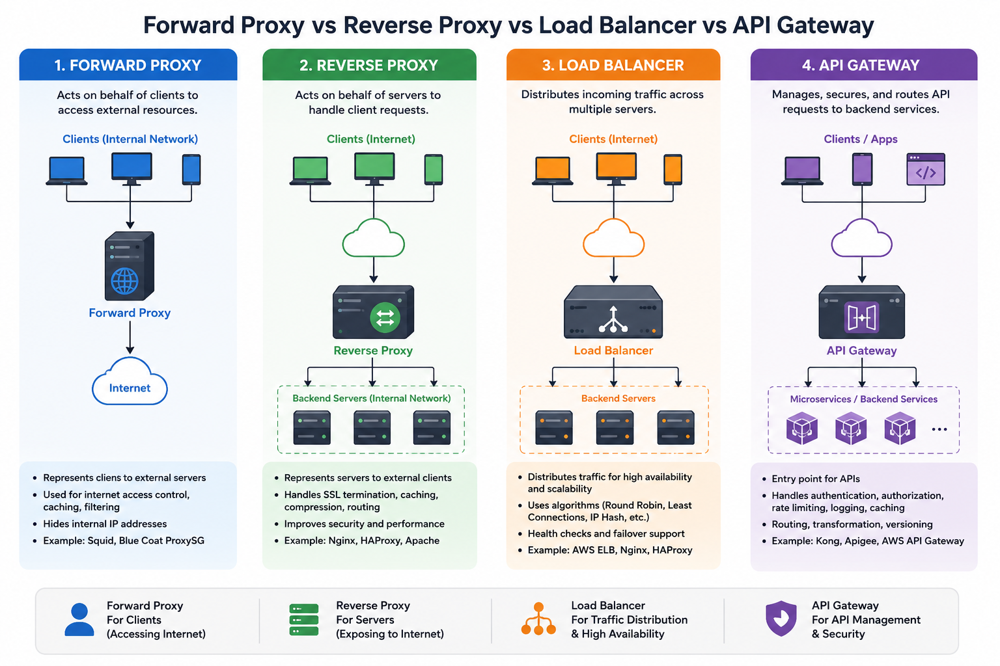

# Forward Proxy, Reverse Proxy, Load Balancer, and API Gateway
Most engineers use Forward Proxy, Reverse Proxy, Load Balancer, and API Gateway interchangeably. They're not interchangeable. 
Each solves a different problem, sits in a different position, and fails differently when misapplied.

Lec-5: Forward proxy vs Reverse proxy | System Design : https://www.youtube.com/watch?v=fe3TP8Momzw



1. Forward Proxy → Protects and represents clients.
2. Reverse Proxy → Protects and represents servers.
3. Load Balancer → Spreads traffic across multiple backend instances.
4. API Gateway → Provides a unified, policy-driven entry point to microservices.

| Component         | Think of it as                                |
| ----------------- | --------------------------------------------- |
| **Forward Proxy** | **Bodyguard for the client**                  |
| **Reverse Proxy** | **Receptionist for the servers**              |
| **Load Balancer** | **Traffic police directing vehicles**         |
| **API Gateway**   | **Manager of all APIs and business policies** |

## Forward Proxy
Forward Proxy protects the client. Sits between users and the internet — obscuring IPs, filtering content, controlling access. 
The internet never sees the real client. It sees the proxy.

Instead of a client talking directly to the internet, the request goes through the proxy.
```
Client
   │
   ▼
Forward Proxy
   │
   ▼
Internet
   │
   ▼
Website
```
The website sees the proxy's IP, not the client's IP.

**Real-life Example**

Inside a company:
```
Employee Laptop
      │
      ▼
Corporate Proxy
      │
      ▼
Google
```

The proxy can
- Block websites
- Log browsing history
- Cache pages
- Hide employee IPs

Common Uses
- Anonymous browsing
- Corporate firewall
- Content filtering
- Internet caching
- VPN

Examples

| Product                       | Common Use                          |
| ----------------------------- | ----------------------------------- |
| Zscaler Internet Access (ZIA) | Secure web gateway for employees    |
| Broadcom (Symantec) ProxySG   | Web filtering and caching           |
| Cisco Secure Web Appliance    | Internet security                   |
| Squid                         | Open-source forward proxy and cache |


## Reverse Proxy
Reverse Proxy protects the server. Sits between the internet and your backend — hiding server identities, terminating SSL, caching responses, running a WAF. 
The client never sees the real server. Same word as Forward Proxy, opposite direction, completely different job.

Clients never directly access backend servers.
```
Client
   │
   ▼
Reverse Proxy
   │
   ├────────► Server A
   ├────────► Server B
   └────────► Server C

Users only know the proxy.
```
Backend servers remain hidden.

Responsibilities
- SSL termination
- Compression
- Caching
- Security
- Static files
- Request routing

Examples

| Product     | Common Use                                  |
| ----------- | ------------------------------------------- |
| NGINX       | Reverse proxy, caching, SSL termination     |
| HAProxy     | Reverse proxy and load balancing            |
| Traefik     | Reverse proxy for containers and Kubernetes |
| Cloudflare  | Reverse proxy, CDN, WAF, DDoS protection    |
| Envoy Proxy | Service mesh and microservices ingress      |


## Load Balancer
Load Balancer optimizes performance. Distributes traffic across healthy servers, health checks every five seconds, reroutes away from failed instances automatically. 
Its job isn't security or routing intelligence — it's throughput. A load balancer without active health checks isn't load balancing. 
It's round-robin routing to servers that might already be down.

A Load Balancer distributes traffic across multiple servers.
```
            Users
               │
               ▼
        Load Balancer
      ┌──────┼──────┐
      ▼      ▼      ▼
    App1   App2   App3
```
Instead of one server receiving 10,000 requests,
```
App1 → 3,300

App2 → 3,300

App3 → 3,400
```

Algorithms
- Round Robin
- Least Connections
- Weighted Round Robin
- IP Hash
- Least Response Time

Benefits
- High Availability
- Fault Tolerance
- Horizontal Scaling
- Better Performance

Examples
- AWS ELB
- NGINX
- HAProxy
- F5 BIG-IP

## API Gateway
API Gateway is the microservices hub. Single entry point — routing, authentication, rate limiting, API composition.
Teams running microservices without one are solving auth, routing, and rate limiting in every service independently. That's not architecture. It's repetition.

Four components. Four different positions in the request path. Four different failure modes when the wrong one gets placed in the wrong spot.

**An API Gateway is the single entry point for APIs in a microservices architecture.**
```
Client
   │
   ▼
API Gateway
   │
   ├────────► User Service
   ├────────► Payment Service
   ├────────► Order Service
   ├────────► Inventory Service
   └────────► Notification Service
```
**Instead of**
```
Client
   │
   ├──► User Service

   ├──► Order Service

   ├──► Payment Service

   └──► Inventory Service
```
**the client only calls**
```
api.company.com
```
The gateway handles everything else.

**Responsibilities**
- Authentication
- Authorization
- JWT validation
- Rate Limiting
- Routing
- Aggregation
- Logging
- Monitoring
- API Versioning
- Request Transformation

**Examples**
- Kong
- Apigee
- AWS API Gateway
- Azure API Management
- Spring Cloud Gateway

## Comparison Table
| Feature           | Forward Proxy | Reverse Proxy | Load Balancer      | API Gateway        |
| ----------------- | ------------- | ------------- | ------------------ | ------------------ |
| Represents        | Client        | Server        | Servers            | APIs/Microservices |
| Location          | Client side   | Server side   | Server side        | Server side        |
| Main Goal         | Hide clients  | Hide servers  | Distribute traffic | Manage APIs        |
| SSL Termination   | No            | Yes           | Yes                | Yes                |
| Authentication    | Rare          | Sometimes     | No                 | Yes                |
| Rate Limiting     | No            | Sometimes     | No                 | Yes                |
| API Routing       | No            | Basic         | No                 | Yes                |
| Load Distribution | No            | Sometimes     | Yes                | Limited            |
| Caching           | Yes           | Yes           | No                 | Sometimes          |

## Enterprise Request Flow
```
                    User
                      │
                      ▼
              DNS (api.company.com)
                      │
                      ▼
             Reverse Proxy (NGINX)
                      │
                      ▼
                Load Balancer
                      │
         ┌────────────┴────────────┐
         ▼                         ▼
      API Gateway 1           API Gateway 2
         │                         │
         ├──────────┬──────────────┬───────────────┐
         ▼          ▼              ▼               ▼
    User Service Order Service Payment Service Notification
         │          │              │               │
         └──────────┴──────────────┴───────────────┘
                      │
                      ▼
                 Database Cluster
```

**Flow**
1. User sends a request to api.company.com.
2. Reverse Proxy terminates HTTPS, serves static content if applicable, and forwards dynamic requests.
3. Load Balancer distributes requests across multiple gateway instances.
4. API Gateway authenticates the user, enforces rate limits, logs the request, and routes it to the correct microservice.
5. The microservice processes the request and returns the response through the same path.


## 
