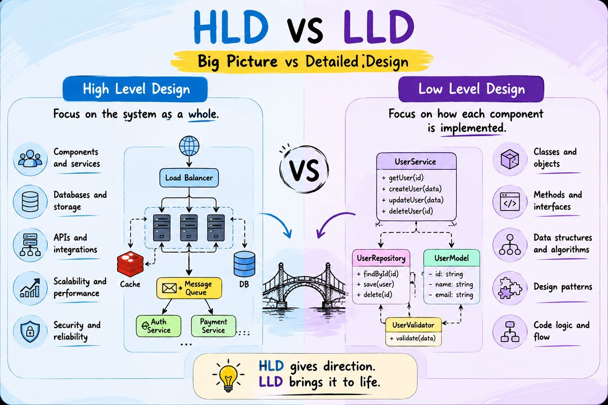

# High-Level Design (HLD)

HLD defines the overall system architecture—major components, services, databases, communication, and scalability.

> HLD: "We need an Order Service."
> LLD: "Here is exactly how OrderService.createOrder() works."

**Easy way to remember:**
```
HLD = What + Where
LLD = How
```



## High-Level Design (HLD) vs Low-Level Design (LLD)
Think of HLD and LLD as building a house 🏠.

|           | HLD                             | LLD                                       |
| --------- | ------------------------------- | ----------------------------------------- |
| Full form | High-Level Design               | Low-Level Design                          |
| Focus     | **What components do we need?** | **How exactly will each component work?** |
| Level     | Big picture                     | Detailed implementation                   |
| Audience  | Architects, senior developers   | Developers                                |
| Example   | API + DB + Redis + Kafka        | Classes, methods, DB tables, algorithms   |

## 🏗️ HLD = Big Picture

Imagine you're designing an e-commerce application.

HLD says:
```
                    ┌─────────────┐
                    │   Angular   │
                    │   Frontend  │
                    └──────┬──────┘
                           │
                           ▼
                    ┌─────────────┐
                    │ API Gateway │
                    └──────┬──────┘
                           │
          ┌────────────────┼────────────────┐
          ▼                ▼                ▼
    ┌───────────┐    ┌───────────┐   ┌───────────┐
    │   User    │    │  Product  │   │  Order    │
    │  Service  │    │  Service  │   │  Service  │
    └─────┬─────┘    └─────┬─────┘   └─────┬─────┘
          │                │                │
          ▼                ▼                ▼
       PostgreSQL       PostgreSQL       PostgreSQL
```

**HLD answers questions like:**
- What services do we have?
- Which database should we use?
- Do we need Redis?
- Do we need Kafka?
- How do services communicate?
- Where does authentication happen?
- How will the system scale?

HLD = architecture of the entire system.


