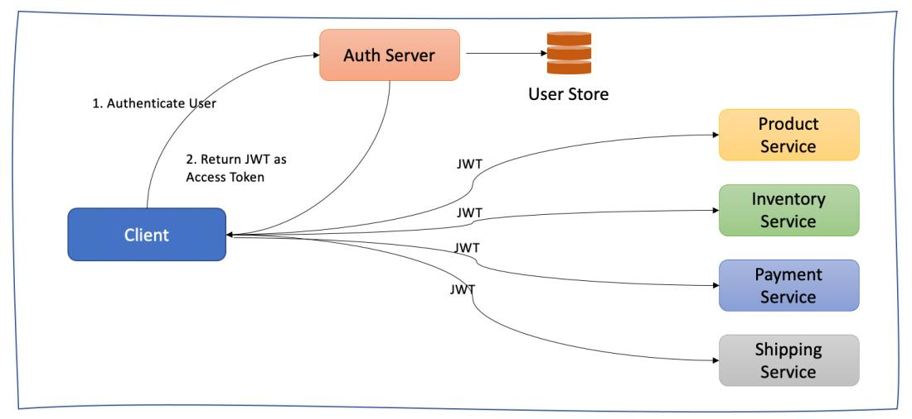
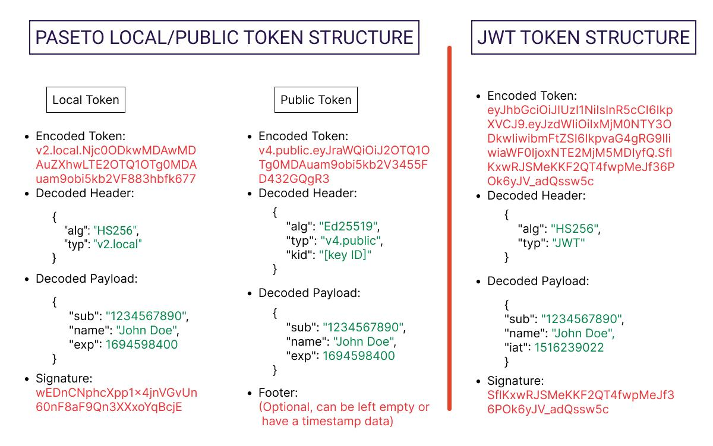
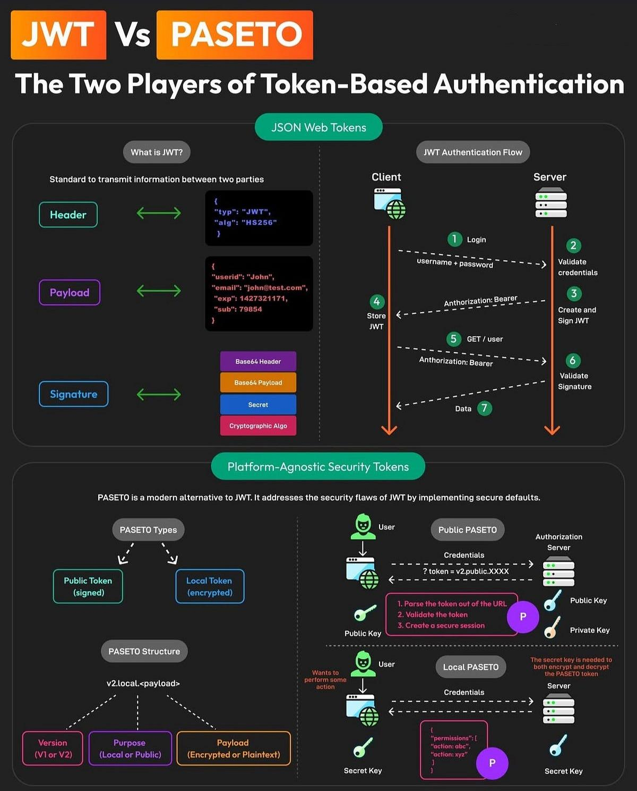

# JSON Web Token

## Video Tutorials
1. JSON WEB TOKENS are Dead! : https://www.youtube.com/watch?v=TD8GH3tCE3M

## What is JWT?

JWT stands for JSON Web Token.

A JWT looks like this and has 3 parts:

1. Header → contains algorithm & type
2. Payload → contains data (encoded, NOT encrypted)
3. Signature → ensures the token is not tampered with

👉 Important:
- Payload is encoded, not encrypted → anyone can read it
- Signature ensures integrity (no modification)

## Why Do We Need Authentication?

Imagine:
- You have a server + database (e.g., MongoDB)
- A user requests data (like comments)

The server must know:
👉 Who is making the request?

So we need:
- Authentication (who are you?)
- Authorization (what can you access?)

Method 1: Stateful Authentication
----------------------------------------------------------------------
**How it works:**
1. User logs in with email/password
2. Server validates from DB
3. Server creates a session ID
4. Stores it in memory (hash map)
5. Sends session ID to user (via cookies)

**Next request:**
- User sends session ID
- Server checks memory → identifies user

**Problems with Stateful Auth:**

❌ Uses server memory (not scalable)
❌ Server crash = all sessions lost
❌ Bad user experience (everyone logged out)
❌ Doesn’t work well with multiple servers (load balancing)

**Example problem:**
- Login happens on Server A
- Next request goes to Server B
- Server B doesn’t know session → user logged out

Solution: Stateless Authentication (JWT)
----------------------------------------------------------------------
Instead of storing sessions on server:

👉 Store data inside the token itself

**How JWT works:**
1. User logs in
2. Server creates JWT containing:
   - userId
   - email
3. Server signs it with a secret key
4. Sends token to user
5. Server DOES NOT store it

Next request:
- User sends token
- Any server can:
- verify signature
- extract user data

✔ No memory needed  
✔ Works across multiple servers  

**JWT Key Properties**

✔ Stateless  
✔ Scalable  
✔ Payload is readable  
✔ Cannot be modified without secret key  

## Problems with JWT

Now comes the interesting part 👇

**1. ❌ Token Revocation Problem**

Once issued:
- You cannot easily invalidate it
- Logout from server side is hard

Solution? Blacklist → but that again becomes stateful

**2. ❌ Too Many Algorithm Choices**

JWT supports many algorithms.

Problem:
- Developers may choose wrong one
- Misconfiguration → security vulnerabilities

**3. ❌ Secret Key Leak**

If secret key leaks:
- Anyone can generate valid tokens 😱

**4. ❌ Implementation Mistakes**

Common mistakes:
- Using decode() instead of verify()
- Skipping signature validation

**5. ❌ Payload is NOT encrypted**  
Anyone can read token data

## Enter PASETO (New Alternative)

PASETO = Platform Agnostic Security Tokens

Goal: 👉 Fix JWT problems by simplifying security

**PASETO Design Philosophy**

Instead of giving many options:
👉 It removes risky choices

✔ No confusing algorithm selection  
✔ Secure defaults  
✔ Better developer experience  

**PASETO Token Structure**

A PASETO token has:
- Version (e.g., v2)
- Type (local/public)
- Payload
- Optional footer

## Two Types of PASETO Tokens
**🔐 1. Local Tokens (Symmetric Encryption)**

- Uses single secret key
- Data is encrypted
- Even user cannot read payload

✔ More secure  
✔ Full control  
✔ Can revoke easily (stateful)  

Best for:  
👉 Banking / sensitive systems

**🔓 2. Public Tokens (Asymmetric Encryption)**

Uses:
- Private key → sign token
- Public key → verify token

✔ Works with microservices  
✔ No need to share secret key  

Flow:
- Auth service signs token
- Other services verify using public key

## JWT vs PASETO
| Feature          | JWT                | PASETO             |
| ---------------- | ------------------ | ------------------ |
| Algorithm choice | Many (confusing)   | Fixed (safe)       |
| Payload          | Encoded (readable) | Encrypted (secure) |
| Revocation       | Hard               | Easier             |
| Security         | Depends on dev     | Safer by design    |
| Complexity       | High               | Simple             |

## Final Conclusion

👉 JWT is NOT actually “dead”  
👉 It’s still widely used and battle-tested  

But:
- Developers often misuse it
- Security issues arise from wrong implementation

👉 PASETO solves this by:
- Reducing complexity
- Enforcing secure defaults
- Supporting both symmetric & asymmetric modes

## 🔷 JWT Architecture (Stateless Token Flow)

🔍 Flow Explanation
--------------------------------------------------------------------
**1. User → Login Request**
    - Sends email/password to server
**2. Auth Server**
    - Validates user from DB
    - Generates JWT (header + payload + signature)
    - Signs with secret key
**3. Token Sent to Client**
    - Stored in:
      - LocalStorage / Cookie
**4. Client → API Requests**
    - Sends JWT in headers (Authorization: Bearer <token>)
**5. Any Server (Behind Load Balancer)**
    - Verifies token using same secret key
    - Extracts user info from payload

✅ Key Characteristics
--------------------------------------------------------------------
✔ Fully stateless
✔ No server memory needed
✔ Works with horizontal scaling

❌ Weak Points
--------------------------------------------------------------------
- Cannot easily revoke tokens
- Payload is readable (not encrypted)
- Misconfiguration risks (algorithms, verify mistakes)

## 🟢 PASETO Architecture (Secure Token Flow)

🔐 Option 1: Local Token (Symmetric / Encrypted)
--------------------------------------------------------------------
Flow:
1. User logs in
2. Server:
  - Encrypts payload
  - Uses single secret key
3. Token sent to client
4. Client sends token in requests
5. Server:
  - Decrypts token
  - Validates user

**✅ Benefits**

✔ Payload is encrypted (not visible)  
✔ More secure than JWT  
✔ Better for sensitive systems  

🔓 Option 2: Public Token (Asymmetric / Microservices)
--------------------------------------------------------------------
Flow:
1. Auth Service
  -  Signs token using private key
2. Client stores token
3. Client calls other services
4. Other Services
  - Verify token using public key
  - No need to share secret key

**✅ Benefits**

✔ Perfect for microservices  
✔ No secret sharing needed  
✔ Safer key distribution  

