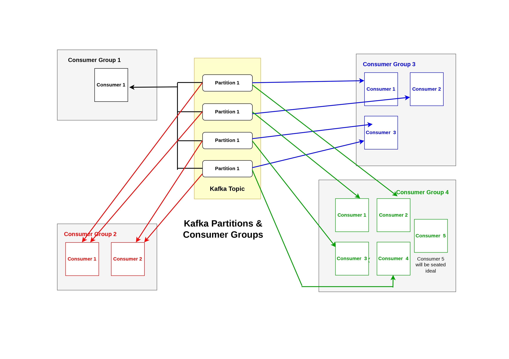

# Kafka
Apache Kafka was originally developed at LinkedIn around 2010 to handle high-volume data ingestion, activity tracking, and system monitoring.
Apache Kafka is not just a message broker. It was initially designed and implemented by LinkedIn in order to serve as a message queue. Since 2011, Kafka has been open sourced and quickly evolved into a distributed streaming platform, which is used for the implementation of real-time data pipelines and streaming applications.

Apache Kafka is an open-source software platform written in Scala and Java, mainly used for stream processing.

> Queue : 1 Producer 1 Consumer (First in first out)

> PubSub : 1 Producer Multiple Consumers

> Kafka With ZooKeeper

## Tutorials
1. Apache Kafka : https://kafka.apache.org/23/getting-started/introduction/
2. Apache Kafka Crash Course | What is Kafka? : https://www.youtube.com/watch?v=ZJJHm_bd9Zo
3. Kafka geeksforgeeks : https://www.geeksforgeeks.org/apache-kafka/apache-kafka/
4. Using Kafka With ZooKeeper : https://www.openlogic.com/blog/using-kafka-zookeeper

## What Is Apache Kafka?
Apache Kafka is a distributed event streaming platform that moves data from producers to consumers in real time. Producers write data to Kafka topics, and consumers read from those topics. Topics are divided into partitions, allowing messages to be distributed across multiple brokers for scalability and fault tolerance. Kafka’s append-only log and replication model enable it to achieve extremely high throughput — ranging from thousands to millions of messages per second.

## Core Components of Apache Kafka
- ✅ Inside Kafka topic can have multiple partitions
- ✅ Consumer will be placed inside a group only. One group can have multiple consumers. So, there can have multiple groups with multiple consumers.
- ✅ **1 Partition = 1 Active Consumer (per group)** : Within a single Kafka consumer group, a partition can only be consumed by one consumer at a time.
- ✅ **Idle Consumers**: If consumers > partitions, those extra consumers sit idle. If you have more consumers in a group than partitions (e.g., 2 consumers for 1 partition), the extra consumers will remain idle.
  - ✅ Within a consumer group, at any time a partition can only be consumed by a single consumer. No you can't have 2 consumers within the same group consuming from the same partition at the same time.
  - ✅ if we have a Kafka topic with 4 partitions & one group with one consumer, then 4 partitions will be assigned to that one consumer only of that group
  - ✅ if we have a Kafka topic with 4 partitions & one group with four consumer, then each partition will be assigned to each one consumer only of that group
  - ✅ if we have a Kafka topic with 4 partitions & one group with five consumer, then 4 partitions will be assigned to four consumers of that group and one consumer will be seated ideal.
  - ✅ if we have a Kafka topic with 4 partitions and two groups (1st group with 4 consumers, 2nd group with 1 consumer), then then 4 partitions will be assigned to four consumers of 1st group and also 4 partitions will be assigned to 1 consumer of 2nd group)
- ✅ How to Parallelize: To increase parallelism, you must increase the partition count of the topic, allowing more consumers in the group to receive assignments.
- ✅ **Alternative for Multiple Processing**: If you need multiple applications to read the same partition simultaneously, use different consumer group IDs for each application.
  - ✅ Kafka Consumer groups allow to have multiple consumer "sort of" behave like a single entity. The group as a whole should only consume messages once. If multiple consumer in a group were to consume the same partitions, these records would be processed multiple times. **If you need to consume a partition multiple times, be sure these consumers are in different groups.**

## Core Concepts of Kafka
To understand Kafka, it’s essential to grasp its core concepts:

**1. Topics** : A topic is a category or stream of records to which producers send data. Topics are partitioned and distributed across Kafka brokers, ensuring scalability and fault tolerance.

- Topics are immutable: Once written, data cannot be changed.
- Each topic can have multiple partitions, enabling parallel processing.

**2. Producers** : Producers are entities (applications or services) that publish messages (data) to Kafka topics. They have control over which topic and partition the data goes to.

**3. Consumers** : Consumers subscribe to Kafka topics and process the messages. Kafka uses Consumer Groups, enabling multiple consumers to read from the same topic while balancing the load across the group.

**4. Brokers** : Kafka brokers are servers that store data and serve client requests. A Kafka cluster can consist of one or more brokers, which work together to ensure fault tolerance.

**5. Partitions** : Each Kafka topic is divided into partitions, and data within a partition is ordered and immutable. This allows Kafka to scale horizontally and distribute data efficiently.

**6. Offset** : Messages in Kafka topics are assigned a unique offset, which is an incremental ID that consumers use to track their read progress.

**7. ZooKeeper** : Historically, ZooKeeper was used to coordinate Kafka brokers and maintain metadata. However, Kafka has been moving toward replacing ZooKeeper with **Kafka Raft (KRaft)** for simplicity and better integration.

## Create Queue model using Kafka
**👉 Queue : 1 Producer 1 Consumer (First in first out)**

We have a Kafka topic with 4 partitions. If in my application, i need Queue model. Then i will create 1 group with 4 consumers. Then each consumer will consume one partition i.e One-To-One mapping means Queue.

✅ No of Cosumers = No. of Partitions

## Create PubSub model using Kafka
> PubSub : 1 Producer Multiple Consumers

We have a Kafka topic with 4 partitions. If in my application, i need PubSub model. Then i will create multiple groups with 4 or less than 4 consumers. Suppose we have 2 groups (1st group with 4 consumers, 2nd group with 1 consumer), then then 4 partitions will be assigned to four consumers of 1st group and also 4 partitions will be assigned to 1 consumer of 2nd group).

## Kafka includes five core APIs
1. The Producer API allows applications to send streams of data to topics in the Kafka cluster.
2. The Consumer API allows applications to read streams of data from topics in the Kafka cluster.
3. The Streams API allows transforming streams of data from input topics to output topics.
4. The Connect API allows implementing connectors that continually pull from some source system or application into Kafka or push from Kafka into some sink system or application.
5. The AdminClient API allows managing and inspecting topics, brokers, and other Kafka objects. Kafka exposes all its functionality over a language independent protocol which has clients available in many programming languages.

## Advantages of Kafka
- High Performance: Kafka can handle gigabytes of data per second.
- Scalability: Easily scales horizontally to meet growing data demands.
- Durability: Data replication ensures no loss of information.
- Flexibility: Supports integration with multiple languages (Java, Python, Go, etc.) and frameworks.
- Open Source: Kafka is free to use and backed by a strong community.

## The use cases of Apache Kafka are
- Messaging
- Website Activity Tracking
- Metrics
- Log Aggregation
- Stream Processing
- Event Sourcing
- Commit Log

1. Real-Time Data Pipelines : Kafka connects multiple data sources and systems in real time, ensuring smooth data flow and processing.
2. Log Aggregation : Organizations use Kafka to centralize logs from multiple systems for monitoring and analysis.
3. Event Streaming : Kafka enables event-driven architectures by streaming events like user activities or system logs.
4. Stream Processing : With tools like Kafka Streams or Apache Flink, businesses can process data streams in real time for analytics and decision-making.
5. Data Integration : Kafka acts as a data bus for integrating multiple systems like databases, microservices, and big data platforms.
6. IoT Applications : Kafka supports real-time processing of IoT sensor data, making it ideal for use cases like smart cities or industrial automation.

**Key Reasons for Using Kafka:**
- Real-time Data Processing: Kafka allows systems to publish, subscribe, and process data streams instantly, crucial for analytics, monitoring, and fraud detection.
- High Throughput & Scalability: Designed to handle trillions of events daily, it scales out by adding more machines to process massive data streams in parallel.
- Reliability & Fault Tolerance: Kafka replicates data across multiple servers, ensuring data safety and system availability even if nodes fail.
- Decoupling Systems (Integration): It serves as a central broker, allowing disparate producers (data creators) and consumers (data users) to interact independently, simplifying complex architectures.
- Data Replayability: Because Kafka stores data in a distributed log, it allows multiple, independent applications to read the same data at their own pace or replay past data.

**Key Concepts and Capabilities:**
- Publish & Subscribe: Acts as a messaging system, allowing applications to send and receive streams of records.
- Storage: Persists data in a distributed, durable, and fault-tolerant manner.
- Stream Processing: Enables real-time processing of data streams via the Kafka Streams API.
- Connectors: Connects to external systems (e.g., databases, search indexes) using pre-built connectors.
- Architecture: Organizes data into topics, which are partitioned across multiple nodes (brokers) to provide scalability and high performance. 

**Common Use Cases:**
- Real-time Data Pipelines: Moving data between systems reliably.
- Event-Driven Applications: Triggering actions based on events.
- Log Aggregation: Collecting and processing log files from multiple servers.
- Real-time Analytics: Analyzing data as it is generated. 

Kafka was originally developed at LinkedIn to handle high-volume data feeds and has become a standard tool in manufacturing, banking, and telecommunications for handling real-time data streaming.

## Kafka With ZooKeeper
Apache ZooKeeper is a centralized service that provides coordination, configuration management, and synchronization for Apache Kafka clusters. It acts as the "executive" or "brain," tracking broker health, managing topic metadata, and handling leader elections.

ZooKeeper provides a highly reliable control plane for distributed coordination of clustered applications through a hierarchical key-value store. The suite of services provided by ZooKeeper include distributed configuration services, synchronization services, leadership election services, and a naming registry. 

> In short, ZooKeeper handles autoscalling.

## Is ZooKeeper Still Useful?
For Kafka — no. Kafka’s ZooKeeper dependency is fully deprecated. ZooKeeper is gone. Kafka 4.0, released March 2025, removed it entirely. KRaft is now the only way to run Kafka.

