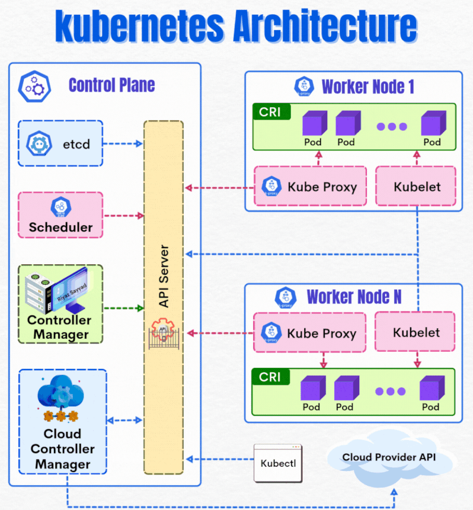

# Kubernetes
Kubernetes is an open source container orchestration tool that was originally developed and designed by engineers at Google. 
Google donated the Kubernetes project to the newly formed Cloud Native Computing Foundation in 2015.
Container orchestration tools provide a framework for managing containers and microservices architecture at scale. 
There are many container orchestration tools that can be used for container lifecycle management. 
Some popular options are Kubernetes, Docker Swarm, and Apache Mesos.

## Tutorials
1. What is Kubernetes? : https://www.youtube.com/watch?v=a-nWPre5QYI&t=2s
2. Kubernetes Services : https://www.kerno.io/blog/kubernetes-services
3. Kubernetes Architecture: The Ultimate Guide : https://devtron.ai/blog/kubernetes-architecture-the-ultimate-guide/
4. kubernetes-architecture-explained : https://devopscube.com/kubernetes-architecture-explained/

## How Kubernetes helps with container orchestration
Kubernetes orchestration allows you to build application services that span multiple containers, schedule containers across a cluster, scale those containers, and manage their health over time.

Kubernetes eliminates many of the manual processes involved in deploying and scaling containerized applications. You can cluster together groups of hosts, either physical or virtual machines, running Linux containers, and Kubernetes gives you the platform to easily and efficiently manage those clusters. 

More broadly, it helps you fully implement and rely on a container-based infrastructure in production environments. These clusters can span hosts across public, private, or hybrid clouds. For this reason, Kubernetes is an ideal platform for hosting cloud-native apps that require rapid scaling.

Kubernetes also assists with workload portability and load balancing by letting you move applications without redesigning them. 

**Main components of Kubernetes:**
- Cluster: A control plane and one or more compute machines, or nodes.
- Control plane: The collection of processes that control Kubernetes nodes. This is where all task assignments originate.
- Kubelet: This service runs on nodes and reads the container manifests and ensures the defined containers are started and running.
- Pod: A group of one or more containers deployed to a single node. All containers in a pod share an IP address, IPC, hostname, and other resources.

## 🚀 Understanding Kubernetes Architecture — Simplified!!!

If you're stepping into the world of DevOps, Cloud, or Container Orchestration, this visual guide (GIF) perfectly explains how Kubernetes works behind the scenes.

**🔍 What the GIF Shows:**  
 This animation breaks down the two major components of Kubernetes:

**🧠 1. Control Plane (The Brain of Kubernetes)**  

**The Control Plane manages the entire cluster and ensures everything runs smoothly. It includes:**
- ✔ API Server – The communication hub for all Kubernetes components.
- ✔ Etcd – A distributed key-value store that stores the cluster state.
- ✔ Scheduler – Decides which node should run a new Pod.
- ✔ Controller Manager – Handles node, replication, and endpoint management.
- ✔ Cloud Controller Manager – Connects Kubernetes with cloud provider APIs.

**🖥️ 2. Worker Nodes (Where Your Apps Run)**  

**Each worker node hosts your application Pods and contains:**
- ✔ Kubelet – Ensures containers are running as expected.
- ✔ Kube Proxy – Manages networking rules for service discovery.
- ✔ CRI (Container Runtime Interface) – Runs containerized applications (e.g., Docker, container ).

Pods are scheduled on these nodes by the Control Plane, and the nodes continuously communicate back with the API Server.

**💡 Why Kubernetes?**

**Kubernetes provides:**
- ⚡ Automated deployment
- ⚡ Self-healing applications
- ⚡ Scalability
- ⚡ Efficient resource usage
- ⚡ Declarative configuration

This GIF beautifully highlights how all these components interact to keep your applications running reliably and efficiently.

