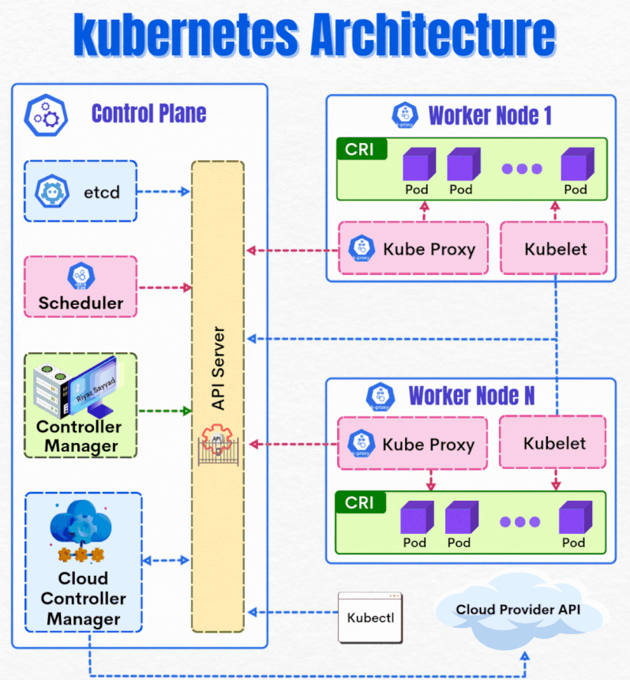

# Kubernetes
Kubernetes is an open source container orchestration tool that was originally developed and designed by engineers at Google. 
Google donated the Kubernetes project to the newly formed Cloud Native Computing Foundation in 2015.
Container orchestration tools provide a framework for managing containers and microservices architecture at scale. 
There are many container orchestration tools that can be used for container lifecycle management. 
Some popular options are Kubernetes, Docker Swarm, and Apache Mesos.

## Tutorials
1. Docker and Kubernetes Explained in 4 minutes : https://www.youtube.com/watch?v=nwDGURcwSNw
2. What is Kubernetes? : https://www.youtube.com/watch?v=a-nWPre5QYI&t=2s
3. Kubernetes Services : https://www.kerno.io/blog/kubernetes-services
4. Kubernetes Architecture: The Ultimate Guide : https://devtron.ai/blog/kubernetes-architecture-the-ultimate-guide/
5. kubernetes-architecture-explained : https://devopscube.com/kubernetes-architecture-explained/
6. Kubernetes Tutorials (Playlists) : https://www.youtube.com/playlist?list=PLiMWaCMwGJXnHmccp2xlBENZ1xr4FpjXF

## Kubernetes Components
𝗜𝗳 𝘆𝗼𝘂 𝗰𝗮𝗻 𝗲𝘅𝗽𝗹𝗮𝗶𝗻 𝘁𝗵𝗲𝘀𝗲 𝟮𝟱 𝗞𝘂𝗯𝗲𝗿𝗻𝗲𝘁𝗲𝘀 𝗰𝗼𝗺𝗽𝗼𝗻𝗲𝗻𝘁𝘀 𝘄𝗶𝘁𝗵𝗼𝘂𝘁 𝗹𝗼𝗼𝗸𝗶𝗻𝗴 𝘁𝗵𝗲𝗺 𝘂𝗽, 𝘆𝗼𝘂'𝗿𝗲 𝗮𝗹𝗿𝗲𝗮𝗱𝘆 𝗮𝗵𝗲𝗮𝗱 𝗼𝗳 𝗺𝗼𝘀𝘁 𝗗𝗲𝘃𝗢𝗽𝘀 𝗲𝗻𝗴𝗶𝗻𝗲𝗲𝗿𝘀.

Many people can deploy a Pod.

Far fewer understand what happens behind the scenes after running:
```
𝗸𝘂𝗯𝗲𝗰𝘁𝗹 𝗮𝗽𝗽𝗹𝘆 -𝗳 𝗱𝗲𝗽𝗹𝗼𝘆𝗺𝗲𝗻𝘁.𝘆𝗮𝗺𝗹
```
That's why I created this Kubernetes Components Explained cheat sheet—a quick reference covering the building blocks you'll encounter in real-world clusters and technical interviews.

**𝗪𝗵𝗮𝘁'𝘀 𝗶𝗻𝘀𝗶𝗱𝗲?**

**📦 Workloads**
- Pod
- Deployment
- ReplicaSet
- StatefulSet
- DaemonSet
- Job
- CronJob

**🌐 Networking**
- Service
- ClusterIP
- NodePort
- LoadBalancer
- Ingress

**💾 Storage**
- Volume
- PersistentVolume (PV)
- PersistentVolumeClaim (PVC)

**⚙️ Configuration**
- ConfigMap
- Secret
- Namespace

**🏗️ Cluster Architecture**
- Node
- Cluster
- Kubelet
- Kube-Proxy
- API Server
- Controller Manager
- Scheduler

## Modern Kubernetes Architecture

In Kubernetes, NGINX is often replaced by an ingress controller or service proxy:
```
Internet
     │
     ▼
Cloudflare
     │
     ▼
Kubernetes Ingress
(NGINX / Envoy / Traefik)
     │
     ▼
Services
     │
     ▼
Pods
```

## How Kubernetes helps with container orchestration
Kubernetes orchestration allows you to build application services that span multiple containers, schedule containers across a cluster, scale those containers, and manage their health over time.

Kubernetes eliminates many of the manual processes involved in deploying and scaling containerized applications. You can cluster together groups of hosts, either physical or virtual machines, running Linux containers, and Kubernetes gives you the platform to easily and efficiently manage those clusters. 

More broadly, it helps you fully implement and rely on a container-based infrastructure in production environments. These clusters can span hosts across public, private, or hybrid clouds. For this reason, Kubernetes is an ideal platform for hosting cloud-native apps that require rapid scaling.

Kubernetes also assists with workload portability and load balancing by letting you move applications without redesigning them. 

**Main components of Kubernetes:**
- Cluster: A control plane and one or more compute machines, or nodes.
- Control plane: The collection of processes that control Kubernetes nodes. This is where all task assignments originate.
- Kubelet: This service runs on nodes and reads the container manifests and ensures the defined containers are started and running.
- Pod: A group of one or more containers deployed to a single node. All containers in a pod share an IP address, IPC, hostname, and other resources.

## Does Kubernetes use Docker ?
- Yes, Kubernetes can run Docker-built images — but modern Kubernetes does not normally use Docker Engine itself to run containers.
- No, Kubernetes no longer uses Docker as its internal container runtime, but it fully supports running Docker-built images.

✅ **Docker Engine** → runtime/tooling for building and running containers     
✅ **Docker image** → packaged application artifact     
✅ **containerd / CRI-O** → container runtimes commonly used by Kubernetes     
✅ **Kubernetes** → orchestrates containers across a cluster     

**The old model**

Historically:
```
Kubernetes
     ↓
Docker Engine
     ↓
Container
```
Kubernetes used a component called DockerShim to communicate with Docker Engine.

**The modern model**

Today, Kubernetes generally uses a CRI-compatible container runtime, such as containerd or CRI-O:
```
Kubernetes
     ↓
kubelet
     ↓
CRI
     ↓
containerd / CRI-O
     ↓
Container
```
So: Kubernetes doesn't need Docker Engine to run containers.

## 🚀 Understanding Kubernetes Architecture — Simplified!!!



If you're stepping into the world of DevOps, Cloud, or Container Orchestration, this visual guide (GIF) perfectly explains how Kubernetes works behind the scenes.

**🔍 What the GIF Shows:**  
 This animation breaks down the two major components of Kubernetes:

**🧠 1. Control Plane (The Brain of Kubernetes)**  

**The Control Plane manages the entire cluster and ensures everything runs smoothly. It includes:**
- ✔ API Server – The communication hub for all Kubernetes components.
- ✔ Etcd – A distributed key-value store that stores the cluster state.
- ✔ Scheduler – Decides which node should run a new Pod.
- ✔ Controller Manager – Handles node, replication, and endpoint management.
- ✔ Cloud Controller Manager – Connects Kubernetes with cloud provider APIs.

**🖥️ 2. Worker Nodes (Where Your Apps Run)**  

**Each worker node hosts your application Pods and contains:**
- ✔ Kubelet – Ensures containers are running as expected.
- ✔ Kube Proxy – Manages networking rules for service discovery.
- ✔ CRI (Container Runtime Interface) – Runs containerized applications (e.g., Docker, container ).

Pods are scheduled on these nodes by the Control Plane, and the nodes continuously communicate back with the API Server.

**💡 Why Kubernetes?**

**Kubernetes provides:**
- ⚡ Automated deployment
- ⚡ Self-healing applications
- ⚡ Scalability
- ⚡ Efficient resource usage
- ⚡ Declarative configuration

This GIF beautifully highlights how all these components interact to keep your applications running reliably and efficiently.

