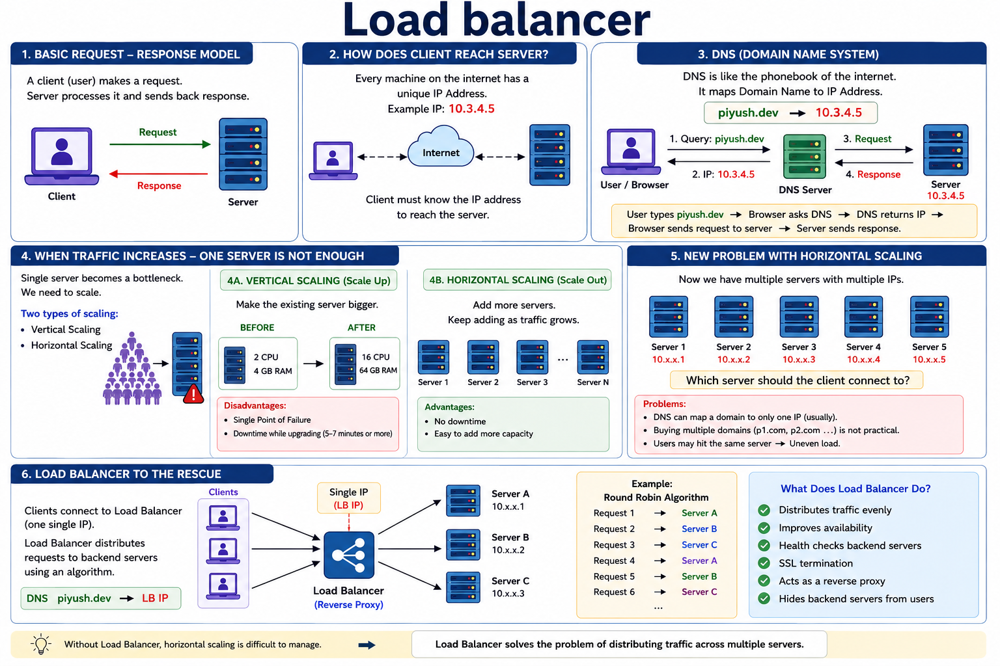

# Load Balancer

## Tutorials
1. What is Load Balancer | Load Balancer from Basic to Advance in 2026 : https://www.youtube.com/watch?v=88vl3BfLqUY
2. Types of Load Balancing Algorithms (Animated + Code Examples) : https://www.youtube.com/watch?v=gqb7LmmXuyw



## Introduction
"A Load Balancer is a component that sits between clients and backend servers, distributing incoming traffic across multiple servers so that no single server becomes a bottleneck or point of failure.

The basic flow is — Client sends a request to the Load Balancer and the Load Balancer routes it to one of the available backend servers based on a routing algorithm.

The four common algorithms are Round Robin — requests are distributed equally across servers in rotation; Least Connections — the next request goes to the server with the fewest active connections; IP Hash — the client's IP is hashed to consistently route the same user to the same server, useful for session-based applications like shopping carts; and Weighted Load Balancing — more powerful servers receive proportionally more traffic.

Load Balancers operate at two layers. L4 Load Balancers work at the transport layer — they route based on IP address and port without inspecting content, making them fast and lightweight. L7 Load Balancers work at the application layer — they can read HTTP request content and route intelligently, for example sending requests to /payments to the Payment Service and requests to /users to the User Service. Nginx primarily operates at L7 and AWS ELB supports both.

Health Checks are how Load Balancers maintain reliability — they periodically ping each server's health endpoint and if a server fails to respond, it is automatically removed from rotation until it recovers.

One important production consideration is that the Load Balancer itself can become a single point of failure. This is solved by deploying multiple Load Balancers in Active-Passive or Active-Active configurations. Netflix, Amazon and Instagram all use multiple layers of load balancing in production to ensure zero single points of failure in their traffic routing layer."

## Problem: Load Balancer becomes a Single Point of Failure (SPOF)

Without redundancy:
```
              Users
                |
                ▼
        +----------------+
        | Load Balancer  |   ❌ Single Point of Failure
        +----------------+
          /      |      \
         ▼       ▼       ▼
     App A    App B    App C
```
If the Load Balancer crashes, users cannot reach any application server.
```
Users
   |
   X  Load Balancer Down
   |
No request reaches servers.
```
Even though your application servers are healthy, your website is completely unavailable.

Solution 1: Active-Passive Load Balancers
-------------------------------------------------------------------
```
                    DNS
                     |
          -----------------------
          |                     |
          ▼                     ▼
    Active LB              Passive LB
   (Handles traffic)      (Standby)
          |
   -------------------
   |        |        |
 App A    App B    App C
```

**How it works**
- Active LB receives all traffic.
- Passive LB continuously monitors Active LB using health checks.
- If Active LB fails:
   - Passive LB automatically takes over.
   - Virtual IP (VIP) or floating IP moves to Passive LB.
   - Traffic resumes.
```
Active LB crashes

      DNS
       |
       ▼
 Passive LB becomes Active
       |
 App Servers
```
**Pros**
- Simple
- Easy to manage
- Predictable failover
**Cons**
- One LB remains idle.
- Resources are underutilized.

Solution 2: Active-Active Load Balancers
----------------------------------------------------
```
                   DNS
                    |
         -----------------------
         |                     |
         ▼                     ▼
      LB-1                  LB-2
    (Active)              (Active)
         \                  /
          \                /
      -------------------------
      |          |           |
    App A      App B       App C
```
Both Load Balancers serve traffic simultaneously.

Example:
```
50% Traffic → LB1

50% Traffic → LB2
```
If LB1 crashes:
```
100% Traffic

      ▼
     LB2
      |
App Servers
```
Users usually notice no interruption.

**Pros**
- Better utilization
- Higher throughput
- Better scalability
**Cons**
- More complex synchronization
- Session handling becomes important

How DNS Helps
-----------------------------------------------------------------
Many companies use DNS to distribute traffic across multiple load balancers.
```
api.company.com

      DNS
       |
-----------------------
|                     |
10.0.0.10         10.0.0.11
 LB-1              LB-2
```
DNS returns multiple IPs, and clients connect to one based on DNS policies such as round-robin, latency, or geo-routing.

---

## 1. Basic Client-Server Architecture

Every backend system has two primary components:

-   **Client** (the user making the request)
-   **Server** (the machine processing the request)

The flow is simple:

``` text
Client
   │
Request
   ▼
Server
   │
Response
   ▼
Client
```

This request-response model has powered web applications for decades.

------------------------------------------------------------------------

## 2. How Does the Client Reach the Server?

A server can be located anywhere on the Internet.

To reach it, every machine has a unique **IP address**.

Example:

``` text
10.3.4.5
```

If the client wants to communicate with the server, it must know this IP
address.

------------------------------------------------------------------------

## 3. Why DNS Exists

Remembering IP addresses like:
```
10.3.4.5
```
is difficult for humans.

That's why we use DNS (Domain Name System).

DNS works like a phonebook.

It maps a domain name to an IP address.

Example:
```
piyush.dev
        ↓
     10.3.4.5
```
When a user types:

piyush.dev

the browser asks the DNS server:

"What is the IP address for this domain?"

DNS returns:
```
10.3.4.5
```
Now the browser knows where to send the request.

Everything works perfectly.

------------------------------------------------------------------------

## 4. Traffic Problem
Eventually, traffic increases.

One server cannot handle millions of requests.

We need scaling.

There are two options.

## Vertical Scaling (Scale Up)

Before:

``` text
2 CPU
4 GB RAM
```

After:

``` text
16 CPU
64 GB RAM
```

Problems:

-   Single Point of Failure
-   Downtime during upgrades
-   Hardware limitations

## Horizontal Scaling (Scale Out)

``` text
Server 1
Server 2
Server 3
...
```

Advantages:

-   High availability
-   Easy scaling
-   No downtime

------------------------------------------------------------------------

## 5. Multiple Servers Problem
Now we have multiple servers.

Each one has a different IP.

Example:
```
Server 1 → 10.x.x.1
Server 2 → 10.x.x.2
Server 3 → 10.x.x.3
```

Now the question becomes:

**Which server should the client connect to?**

DNS can normally map one domain to one IP address.

For example:
```
piyush.dev
```
can point to only one IP.

Buying multiple domains like:
```
p1.com
p2.com
p3.com
```
is not practical.

Users shouldn't decide which server to use.

This creates uneven traffic distribution.

Questions:

-   Which server should receive the request?
-   DNS maps one domain to one IP.
-   Buying multiple domains isn't practical.

DNS typically returns a single IP address, so managing multiple backend servers becomes difficult.

------------------------------------------------------------------------

## 6. Load Balancer Solution

```
Users
     │
     ▼
Load Balancer
     │
 ┌───┼────┐
 ▼   ▼    ▼
S1   S2   S3
```

DNS points to the Load Balancer instead of individual servers.
```
example.com
      │
      ▼
Load Balancer IP
```
The Load Balancer decides which backend server should receive each request.

### Example: Round Robin Algorithm

Requests are distributed sequentially:

``` text
Request 1 → Server A
Request 2 → Server B
Request 3 → Server C
Request 4 → Server A
Request 5 → Server B
Request 6 → Server C
```

This helps distribute traffic evenly.

## What Does a Load Balancer Do?

**Traffic Distribution**

Spreads requests across multiple servers.

**High Availability**

If one server fails, traffic is redirected to healthy servers.

**Health Checks**

Continuously monitors backend servers.

**SSL Termination**

Handles HTTPS encryption/decryption.

**Reverse Proxy**

Clients communicate only with the Load Balancer, not directly with backend servers.

**Security**

Backend servers remain hidden from the public internet.

------------------------------------------------------------------------

## 7. Load Balancers in Microservices

Suppose we have an API Service running multiple containers.
```
API Service

Container 1
Container 2
Container 3
Container 4
Container 5
```

A Load Balancer sits in front of these containers.
```
Clients
    │
    ▼
Load Balancer
    │
 ┌──┼──┐
 ▼  ▼  ▼
C1 C2 C3
```
The Load Balancer forwards requests to healthy containers.

Similarly, another microservice (e.g., Notification Service) may also have multiple containers behind its own Load Balancer.

When the API Service wants to send a notification, it calls the Notification Service's Load Balancer, which forwards the request to one of its containers.

------------------------------------------------------------------------

## 8. Challenges

-   Service-to-service authorization
-   Difficult container failure tracking
-   Configuration management
-   Retry complexity

------------------------------------------------------------------------

## 9. Service Mesh

Modern architectures often use a **Service Mesh** for internal service
communication.

Features:

-   Service discovery
-   mTLS
-   Traffic routing
-   Retries
-   Circuit breaking
-   Observability
-   Access control

Popular options:

-   Istio
-   Linkerd
-   Consul Connect
-   Kuma

------------------------------------------------------------------------

## Conclusion

Load Balancers are **not dead**.

They remain essential for **North-South (external)** traffic.

For **East-West (internal)** traffic in modern Kubernetes and
microservice architectures, **Service Mesh** provides advanced
networking, security, and observability.

------------------------------------------------------------------------

## Real-World Example (Angular + Node.js)
```
Users
   ↓
DNS (app.company.com)
   ↓
Load Balancer (NGINX / AWS ALB)
   ↓
 ┌─────────────────────┐
 │ Angular App Server 1│
 │ Angular App Server 2│
 │ Angular App Server 3│
 └─────────────────────┘
   ↓
API Servers
   ↓
Database
```

**Popular Load Balancers:**
- NGINX
- HAProxy
- AWS Application Load Balancer
- Azure Load Balancer
- Google Cloud Load Balancing

Horizontal scaling creates multiple servers, and a Load Balancer acts as a single entry point that intelligently distributes traffic among them while providing availability, scalability, and fault tolerance.

------------------------------------------------------------------------


