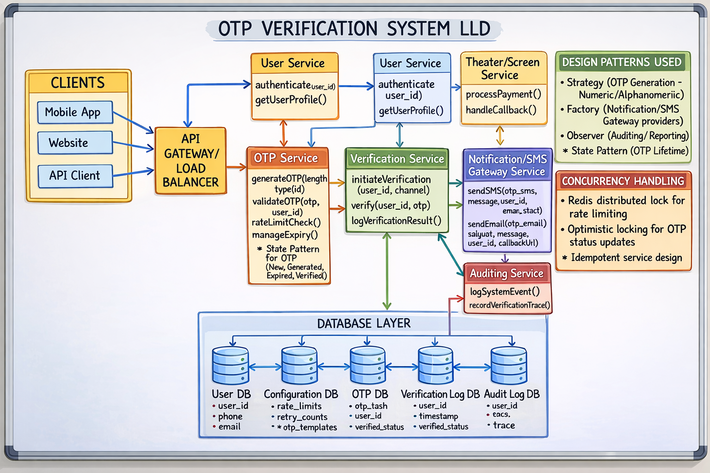

# 𝗢𝗧𝗣 Verification System Design



𝗧𝗵𝗮𝘁 𝟲-𝗱𝗶𝗴𝗶𝘁 𝗢𝗧𝗣 𝘆𝗼𝘂 𝗲𝗻𝘁𝗲𝗿 𝗶𝗻 𝘀𝗲𝗰𝗼𝗻𝗱𝘀...𝗶𝘀 𝗽𝗼𝘄𝗲𝗿𝗲𝗱 𝗯𝘆 𝗮𝗻 𝗲𝗻𝘁𝗶𝗿𝗲 𝗮𝘂𝘁𝗵𝗲𝗻𝘁𝗶𝗰𝗮𝘁𝗶𝗼𝗻 𝘀𝘆𝘀𝘁𝗲𝗺 𝘄𝗼𝗿𝗸𝗶𝗻𝗴 𝗯𝗲𝗵𝗶𝗻𝗱 𝘁𝗵𝗲 𝘀𝗰𝗲𝗻𝗲𝘀....

I built an OTP login system from scratch and realized how much goes into verifying those 6 digits.

𝗛𝗲𝗿𝗲'𝘀 𝘄𝗵𝗮𝘁 𝗵𝗮𝗽𝗽𝗲𝗻𝘀 𝘄𝗵𝗲𝗻 𝘆𝗼𝘂 𝗿𝗲𝗾𝘂𝗲𝘀𝘁 𝗮𝗻 𝗢𝗧𝗣:

𝟭) 𝗥𝗮𝗻𝗱𝗼𝗺 𝗡𝘂𝗺𝗯𝗲𝗿 𝗚𝗲𝗻𝗲𝗿𝗮𝘁𝗶𝗼𝗻
The system generates a cryptographically secure 6-digit code. Not just random, but unpredictable enough that attackers can't guess patterns.

𝟮) 𝗧𝗶𝗺𝗲-𝗕𝗮𝘀𝗲𝗱 𝗘𝘅𝗽𝗶𝗿𝗮𝘁𝗶𝗼𝗻
Your OTP expires in 5-10 minutes. The backend stores the code with a timestamp and validates it's still fresh when you submit it.

𝟯) 𝗥𝗮𝘁𝗲 𝗟𝗶𝗺𝗶𝘁𝗶𝗻𝗴
Try requesting 20 OTPs in a minute? Blocked. This prevents brute force attacks and SMS spam that could cost thousands in API fees.

𝟰) 𝗦𝗠𝗦/𝗘𝗺𝗮𝗶𝗹 𝗜𝗻𝘁𝗲𝗴𝗿𝗮𝘁𝗶𝗼𝗻
The OTP gets sent via Twilio, AWS SNS, or email providers. This means handling API credentials, retry logic, and delivery failures gracefully.

𝟱) 𝗩𝗲𝗿𝗶𝗳𝗶𝗰𝗮𝘁𝗶𝗼𝗻 𝗟𝗼𝗴𝗶𝗰
When you submit the OTP, the system checks: Is it correct? Is it expired? Has it already been used? Only then does it create your session.

𝟲) 𝗦𝗲𝘀𝘀𝗶𝗼𝗻 𝗠𝗮𝗻𝗮𝗴𝗲𝗺𝗲𝗻𝘁
After successful verification, the backend generates a JWT or session token that keeps you logged in securely.

𝗖𝗵𝗮𝗹𝗹𝗲𝗻𝗴𝗲𝘀 & 𝗘𝗱𝗴𝗲 𝗖𝗮𝘀𝗲𝘀 𝗬𝗼𝘂 𝗠𝘂𝘀𝘁 𝗛𝗮𝗻𝗱𝗹𝗲:
• 𝗢𝗧𝗣 𝗯𝗿𝘂𝘁𝗲 𝗳𝗼𝗿𝗰𝗲 → limit retries and temporarily block repeated attempts.
• 𝗠𝘂𝗹𝘁𝗶𝗽𝗹𝗲 𝗢𝗧𝗣 𝗿𝗲𝗾𝘂𝗲𝘀𝘁𝘀 → invalidate previous codes when a new OTP is generated.
• 𝗦𝗠𝗦 𝗱𝗲𝗹𝗶𝘃𝗲𝗿𝘆 𝗱𝗲𝗹𝗮𝘆𝘀 → balance OTP expiration time with real-world delivery delays.
• 𝗢𝗧𝗣 𝗿𝗲𝘂𝘀𝗲 𝗮𝘁𝘁𝗲𝗺𝗽𝘁𝘀 → invalidate the OTP immediately after successful verification.
• 𝗖𝗼𝗻𝗰𝘂𝗿𝗿𝗲𝗻𝘁 𝗹𝗼𝗴𝗶𝗻𝘀 → handle race conditions when users request or verify OTPs from multiple devices.

The difference between a secure OTP login and a system vulnerable to abuse is how y𝗼𝘂 𝗵𝗮𝗻𝗱𝗹𝗲 𝗿𝗮𝘁𝗲 𝗹𝗶𝗺𝗶𝘁𝗶𝗻𝗴, 𝗲𝘅𝗽𝗶𝗿𝗮𝘁𝗶𝗼𝗻, 𝗮𝗻𝗱 𝗲𝗱𝗴𝗲 𝗰𝗮𝘀𝗲𝘀.

I built the entire system from scratch covering the 𝗢𝗧𝗣 𝗴𝗲𝗻𝗲𝗿𝗮𝘁𝗶𝗼𝗻, 𝘃𝗲𝗿𝗶𝗳𝗶𝗰𝗮𝘁𝗶𝗼𝗻 𝗹𝗼𝗴𝗶𝗰, 𝗦𝗠𝗦 𝗶𝗻𝘁𝗲𝗴𝗿𝗮𝘁𝗶𝗼𝗻, and 𝘀𝗲𝘀𝘀𝗶𝗼𝗻 𝗵𝗮𝗻𝗱𝗹𝗶𝗻𝗴.

If this made you pause and think, “𝘁𝗵𝗲𝗿𝗲’𝘀 𝘁𝗵𝗶𝘀 𝗺𝘂𝗰𝗵 𝗵𝗮𝗽𝗽𝗲𝗻𝗶𝗻𝗴 𝗯𝗲𝗵𝗶𝗻𝗱 𝗮 𝘀𝗶𝗺𝗽𝗹𝗲 𝗢𝗧𝗣?”, I break the entire flow down step-by-step in my video.

# 🏦 Production OTP System Architecture
```
                        +--------------------+
                        |       CLIENTS      |
                        |--------------------|
                        |  Mobile App        |
                        |  Web App           |
                        |  API Client        |
                        +----------+---------+
                                   |
                                   v
                     +---------------------------+
                     | CDN / WAF (Cloudflare)    |
                     | DDoS protection           |
                     +------------+--------------+
                                  |
                                  v
                     +---------------------------+
                     | API Gateway / LoadBalancer|
                     | Authentication            |
                     +------------+--------------+
                                  |
               +------------------+------------------+
               |                                     |
               v                                     v
      +-------------------+                +-------------------+
      |   Auth Service    |                |  Rate Limit Layer |
      |-------------------|                |-------------------|
      | login()           |                | Redis / TokenBucket|
      | requestOTP()      |                | abuse detection    |
      +---------+---------+                +---------+---------+
                |                                     |
                +------------------+------------------+
                                   |
                                   v
                          +------------------+
                          |   OTP Service    |
                          |------------------|
                          | generateOTP()    |
                          | validateOTP()    |
                          | manageExpiry()   |
                          +--------+---------+
                                   |
                    +--------------+--------------+
                    |                             |
                    v                             v
          +-------------------+         +----------------------+
          | Notification      |         |  Event Streaming     |
          | Service           |         |  (Kafka / PubSub)    |
          |-------------------|         | logging / analytics  |
          | sendSMS()         |         +-----------+----------+
          | sendEmail()       |                     |
          +---------+---------+                     v
                    |                      +--------------------+
                    v                      | Monitoring & Fraud |
         +---------------------+           | Detection System   |
         | SMS / Email Gateway |           +--------------------+
         | Twilio / AWS SNS    |
         +---------------------+

                          DATA LAYER
    --------------------------------------------------------------
        Redis Cache        OTP Database        User Database
    (rate limit + TTL)     (hashed OTP)        (user profile)

        Audit Logs         Verification Logs   Analytics DB
```
## 🔁 Full OTP Flow in Production
**1️⃣ User requests OTP**

Example:
```
User → Mobile App → API Gateway
```
API Gateway performs:
- authentication
- rate limiting
- bot protection

**2️⃣ Request reaches Auth Service**
```
Auth Service → requestOTP(user_id)
```
Auth service verifies:
- user exists
- user account status
- OTP eligibility

**3️⃣ Rate Limiting (Very Important)**

To prevent abuse.

Example rule:
- Max 3 OTP per minute
- Max 10 OTP per hour

Implementation:
```
Redis Token Bucket Algorithm
```

**4️⃣ OTP Generation**

OTP Service generates OTP.

Example:
```
generateOTP(6 digits)
```
Example OTP:
```
829145
```
Stored in DB as:
```
user_id = 101
otp_hash = SHA256(829145)
expiry = now + 90 sec
attempts = 0
```
Important security: OTP is NEVER stored in plain text

**5️⃣ OTP Delivery**

OTP service sends event:
```
OTP_CREATED → Kafka
```
Notification service consumes the event.

Then sends:
```
SMS → Twilio / AWS SNS
Email → SES / SendGrid
```
User receives message:
```
Your OTP is 829145
Valid for 90 seconds
```

**6️⃣ User submits OTP**
```
User → API Gateway → OTP Service
```
OTP Service validates:
- Check expiry
- Compare hash
- Check retry attempts
- Check user lock status

If valid:
```
status = VERIFIED
```

**7️⃣ Event Logging**

Events sent to Kafka:
```
OTP_GENERATED
OTP_SENT
OTP_FAILED
OTP_VERIFIED
```
Used for:
- fraud detection
- analytics
- monitoring

## 🔒 Security Measures Used by Banks
**1️⃣ OTP Expiration**

Typical expiry:
```
30 – 120 seconds
```

**2️⃣ Attempt Limit**

Example:
```
Max 3 attempts
```
After that:

Account temporarily locked

**3️⃣ Device Fingerprinting**

System checks:
```
IP address
Device ID
Location
Browser fingerprint
```
If suspicious → trigger extra verification.

**4️⃣ Distributed Locking**

Prevent duplicate OTP verification.

Example:
```
Redis Distributed Lock
```

**5️⃣ Idempotent APIs**

If user presses Verify multiple times, only one request succeeds.

## 📊 OTP State Machine
```
NEW
 ↓
GENERATED
 ↓
SENT
 ↓
VERIFIED
 ↓
EXPIRED
```

## ⚡ Scalability Techniques

Production systems use:

**Horizontal scaling**
```
Multiple OTP service instances
behind load balancer
```

**Redis caching**  
Used for:  
```
rate limit
OTP expiry
session validation
```

**Message Queue**  
Example:
```
Kafka / RabbitMQ
```
Benefits:
- asynchronous SMS sending
- failure retries
- decoupled services

## 📈 Handling 10M OTP Requests

Large companies optimize by:
| Layer        | Technology            |
| ------------ | --------------------- |
| API Gateway  | Kong / NGINX          |
| Cache        | Redis Cluster         |
| Queue        | Kafka                 |
| DB           | PostgreSQL / DynamoDB |
| SMS Provider | Twilio / AWS SNS      |
| Monitoring   | Prometheus / Grafana  |

## 🧠 Advanced OTP Types Used by Google/Banks
1️⃣ SMS OTP : Most common.  
2️⃣ Email OTP : For login verification.  
3️⃣ TOTP (Time-based OTP) : Used in Google Authenticator.  
4️⃣ Push OTP : Approve login via app notification.  


It’s also a vital authentication system design concept many developers struggle to explain in interviews.
