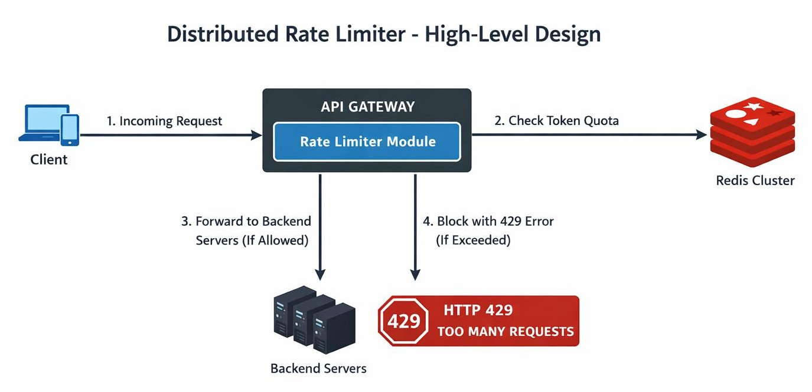

# Rate Limiter

## Tutorials
1. Design Rate Limiter (LLD) - Token Bucket, Fixed & Sliding Window with Thread Safety : https://www.youtube.com/watch?v=7y0KWxaUn-E



## Request flow
```
Client
   │
   │ API Request
   ▼
┌───────────────────────┐
│ RateLimiterService    │
│ allowRequest(userId)  │
└───────────┬───────────┘
            │
            │ Get User
            ▼
      ┌─────────────┐
      │    User     │
      │ tier=FREE   │
      └──────┬──────┘
             │
             │ tier
             ▼
      ┌───────────────┐
      │ RateLimiter   │
      │ Map<Tier,...> │
      └───────┬───────┘
              │
       ┌──────┴──────┐
       │             │
     FREE         PREMIUM
       │             │
       ▼             ▼
 Fixed Window    Token Bucket
       │             │
       └──────┬──────┘
              │
        allowRequest()
              │
       ┌──────┴───────┐
       │              │
     ALLOW           DENY
       │              │
       ▼              ▼
   API Server       HTTP 429
```
   
## Algorithms for implementing a Rate Limiter
These are the three most common algorithms for implementing a Rate Limiter. Your uploaded material covers all three: Token Bucket, Fixed Window Counter, and Sliding Window Log.

The easiest way to understand them is to imagine a user is allowed 10 requests per minute.

**1. Fixed Window Counter**

The simplest approach.

Divide time into fixed intervals:
```
Limit = 10 requests
Window = 1 minute


10:00:00                    10:01:00
    │---------------------------│
              1 minute
```
Maintain a counter:
```
10:00:00 → 0
10:00:10 → 1
10:00:20 → 2
...
10:00:50 → 10
```
Once the counter reaches 10:
```
Request #11
    │
    ▼
   DENY ❌
```
At 10:01:00, the counter resets:
```
10:01:00 → 0
```

The problem: boundary burst

Suppose:
```
10:00:55 → 10 requests
```
Then:
```
10:01:05 → 10 requests
```
The user can make:
```
10 requests
     +
10 requests
     =
20 requests
```
within roughly 10 seconds, even though the policy says 10/minute.

That's the major weakness of Fixed Window.

Advantages
- Very simple
- Very fast
- Low memory
- Easy Redis implementation

Disadvantages
- Boundary burst problem
- Traffic isn't evenly distributed
- Less precise

**2. Sliding Window Log**

Instead of storing only a counter, store the timestamp of every request.

For:
```
10 requests / minute
```
you might have:

Request timestamps:
```
10:00:03
10:00:08
10:00:15
10:00:22
10:00:31
10:00:35
10:00:41
10:00:47
10:00:52
10:00:58
```
Now a request arrives at:
```
10:01:00
```
The algorithm asks:

How many requests happened during the previous 60 seconds?

If there are already 10:
```
10:00:00 ─────────────────── 10:01:00
          10 requests

New request
     │
     ▼
    DENY ❌
```
At:
```
10:01:04
```
the request at 10:00:03 falls outside the window.

Therefore:
```
Remove 10:00:03

9 requests remain

New request
     │
     ▼
   ALLOW ✅
```

Why is it better?

There is no fixed boundary.

The window continuously moves:
```
Window 1

[10:00:00 ---------------- 10:01:00]


Window 2

    [10:00:05 ---------------- 10:01:05]


Window 3

        [10:00:10 ---------------- 10:01:10]
```
This gives much more accurate rate limiting.

Disadvantage
- You need to store request timestamps.

If you have:
```
1 million users
×
many requests
```
the memory requirement can become significant.

Your source specifically identifies the Sliding Window Log as accurate but potentially memory-intensive because it stores timestamps for requests.

**3. Token Bucket**

This is fundamentally different.

Instead of counting requests, imagine every user has a bucket containing tokens.
```
                 Tokens
                   ↓

             ┌─────────────┐
             │ ● ● ● ● ● ● │
             │ ● ● ● ●     │
             └──────┬──────┘
                    │
                    │ 1 token
                    ▼
                 Request
```
Suppose:
```
Bucket capacity = 10
Refill rate     = 2 tokens/sec
```
Each request consumes one token:
```
Request
   │
   ▼
Take 1 token
   │
   ▼
Token available?
   │
 ┌─┴──┐
YES   NO
 │     │
 ▼     ▼
ALLOW  DENY
```
Meanwhile tokens continuously refill:
```
0 tokens
   │
   │ +2/sec
   ▼
2 tokens
   │
   ▼
4 tokens
   │
   ▼
6 tokens
   │
   ▼
...
```

**The biggest Token Bucket advantage: bursts**

Suppose:
```
Capacity = 10
Refill   = 2 tokens/sec

The bucket is full:

● ● ● ● ● ● ● ● ● ●
```
The user can immediately send:
```
10 requests
```
because there are 10 tokens available.

Then:
```
11th request → DENY
```
After one second:
```
2 tokens refill
```
So:
```
Request → ALLOW
Request → ALLOW
Request → DENY
```
This means Token Bucket allows controlled bursts while still enforcing a long-term rate.

Your uploaded source specifically highlights this burst-handling behavior and Token Bucket's memory efficiency.

| Feature             | Fixed Window          | Sliding Window Log | Token Bucket     |
| ------------------- | --------------------- | ------------------ | ---------------- |
| Basic idea          | Counter per window    | Store timestamps   | Bucket of tokens |
| Accuracy            | ⭐⭐                    | ⭐⭐⭐⭐⭐              | ⭐⭐⭐⭐             |
| Memory              | Very low              | High               | Low              |
| Burst support       | Poor / boundary burst | Strict             | Excellent        |
| Implementation      | Easy                  | Moderate           | Moderate         |
| Redis friendly      | ⭐⭐⭐⭐⭐                 | ⭐⭐⭐                | ⭐⭐⭐⭐⭐            |
| Large-scale systems | Good                  | Expensive          | Excellent        |
| Typical use         | Simple APIs           | Strict throttling  | Production APIs  |

## Fixed Window vs Sliding Window Log vs Token Bucket (Visual comparison)
**Fixed Window**

Imagine the rule:
```
10 requests / minute
```
Fixed Window
```
10:00                         10:01
│                              │
██████████                     │
10 requests                    │
                               │
                               ▼
                         counter resets
                               │
                               │
                         ██████████
                         10 requests
```
⚠️ Possible boundary burst
---
Sliding Window
```
             Moving 60-second window
        ◄──────────────────────────►

10:00:20   ●
10:00:31      ●
10:00:42         ●
10:00:53            ●
10:01:04               ●
                       ▲
                       │
                  current time

Window continuously moves
```
No artificial reset.

---
**Token Bucket**
```
                Refill
                  ↓
             +2 tokens/sec
                  │
                  ▼
             ┌───────────┐
             │ ● ● ● ● ● │
             │ ● ● ● ● ● │
             └─────┬─────┘
                   │
                Request
                   │
             ┌─────▼─────┐
             │ Token?    │
             └─────┬─────┘
                YES│NO
                   │
             ┌─────┴─────┐
             ▼           ▼
          ALLOW         DENY
```

## Real-world example

Imagine an API:
```
POST /orders

Limit:
10 requests/sec
```

**Fixed Window**
```
12:00:00 → 10 requests
12:00:01 → reset
12:00:01 → 10 requests
```
Potentially:
```
20 requests
within ~1 second
```
❌ Not ideal for sensitive APIs.

**Sliding Window**

At every request:
```
Look at previous 1 second
        │
        ▼
Count requests
        │
        ▼
< 10 ? ── YES → ALLOW
        │
        NO
        │
        ▼
      DENY
```
Very accurate.

But maintaining every timestamp can become expensive at huge scale.

**Token Bucket**
```
capacity = 10
refill   = 10/sec
```
A sudden burst of:
```
10 requests
```
is allowed.

After the bucket empties:
```
~10 requests/sec
```
can continue.

This is usually the most practical choice for a production distributed API rate limiter.

## Why I would choose Token Bucket

For the production architecture we discussed earlier:
```
                    API Gateway
                         │
                         ▼
                  Rate Limiter
                         │
                         ▼
                    Redis
                         │
                         ▼
                   Token Bucket
```
I would choose:
```
Token Bucket + Redis + atomic Lua script
```

because it gives a strong combination of:
- Low memory + controlled bursts + high throughput + distributed consistency.
- The source itself concludes that there isn't one universally best algorithm; the choice depends on the system's requirements.


## Production-Grade Distributed Rate Limiter
```
                         ┌──────────────────────┐
                         │      Clients         │
                         │ Web / Mobile / API   │
                         └──────────┬───────────┘
                                    │
                                    │ HTTPS
                                    ▼
                    ┌──────────────────────────────┐
                    │       Load Balancer          │
                    └──────────────┬───────────────┘
                                   │
                 ┌─────────────────┼─────────────────┐
                 │                 │                 │
                 ▼                 ▼                 ▼
        ┌────────────────┐ ┌────────────────┐ ┌────────────────┐
        │ API Gateway #1 │ │ API Gateway #2 │ │ API Gateway #N │
        │ Rate Limiter   │ │ Rate Limiter   │ │ Rate Limiter   │
        └───────┬────────┘ └───────┬────────┘ └───────┬────────┘
                │                  │                  │
                └──────────────────┼──────────────────┘
                                   │
                         Atomic Rate Check
                                   │
                                   ▼
                     ┌─────────────────────────┐
                     │      Redis Cluster      │
                     │                         │
                     │ counters / tokens       │
                     │ timestamps              │
                     │ distributed state       │
                     └───────────┬─────────────┘
                                 │
                  ┌──────────────┴──────────────┐
                  │                             │
                  ▼                             ▼
       ┌─────────────────────┐       ┌─────────────────────┐
       │ Rules Cache         │       │ Rules Database      │
       │ Redis / local cache │◄──────│ PostgreSQL          │
       └─────────────────────┘       └─────────────────────┘

                                   ALLOWED
                                      │
                                      ▼
                           ┌────────────────────┐
                           │ Backend Services   │
                           │ User / Order / API │
                           └────────────────────┘

                                   DENIED
                                      │
                       ┌──────────────┴─────────────┐
                       ▼                            ▼
                 HTTP 429                    Optional Queue
                 Retry-After                 Async retry
```
If request 1 reaches Gateway #1 and request 2 reaches Gateway #2, both must see the same counter/token state. That's why the transcript introduces a common Redis store for all distributed rate limiters.

> Many API Gateway instances share one centralized rate-limit state in Redis, so a client cannot bypass the limit simply by being routed to a different server.

## What exactly are we limiting?

A production system shouldn't simply say:
```
"100 requests per second."
```
Instead, define a rate-limit key.

For example:
```
tenant:user:api
```
or:
```
tenant:123:user:456:POST:/orders
```
Possible dimensions:
```
IP
 │
 ├── 10 req/sec
 │
User
 │
 ├── 100 req/min
 │
API Key
 │
 ├── 1000 req/min
 │
Tenant
 │
 ├── 10,000 req/min
 │
Endpoint
 │
 ├── POST /orders → 20 req/sec
 │
 └── GET /products → 1000 req/sec
```
You can therefore support multiple rules simultaneously, which is explicitly one of the requirements discussed in the source.

## Rate-limit response

**When rejected:**
```
HTTP/1.1 429 Too Many Requests
Retry-After: 3
X-RateLimit-Limit: 100
X-RateLimit-Remaining: 0
X-RateLimit-Reset: 1723123459
```
**The client knows:**
```
Limit       = 100
Remaining   = 0
Retry after = 3 seconds
```
**This is better than simply returning:**
```
429
```

## What happens if Redis is unavailable?

This is an excellent system-design interview question.

You have two strategies.

**Fail closed**
```
Redis DOWN
    │
    ▼
Reject requests
    │
    ▼
429 / 503
```
Advantages:
- protects backend
- prevents unlimited traffic

Disadvantage:
- Redis outage can make the entire API unavailable

**Fail open**
```
Redis DOWN
    │
    ▼
Allow requests
    │
    ▼
Backend
```
Advantages:
- application remains available

Disadvantage:
- rate limiting is temporarily bypassed

A production system often chooses this per endpoint/business criticality.

For example:
```
POST /payment       → fail closed
POST /login         → fail closed
GET /products       → fail open
GET /health         → bypass
```

## How do we enforce a globally consistent limit?
```
                     GLOBAL DNS
                         │
             ┌───────────┴───────────┐
             │                       │
             ▼                       ▼
        REGION INDIA             REGION US
             │                       │
      ┌──────┴──────┐         ┌──────┴──────┐
      │             │         │             │
   Gateway       Gateway   Gateway       Gateway
      │             │         │             │
      └──────┬──────┘         └──────┬──────┘
             │                       │
             ▼                       ▼
        Redis Cluster           Redis Cluster
```
For example:
```
Global limit = 10,000 req/sec
```
If India allows:
```
7,000
```
and US allows:
```
7,000
```
you have accidentally allowed:
```
14,000 req/sec
```
instead of 10,000.

Instead of maintaining one globally synchronized counter for every request, allocate regional quotas.
```
Global quota
10,000 req/sec

        │
        ├──────────────┐
        ▼              ▼
     India           US
   6,000/sec       4,000/sec
```
Each region enforces its local allocation.

When traffic changes:
```
India utilization ↑
        │
        ▼
Quota Manager
        │
        ▼
India → 7,000
US    → 3,000
```
This reduces cross-region coordination.

For extremely strict global quotas, you can introduce a centralized/global quota service, but that increases latency and creates a dependency.

## Rate limiter vs WAF vs DDoS protection
| Layer        | Primary purpose        |
| ------------ | ---------------------- |
| DDoS         | Volumetric attacks     |
| WAF          | Malicious HTTP traffic |
| CDN          | Edge caching           |
| API Gateway  | API routing/auth       |
| Rate Limiter | Request quota          |
| Application  | Business logic         |


