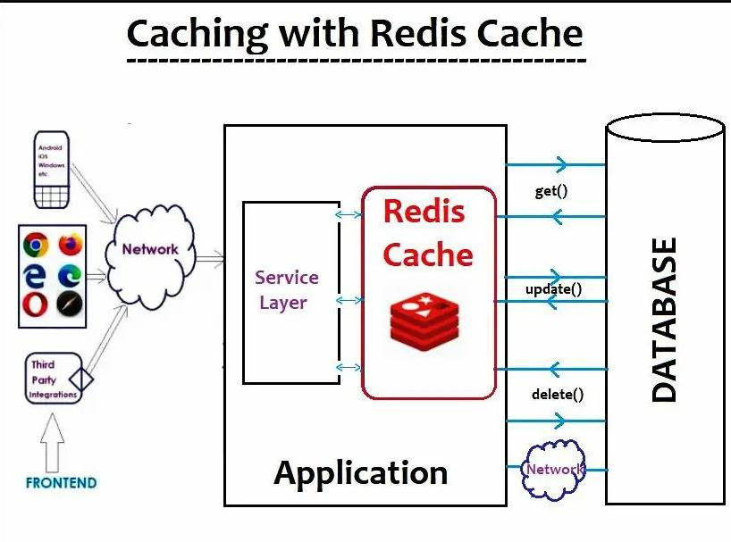
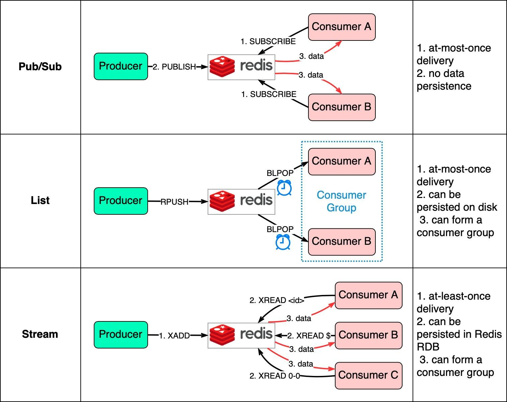
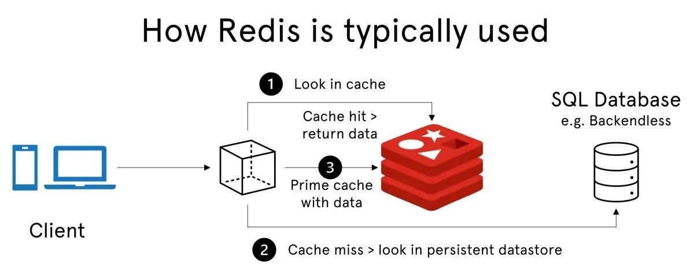

# Redis = Remote Dictionary Server
**Redis** : https://redis.io/



**👉 It stores data in RAM (memory) → extremely fast ⚡**

Key Concepts:
- Key-Value Store
```
    user:1 → {name: "Piyali", age: 25}
```
- In-Memory
    - Data stored in RAM → microsecond latency
- Persistence (optional)
    - Snapshot (RDB)
    - Append-only file (AOF)
- Data Structures (VERY IMPORTANT)
    - String
    - List
    - Set
    - Hash
    - Sorted Set (ZSET)



👉 Examples:
- String → caching API response
- List → queue (FIFO)
- Set → unique users
- Hash → user object
- Sorted Set → leaderboard / ranking

## Redis Architecture (How it works)
```
Client → Redis → Database
```
👉 Redis sits between API and DB (cache layer)


## Tutorials
1. Redis Crash Course : https://www.youtube.com/watch?v=Vx2zPMPvmug

## 🚀 2. Why Do We Need Redis?
**❌ Without Redis**
```
Client → API → Database (slow 😓)
```
- DB gets overloaded
- High latency
- Poor scalability

**✅ With Redis**
```
Client → API → Redis → Database
```
- ⚡ Faster response (microseconds)
- 🔥 Reduced DB load
- 🚀 Better scalability
- 💰 Cost efficient (less DB usage)

## 🌍 3. Real-Time Use Cases of Redis
1. Caching (Most Common)
- API responses (like your project)
- Product pages (e-commerce)
2. Rate Limiting
- Prevent abuse (login attempts, APIs)
3. Session Management
- Store user sessions (login tokens)
4. Real-time Chat
- Messaging systems (WhatsApp, Slack)
5. Leaderboards
- Gaming ranks using Sorted Sets
6. Pub/Sub (Real-time events)
- Notifications
- Live dashboards
7. Queue System
- Background jobs (emails, payments)

## 🏢 Real Companies Using Redis
- Netflix → caching & personalization
- Uber → real-time location
- Twitter → timeline caching
- Amazon → session & product cache

## ⚖️ 4. Why Choose Redis Over Other Cache Systems?
| Feature         | Redis         | Memcached       | Others  |
| --------------- | ------------- | --------------- | ------- |
| Data Structures | ✅ Rich       | ❌ Only string | Limited |
| Persistence     | ✅ Yes        | ❌ No          | Depends |
| Performance     | ⚡ Ultra fast | ⚡ Fast        | Medium  |
| Pub/Sub         | ✅ Yes        | ❌ No          | Rare    |
| Scalability     | ✅ Cluster    | Limited         | Varies  |
| Use Cases       | Many          | Only cache      | Narrow  |

## 🧠 Why Redis Wins

👉 1. Multi-purpose (not just cache)
- Cache + Queue + Pub/Sub + DB

👉 2. Advanced Data Structures
- Enables complex systems (leaderboards, chat)

👉 3. Persistence
- Data can survive restarts

👉 4. High Availability
- Replication + clustering

👉 5. Ecosystem & Community
- Widely adopted

## Cache invalidation (write-through / write-back)
🧠 A. Write-Through (Strong Consistency)
----------------------------------------------------------------
**👉 Flow:**
```
Client → API → DB → Redis (update immediately)
```

**✅ Use Case**
- User updates data → cache must reflect immediately

**✅ Implementation**   
✏️ Update API (Write-Through)
```
app.put("/todos/:id", async (req, res) => {
  const { id } = req.params;
  const updatedTodo = req.body;

  try {
    // 1. Update DB (simulated here)
    console.log("📝 Updating DB...");

    // 2. Update cache immediately
    if (redisClient.isOpen) {
      let todos = await redisClient.get("todos");

      if (todos) {
        todos = JSON.parse(todos);

        const updatedList = todos.map((t) =>
          t.id == id ? { ...t, ...updatedTodo } : t
        );

        await redisClient.set("todos", JSON.stringify(updatedList), { EX: 30 });
        console.log("✅ Cache updated (write-through)");
      }
    }

    res.json({ message: "Updated successfully" });
  } catch (err) {
    res.status(500).json({ error: "Update failed" });
  }
});
```

⚡ B. Write-Back (Lazy Update, High Performance)
----------------------------------------------------------------
**👉 Flow:**
```
Client → API → Redis → (Later) DB
```

**✅ Use Case** 
- High-performance systems (analytics, logs)
- DB writes can be delayed

**✅ Implementation**
```
app.post("/todos", async (req, res) => {
  const newTodo = req.body;

  try {
    // 1. Update cache immediately
    if (redisClient.isOpen) {
      let todos = await redisClient.get("todos");

      todos = todos ? JSON.parse(todos) : [];
      todos.push(newTodo);

      await redisClient.set("todos", JSON.stringify(todos), { EX: 30 });

      // 2. Queue DB write (simulated async)
      setTimeout(() => {
        console.log("💾 Writing to DB (delayed)");
      }, 5000);
    }

    res.json({ message: "Stored in cache (write-back)" });
  } catch (err) {
    res.status(500).json({ error: "Failed" });
  }
});
```
**⚖️ Write-Through vs Write-Back**

| Feature     | Write-Through      | Write-Back       |
| ----------- | ------------------ | ---------------- |
| Consistency | ✅ Strong           | ❌ Eventual       |
| Performance | Medium             | 🔥 High          |
| Risk        | Low                | High (data loss) |
| Use Case    | Banking, user data | Logs, analytics  |


## Rate limiting using Redis
👉 Prevent abuse like:
- Too many API calls
- DDoS
- Bot attacks

```
IP → Redis key → count requests → block if limit exceeded
```

**✅ Middleware Implementation**
```
async function rateLimiter(req, res, next) {
  const ip = req.ip;
  const key = `rate:${ip}`;
  const LIMIT = 5; // max requests
  const WINDOW = 60; // seconds

  try {
    if (!redisClient.isOpen) {
      return next(); // fallback if Redis down
    }

    const requests = await redisClient.incr(key);

    if (requests === 1) {
      await redisClient.expire(key, WINDOW);
    }

    if (requests > LIMIT) {
      return res.status(429).json({
        error: "Too many requests. Try later.",
      });
    }

    next();
  } catch (err) {
    console.log("⚠️ Rate limiter failed, skipping");
    next();
  }
}
```

## What if Redis fails
If Redis fails, your API should still work (graceful fallback) instead of hanging or crashing.

👉 If Redis is:
- ✅ Working → use cache
- ❌ Down → skip cache, call API directly

```
Request → Try Redis
         ↓
     If FAIL ❌ → Call API directly (fallback)
         ↓
     Return response (always)
```

## ⚡ Behavior Now
| Scenario                     | Result             |
| ---------------------------- | ------------------ |
| Redis ✅ + Cache HIT          | ⚡ Fast response    |
| Redis ✅ + MISS               | Fetch + cache      |
| Redis ❌ Down                 | 🔥 API still works |
| Redis ❌ Crash during request | Fallback to API    |

## 💡 Advanced Production Enhancements
✅ 1. Circuit Breaker (Avoid repeated Redis attempts)
- After 3 failures → stop trying Redis for 30 sec

✅ 2. In-Memory Fallback (Super fast)
```
let memoryCache = null;
```
✅ 3. Logging + Monitoring
- Track Redis failures
- Alert if down


**👉 This pattern is called:**
- Graceful Degradation
- Cache Aside Pattern with Fallback

Used by:
- Netflix
- Amazon
- Uber
