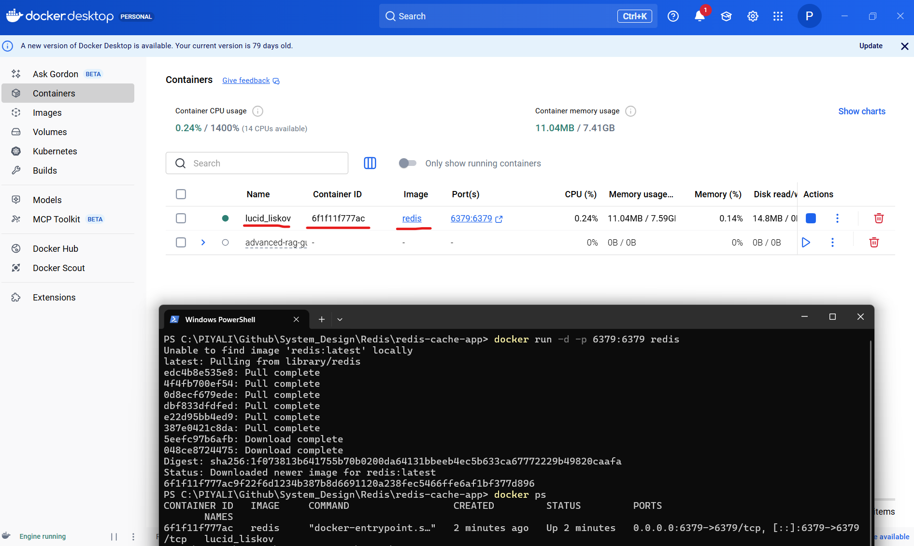
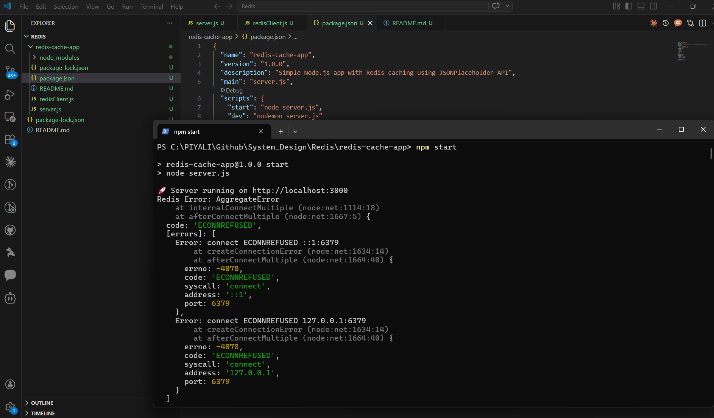
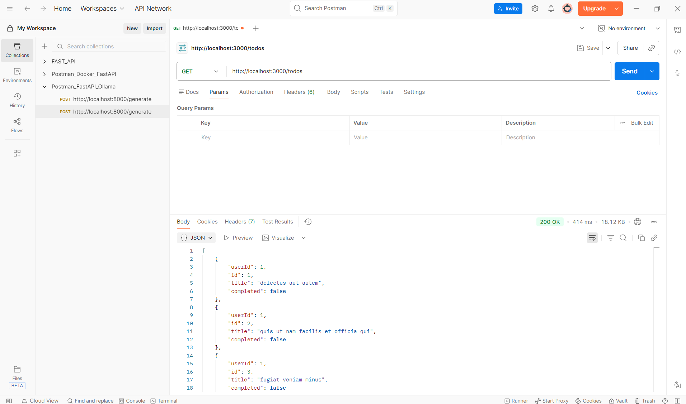

# simple Node.js + Redis caching app using JSONPlaceholder

```
Client
  ↓
Rate Limiter (Redis)
  ↓
API Server
  ↓
Cache Layer (Redis)
  ↓
Database / External API
```

**🚀 1. Project Structure**
```
redis-cache-app/
│── server.js
│── redisClient.js
│── package.json
```

## RUN Application
1. Install 🐳Docker in your local machine
2. Open Docker Desktop 🐳
3. Run Redis with one command:
```
docker run -d -p 6379:6379 redis
```

🔍 Verify it’s running
```
docker ps
```
You should see a Redis container.


🧪 Test Redis (inside container)
```
docker exec -it <container_id> redis-cli ping
```

👉 Output:
```
PONG
```
4. ⚡ Now Run Your App
```
node server.js
```
or 
```
npm start
```



Then test in Postman:
```
GET http://localhost:3000/todos
```



## ⚡ Behavior Now
| Scenario                     | Result             |
| ---------------------------- | ------------------ |
| Redis ✅ + Cache HIT          | ⚡ Fast response    |
| Redis ✅ + MISS               | Fetch + cache      |
| Redis ❌ Down                 | 🔥 API still works |
| Redis ❌ Crash during request | Fallback to API    |


## 📦 2. Install Dependencies
```
npm init -y
npm install express axios redis
```

## 🔌 3. Redis Client (redisClient.js)
```
const { createClient } = require("redis");

const client = createClient({
  url: "redis://localhost:6379"
});

client.on("error", (err) => {
  console.error("Redis Error:", err);
});

(async () => {
  await client.connect();
  console.log("✅ Redis connected");
})();

module.exports = client;
```

## 🌐 4. Server Code (server.js)
```
const express = require("express");
const axios = require("axios");
const redisClient = require("./redisClient");

const app = express();
const PORT = 3000;

// Cache middleware
async function cache(req, res, next) {
  const key = "todos";

  try {
    const cachedData = await redisClient.get(key);

    if (cachedData) {
      console.log("⚡ Cache HIT");
      return res.json(JSON.parse(cachedData));
    }

    console.log("❌ Cache MISS");
    next();
  } catch (err) {
    console.error(err);
    next();
  }
}

// API route
app.get("/todos", cache, async (req, res) => {
  try {
    const { data } = await axios.get(
      "https://jsonplaceholder.typicode.com/todos"
    );

    // Store in Redis
    await redisClient.set("todos", JSON.stringify(data), {
      EX: 30, // expire in 30 seconds
    });

    res.json(data);
  } catch (err) {
    res.status(500).json({ error: "Failed to fetch data" });
  }
});

app.listen(PORT, () => {
  console.log(`🚀 Server running on http://localhost:${PORT}`);
});
```

## ▶️ 5. Run Redis (Important)

If you have Redis locally:
```
redis-server
```
Or using Docker:
```
docker run -d -p 6379:6379 redis
```

## ▶️ 6. Run App
```
node server.js
```

## 🧪 7. Test API

Open:
```
http://localhost:3000/todos
```

## ⚡ Output Behavior
- First request → ❌ Cache MISS → fetch from API
- Next request (within 30s) → ⚡ Cache HIT → served from Redis

## Cache invalidation (write-through / write-back)
🧠 A. Write-Through (Strong Consistency)
----------------------------------------------------------------
**👉 Flow:**
```
Client → API → DB → Redis (update immediately)
```

**✅ Use Case**
- User updates data → cache must reflect immediately

**✅ Implementation**   
✏️ Update API (Write-Through)
```
app.put("/todos/:id", async (req, res) => {
  const { id } = req.params;
  const updatedTodo = req.body;

  try {
    // 1. Update DB (simulated here)
    console.log("📝 Updating DB...");

    // 2. Update cache immediately
    if (redisClient.isOpen) {
      let todos = await redisClient.get("todos");

      if (todos) {
        todos = JSON.parse(todos);

        const updatedList = todos.map((t) =>
          t.id == id ? { ...t, ...updatedTodo } : t
        );

        await redisClient.set("todos", JSON.stringify(updatedList), { EX: 30 });
        console.log("✅ Cache updated (write-through)");
      }
    }

    res.json({ message: "Updated successfully" });
  } catch (err) {
    res.status(500).json({ error: "Update failed" });
  }
});
```

⚡ B. Write-Back (Lazy Update, High Performance)
----------------------------------------------------------------
**👉 Flow:**
```
Client → API → Redis → (Later) DB
```

**✅ Use Case** 
- High-performance systems (analytics, logs)
- DB writes can be delayed

**✅ Implementation**
```
app.post("/todos", async (req, res) => {
  const newTodo = req.body;

  try {
    // 1. Update cache immediately
    if (redisClient.isOpen) {
      let todos = await redisClient.get("todos");

      todos = todos ? JSON.parse(todos) : [];
      todos.push(newTodo);

      await redisClient.set("todos", JSON.stringify(todos), { EX: 30 });

      // 2. Queue DB write (simulated async)
      setTimeout(() => {
        console.log("💾 Writing to DB (delayed)");
      }, 5000);
    }

    res.json({ message: "Stored in cache (write-back)" });
  } catch (err) {
    res.status(500).json({ error: "Failed" });
  }
});
```
**⚖️ Write-Through vs Write-Back**

| Feature     | Write-Through      | Write-Back       |
| ----------- | ------------------ | ---------------- |
| Consistency | ✅ Strong           | ❌ Eventual       |
| Performance | Medium             | 🔥 High          |
| Risk        | Low                | High (data loss) |
| Use Case    | Banking, user data | Logs, analytics  |


## Rate limiting using Redis
👉 Prevent abuse like:
- Too many API calls
- DDoS
- Bot attacks

```
IP → Redis key → count requests → block if limit exceeded
```

**✅ Middleware Implementation**
```
async function rateLimiter(req, res, next) {
  const ip = req.ip;
  const key = `rate:${ip}`;
  const LIMIT = 5; // max requests
  const WINDOW = 60; // seconds

  try {
    if (!redisClient.isOpen) {
      return next(); // fallback if Redis down
    }

    const requests = await redisClient.incr(key);

    if (requests === 1) {
      await redisClient.expire(key, WINDOW);
    }

    if (requests > LIMIT) {
      return res.status(429).json({
        error: "Too many requests. Try later.",
      });
    }

    next();
  } catch (err) {
    console.log("⚠️ Rate limiter failed, skipping");
    next();
  }
}
```