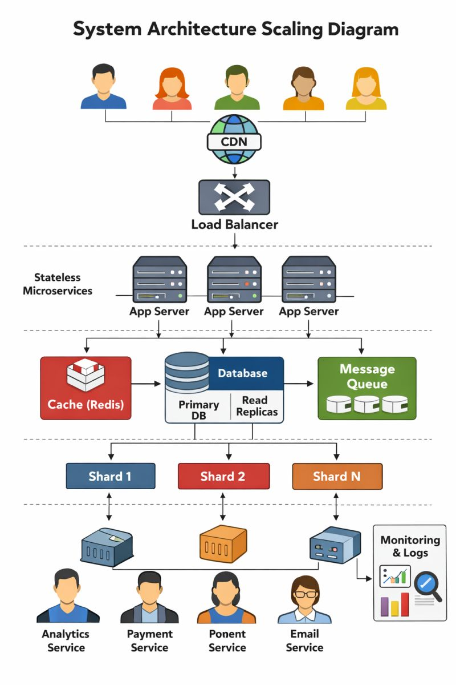

# 🚀 Scaling System Design: 1 → 10M Users



🗂 Basics
----------------------------------------------------------------------
Database indexing  
Environment Separation  
Secrets Management (API keys, Passwords)  
Monitoring  

⚡ Scaling Challenges & Solutions
----------------------------------------------------------------------
**1. 1000 Users → CPU spike, API timeout (200ms → 2s)**  
Solution: Separation of concern (App Server vs Database Server)

**2. Too many DB connections (each call = new connection)**  
Solution: Connection pooling configuration

**3. Vertical Scaling (fast but limited)**  
Problem: At 10k traffic in 3h → server down, orders fail   
Solution: Horizontal Scaling with Load Balancer  

**4. User login → sudden logout**  
Solution: Stateless architecture (JWT + Redis Shared Session Store)

**5. Read requests overload primary DB**
Solution: Read replicas (Primary = Write, Replicas = Read)

**6. Replication lag (50ms delay → stale reads)**
Solution: CAP Theorem trade-offs  
Availability: Fast, possible stale data (Social Feed, Ecommerce)  
Consistency: Accurate, slower (Banking)  
Partition Tolerance: Always required  

**7. Server slows down with repeated queries**
Solution: Cache (Redis → DB query 100ms vs Redis 1ms)

**8. Stale cache data**
Solution: Cache Invalidation  
TTL (Time to Live)  
Write-through  
Cache-aside (popular, flexible)  

**8. Static assets (images, CSS, JS) overload main server**
Solution: CDN (Content Delivery Network)

**9. Order placement → dependent services fail (Email, Fraud, Analytics)**
Solution: Message Queue  
RabbitMQ, ActiveMQ, NATS, Amazon SQS (moderate scale)  
Kafka, Kinesis, Redpanda (high scale, complex)  

**10. Payment retry → duplicate charge risk**
Solution: Idempotency  
Same request → same result  
Use UUID per request  


📌 Key Considerations
----------------------------------------------------------------------
**Traffic type:** Steady vs Spike (e.g., IPL match)  
**Workload:** Read-heavy (Redis, ElasticSearch, Cassandra, S3) vs Write-heavy (NoSQL, Time Series DB, MongoDB)  
**Recovery:**  
```
RTO = Recovery Time Objective (how fast system must be restored)
RPO = Recovery Point Objective (max tolerable data loss age)
```
