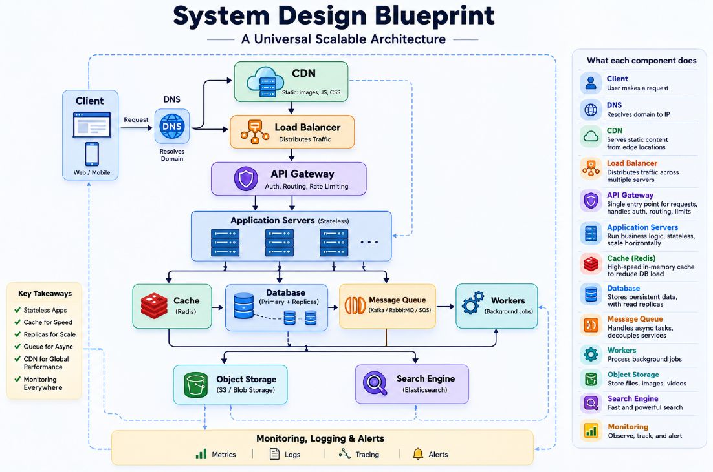

# System Design Blueprint

- 🔴 Client → The web or mobile application that initiates requests. 
- 🔴 DNS → Maps a domain name to the appropriate server. 
- 🔴 CDN → Delivers static assets from edge locations to minimize latency. 
- 🔴 Load Balancer → Distributes traffic across servers for scalability and high availability. 
- 🔴 API Gateway → Manages authentication, routing, and rate limiting. 
- 🔴 Application Servers → Execute stateless business logic. 
- 🔴 Redis Cache → Provides frequently accessed data with low latency while alleviating database load. 
- 🔴 Database + Read Replicas → Stores persistent data and scales read traffic. 
- 🔴 Message Queue → Decouples services and facilitates asynchronous processing. 
- 🔴 Workers → Handle background tasks such as notifications, image processing, and report generation. 
- 🔴 Object Storage (S3) → Stores files, images, videos, and other large objects. 
- 🔴 Search Engine → Enables fast full-text search and filtering. 
- 🔴 Monitoring & Logging → Offers insights into system health, performance, and failures.

## Five building blocks commonly found in scalable systems:
✅ Load Balancer 
✅ Cache 
✅ Database with Read Replicas 
✅ Message Queue 
✅ CDN 

## A straightforward approach to system design: 
1. Begin with the core request flow: Client → Application → Database. 
2. Incorporate a cache to enhance frequent reads. 
3. Add read replicas as read traffic increases. 
4. Introduce a message queue for long-running or asynchronous tasks. 
5. Utilize object storage and a CDN for media delivery. 
6. Implement a search engine for quick discovery.
7. Ensure everything is wrapped with monitoring, logging, and observability.

The objective is not to memorize diagrams but to comprehend the purpose of each component, when it should be introduced, and the trade-offs involved. 

Once these fundamentals are understood, designing systems transforms into a process of making informed engineering decisions rather than merely recalling a set architecture.
