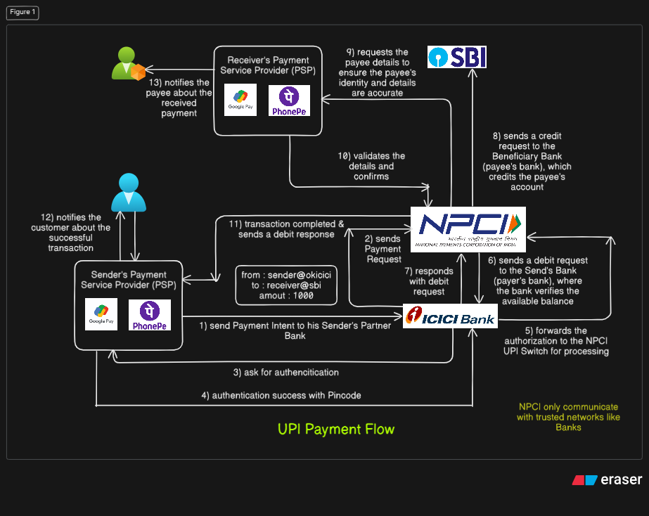

# UPI Payment Works

Step 1: VPA Creation
--------------------------------------------------------------------------------------
- The customer creates a Virtual Payment Address (VPA) using their PSP’s mobile app.
- The request is sent to the VPA Management Service, which verifies and registers the VPA, responding with a success message.

Step 2: Initiating Payment
--------------------------------------------------------------------------------------
- The customer initiates a payment by scanning a QR code using the QR Code Scanner or entering the payee’s VPA.
- The PSP sends a payment request to the NPCI UPI Network to start the process.

Step 3: Payment Authorization
--------------------------------------------------------------------------------------
- The customer authorizes the payment through their PSP app using MPIN, biometric verification, or 2FA.
- The Payer PSP forwards the authorization to the NPCI UPI Switch for processing.

Step 4: Payment Processing
--------------------------------------------------------------------------------------
- The NPCI Switch sends a debit request to the Remitter/Issuer Bank (payer’s bank), where the bank verifies the available balance.
- The Remitter Bank responds to the NPCI with the result of the debit request.
- Upon successful debit, the NPCI sends a credit request to the Beneficiary Bank (payee’s bank), which credits the payee’s account.

Step 5: Payee Details Validation
--------------------------------------------------------------------------------------
- The NPCI Switch requests the payee details from the Payee PSP to ensure the payee’s identity and details are accurate.
- The Payee PSP validates the details and confirms them with the NPCI network.

Step 6: Transaction Completion
--------------------------------------------------------------------------------------
- Once the transaction is completed, the NPCI sends a debit response to the Payer PSP, confirming the transaction status.
- The Payer PSP notifies the customer about the successful transaction.
- Similarly, the Payee PSP notifies the payee about the received payment.

## Unified Payments Interface (UPI) System Design
Designing a Unified Payments Interface (UPI) system involves creating a robust and secure architecture that enables real-time inter-bank transactions. UPI, managed by the National Payments Corporation of India (NPCI), is a platform that allows seamless fund transfers between bank accounts through mobile devices.

**NPCI**

NPCI is the orchestrater which defines the rules and regulations, defines the responsibilities of each entity, manages transaction processing etc. NPCI provides the ecosystem for routing, processing and settlement services to members participating in UPI. NPCI also performs approval of participating PSPs, conducting audits of the PSPs, report generation etc.

**PSP**

PSP (Payment service Provider) is one of the entities in UPI ecosystem whose responsibility is to provide users with a frontend application which can be used for generating the VPAs and carrying out transactions.

## Key Components

**User Interfaces:**

UPI apps are developed by banks and third-party service providers. These mobile applications allow users to initiate and manage transactions, view history, and interact with payment services.

**Central UPI Switch:**

Managed by NPCI, the central switch acts as the intermediary that routes transaction requests between banks, ensuring proper authentication, authorization, and secure fund transfer.

**Banking Systems:**

Each participating bank’s backend system interacts with the UPI switch to process and approve transactions. These systems ensure that money is transferred from the sender’s account to the receiver’s account in real time.

**Third-Party Service Providers:**

Apps developed by non-banking entities that facilitate UPI payments (e.g., Google Pay, PhonePe) are integrated with the NPCI and banks, providing users with easy access to UPI functionalities.

**VPA**

A Virtual Payment Address (VPA) is a unique identifier that helps UPI to track a person’s account. It acts as an ID independent of your bank account number and other details. VPA can be used to make and request payments through a UPI-enabled app. You need not fill in your bank account details repeatedly for making multiple payments.

## Core Functionalities

**User Registration and Authentication:**

Users register on the platform by linking their bank accounts using their mobile numbers. Multi-factor authentication (e.g., mobile number OTP, MPIN) ensures that only authorized users can access their accounts.

**Payment Initiation and Authorization:**

Payments are initiated using a UPI ID or Virtual Payment Address (VPA), a unique identifier linked to the user’s bank account. Users can also transfer funds using the receiver’s mobile number or by scanning QR codes.

**Inter-Bank Transaction Processing:**

Once a payment is authorized, the UPI switch routes the transaction request to the receiver’s bank for approval and settlement. The entire process happens in real time, ensuring seamless and instant transfers.
Real-Time Settlement:

UPI enables immediate settlement of funds between banks, reducing the complexity and delays associated with traditional banking transactions.

## Key Features in the HLD:
- Real-Time Processing: UPI transactions are processed in real time, ensuring instant transfer of funds.
- Scalability: The system is designed to scale horizontally with load balancers and microservices. This allows each component to scale independently as transaction volumes grow.
- Fault Tolerance: By using retry mechanisms and circuit breakers, the system is robust against failures and ensures that transactions are retried in case of temporary errors.
- Asynchronous Messaging: Services like message queues (e.g., RabbitMQ, Kafka) are used for handling notifications, transaction updates, and asynchronous tasks.

## Low Level Architecture Components:

User Interfaces (Mobile Applications, USSD, Web, etc.):
- Mobile App (Customer/Payee): Users interact with UPI through mobile apps, web apps, or USSD (*99#) to initiate transactions, check balances, and manage accounts.
- Internet Banking (Customer/Payee): Web-based access to UPI functionalities, often integrated with internet banking systems.
- Third-Party Applications (e.g., Google Pay, PhonePe): Apps use UPI APIs to allow users to initiate or collect payments.
- USSD Code (*99#): Allows users to perform banking transactions using basic mobile phones without internet access.

## Microservices Layer (Internal Components of UPI System):

**User Service:**
- Handles registration and login requests.
- Manages user details and device information for UPI authentication.
- Endpoints:
    - POST /register: Register a new user with details like mobile number, MPIN.
    - POST /login: Authenticate a user.
- Bank Service:
    - Facilitates linking of bank accounts and retrieves account balances.
    - Endpoints:
      - POST /link-account: Link a bank account to a UPI VPA.
      - GET /balance: Retrieve the balance of a linked account.
- Transaction Service:
    - Manages real-time transaction requests, including money transfers and UPI collect requests.
    - Endpoints:
      - POST /transfer: Transfer money between accounts.
      - POST /collect: Collect payment requests.
      - GET /history: Retrieve transaction history for the user.
- Notification Service:
  - Sends notifications for completed transactions or failed attempts.
  - Endpoints:
    - POST /notify: Notify users of transaction status.
- VPA Management Service:
  - Manages the creation and maintenance of Virtual Payment Addresses (VPAs).
  - Endpoints:
    - POST /create-vpa: Create a new VPA for a user.
    - GET /vpa-details: Fetch VPA details for validation.

**NPCI UPI Switch:**
- Centralized system that acts as a transaction switch.
- Responsible for routing requests between banks, validating transactions, and facilitating real-time settlement.
- Connects with the payer's bank (Remitter/Issuer) and payee’s bank (Beneficiary) for processing.
- Uses secure communication protocols (TLS/SSL, PKI) to ensure transaction safety.

**Banking Systems:**
- Remitter Bank: The payer’s bank that validates user credentials, checks available balance, and processes debit transactions.
- Beneficiary Bank: The payee’s bank that processes credit transactions.
- The bank’s standard interface communicates with the NPCI UPI Switch to settle funds.

**Security Modules:**
- Encryption Service: All transactions are encrypted using secure encryption mechanisms like AES, ensuring sensitive data is protected.
- Authentication Service: Manages authentication using MPIN, biometrics, or 2FA for ensuring that only authorized users can initiate transactions.
- Fraud Detection Module: Monitors transaction patterns to detect suspicious activities and flag fraudulent transactions.

**Central Repository:**
- Stores transaction history, user account details, and audit logs.
- Provides data to the UPI system for transaction validation and status checks.

**External Payment Systems Integration:**
- IMPS (Immediate Payment Service): Used for instant fund transfers within banks.
- AEPS (Aadhaar Enabled Payment System): Allows payments using Aadhaar-linked bank accounts.
- RuPay: A card payment network integrated for UPI-linked transactions.

## Security Measures

**Encryption:**
- All transaction data is encrypted to ensure secure communication between users, banks, and the UPI switch, protecting sensitive information.

**Multi-Factor Authentication (MFA):**
- UPI uses multi-factor authentication to verify user identities. This includes device binding, OTP-based verification, and MPIN for added security, minimizing the risk of fraud and unauthorized transactions.

**Compliance with Regulatory Standards:**
- UPI follows strict regulatory and security standards mandated by the Reserve Bank of India (RBI) to ensure the safety and integrity of the payment ecosystem.

