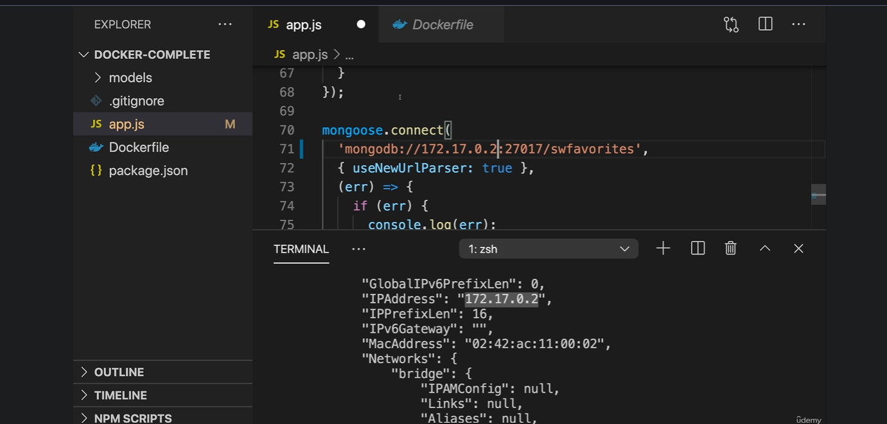

# Docker Container-to-Container Communication
## ⭐ Overview

Dockerized applications are commonly composed of multiple containers, where each container has a focused responsibility.

A typical application might look like:
```
                    ┌──────────────────┐
                    │     INTERNET     │
                    │   External API   │
                    └────────▲─────────┘
                             │
                             │ Container → Internet
                             │
┌─────────────────────────────────────────────────┐
│                 Docker Host                     │
│                                                 │
│  ┌─────────────────┐       ┌─────────────────┐  │
│  │   App Container │──────►│   DB Container  │  │
│  │   Node.js API   │       │ MongoDB / SQL   │  │
│  └────────┬────────┘       └─────────────────┘  │
│           │                                     │
└───────────┼─────────────────────────────────────┘
            │
            ▼
       Host Machine
```
The key idea is:
> **Multiple containers can remain isolated while still communicating with each other through a Docker network.**

---

## ⭐ The first approach: Container IP address

You can inspect the MongoDB container:
```
docker inspect mongodb
```



**Inside the output, Docker exposes something similar to:**
```
NetworkSettings
    IPAddress: 172.17.0.2
```
**The Node.js application can then connect using:**
```
mongodb://172.17.0.2:27017
```
This works because the Node container can communicate directly with the MongoDB container's IP.

### But there is a problem

Container IP addresses are not stable identifiers.

**For example:**
```
MongoDB container
     ↓
172.17.0.2
```
You remove/recreate the container:
```
docker rm mongodb
docker run ...
```
Now it could become:
```
172.17.0.3
```
Your Node.js application would still contain:
```
mongodb://172.17.0.2:27017
```
and communication breaks.

Therefore:
> **❌ Don't build your application around container IP addresses.**

### Why localhost is wrong here

This is one of the most important Docker concepts.

Inside the Node container:
```
localhost
```
means:
```
Node.js container itself
```
It does not mean:
```
MongoDB container
```
So this is wrong:
```
mongodb://localhost:27017
```
unless MongoDB is running inside the same container, which is generally not the architecture you want.

Instead:
```
mongodb://mongodb:27017
```
means:
```
Node container
      ↓
mongodb hostname
      ↓
MongoDB container
```

---

## ⭐ The better solution: Docker Network

Docker networks allow multiple containers to communicate privately using container/service names through Docker's internal DNS, eliminating the need to hard-code dynamic container IP addresses.

Unlike with volumes, for networks, Docker will not automatically create them for you. If you want to run a container using a network, instead you have to create them on your own.

**Displays the usage guide, subcommands, and available options for the command.**
```
docker network --help
```
- docker network disconnect: Disconnects a running container from a specific network.
- docker network inspect: Displays highly detailed configuration information (like IP addresses and connected containers) for one or more networks in JSON format.
- docker network ls: Lists all available networks on your current Docker host.
- docker network prune: Automatically deletes all unused networks to clear out clutter.
- docker network rm: Manually deletes one or more specific networks.

### What is a Docker Network?
A Docker network provides a private communication environment where multiple containers can communicate with each other.

**For example:**
```
                    Docker Host
┌──────────────────────────────────────────────────┐
│                                                  │
│       favorites-net                              │
│                                                  │
│  ┌─────────────────┐       ┌─────────────────┐  │
│  │ Node.js         │       │ MongoDB         │  │
│  │ Container       │──────►│ Container       │  │
│  │                 │       │                 │  │
│  │ favorites       │       │ mongodb         │  │
│  │ :3000           │       │ :27017          │  │
│  └─────────────────┘       └─────────────────┘  │
│                                                  │
└──────────────────────────────────────────────────┘
```
**Both containers belong to:**
```
favorites-net
```
Docker handles the internal networking and DNS resolution.

### Create a Docker Network

**Unlike some Docker resources, you should explicitly create the network:**

```
docker network create favorites-network
```
favorites-network is custom network name. This network gets created and set up by Docker. 
It's a Docker internal network, which you can then use on Docker containers to let them talk to each other. 
All the hard work and heavy lifting is taken care of by Docker here.

**Now inspect all existing networks:**
```
docker network ls
```

**You should see something similar to:**
```
NETWORK ID     NAME            DRIVER
abc123         bridge          bridge
def456         host            host
ghi789         none            null
xyz123         favorites-net   bridge
```

### Start MongoDB on the Network
Run `docker ps -a` to list all containers on your system, regardless of their current state.
Run `docker container prune` to remove all stopped containers.

**Now run MongoDB on that network:**
```
docker run -d --name mongodb --network favorites-network mongo
```
Now any other container can also be part of that network, and if two containers or possibly more containers also are part of the same network, they can talk to each other.

### The only remaining question is how containers can talk to each other

**This IP address here, might be the IP address of the other MongoDB container, but I mentioned that we don't want to hard code it in here. 
MongoDB should automatically resolve it instead,**
```
app.js

mongoose.connect(
  'mongodb://172.17.0.2:27017/swfavorites',
  { useNewUrlParser: true },
  (err) => {
    if (err) {
      console.log(err);
    } else {
      app.listen(3000);
    }
  }
);
```
If two containers are part of the same network, you can just put the other containers name in here. 
So, in my case, MongoDB, because my other container is named MongoDB here.
```
app.js

mongoose.connect(
  'mongodb://mongodb:27017/swfavorites',
  { useNewUrlParser: true },
  (err) => {
    if (err) {
      console.log(err);
    } else {
      app.listen(3000);
    }
  }
);
```
### Container Name Becomes the Hostname

This is the most important concept.

Instead of:
```
mongodb://172.17.0.2:27017
```
use:
```
mongodb://mongodb:27017
```
Why?

Because:
```
mongodb
```
is the name of the MongoDB container.

Docker's internal DNS resolves:
```
mongodb
    ↓
Docker DNS
    ↓
MongoDB container IP
```
Therefore:
```
Node.js
   │
   │ mongodb://mongodb:27017
   ▼
Docker DNS
   │
   ▼
MongoDB
```
You don't need to know the MongoDB container's IP address.

### Start Node.js on the Same Network
```
docker run -d --name favorites --network favorites-network -p 3000:3000 favorites-node
```

Now:
```
                    favorites-net
                         │
              ┌──────────┴──────────┐
              │                     │
        ┌─────▼─────┐         ┌─────▼─────┐
        │ favorites │         │  mongodb   │
        │ Node.js   │────────►│  MongoDB   │
        └───────────┘         └────────────┘
```
Both containers are members of the same network.

As you saw, you don't need to publish any port when running that to be connected to container. When I run the MongoDB container, I don't have the -p option here. 
The reason for that is that the -p option is only required if we plan on connecting to something in that container from our local host machine or from outside the container network.

### Docker does NOT modify your source code
When multiple containers are in the same network, you can actually use the name of a container as a domain, as an address, and Docker will automatically resolve the IP addresses.
> **Docker does not modify or replace your application source code. Docker performs name resolution at runtime when the application tries to communicate with another network endpoint.**

Suppose your Node.js code contains:
```
mongoose.connect('mongodb://mongodb:27017/favorites');
```
Docker does not open your JavaScript file and transform it into:
```
mongoose.connect('mongodb://172.18.0.2:27017/favorites');
```
Your source code remains:
```
mongodb://mongodb:27017/favorites
```

### What actually happens?

**When your application starts a network connection:**
```
Node.js Application
       │
       │ MongoDB request
       ▼
mongodb:27017
       │
       │ DNS resolution
       ▼
Docker's internal DNS
       │
       ▼
172.18.0.2:27017
       │
       ▼
MongoDB Container
```

**Docker's networking layer resolves:**
```
mongodb
```
to the appropriate container IP.

So the resolution happens during network communication, not during source-code processing.

### Docker Runtime network resolution

**Suppose you have:**
```
Node container
    │
    │ mongodb:27017
    ▼
MongoDB container
```

**Your application code:**
```
mongoose.connect(
  'mongodb://mongodb:27017/favorites'
);
```

**Docker effectively handles:**
```
mongodb
   ↓
Docker DNS
   ↓
172.18.0.x
```

**The important distinction is:**
```
❌ Source-code replacement

mongodb
   ↓
replace string
   ↓
172.18.0.2
```
versus:

**✅ Runtime network resolution**
```
mongodb
   ↓
network request
   ↓
Docker DNS
   ↓
172.18.0.2
```

---

## Very Important: -p Is Not Required for Container-to-Container Communication

This is one of the most important Docker networking rules.

For MongoDB:
```
docker run -d \
  --name mongodb \
  --network favorites-net \
  mongo
```
Notice:
```
NO -p
```
You don't need:
```
-p 27017:27017
```

**because the Node.js container communicates with MongoDB inside the Docker network.**
```
Node.js Container
       │
       │ mongodb:27017
       ▼
Docker Network
       │
       ▼
MongoDB Container
       │
       │
       └── Port 27017
```
The port doesn't need to be exposed to your host.

## When Do You Need -p?

You need -p when something outside the Docker network needs to access the container.

For example:
```
docker run -d \
  --name favorites \
  --network favorites-net \
  -p 3000:3000 \
  favorites-node
```
Now your host can access:
```
localhost:3000
      ↓
Node.js container :3000
```
That's why Postman can call:
```
http://localhost:3000/favorites
```
But MongoDB doesn't need to be accessible from your host.

Therefore:
```
Node.js → MongoDB
```
doesn't require -p.

## localhost Is NOT MongoDB

Inside the Node.js container:
```
localhost
```
means:
```
Node.js container itself
```
It does not mean the MongoDB container.

Therefore:
```
❌ mongodb://localhost:27017
```
is wrong for this architecture.

Instead:
```
✅ mongodb://mongodb:27017
```

---

## Three Docker Communication Patterns

You can now organize everything you've learned like this:

| Communication         | Address                | Requirement                    |
| --------------------- | ---------------------- | ------------------------------ |
| Host → Container      | `localhost:3000`       | `-p 3000:3000`                 |
| Container → Host      | `host.docker.internal` | Host service must be reachable |
| Container → Container | `mongodb:27017`        | Same Docker network            |

**Visual summary**
```
1. HOST → CONTAINER

Postman
   │
   │ localhost:3000
   ▼
Node Container


2. CONTAINER → HOST

Node Container
   │
   │ host.docker.internal
   ▼
Host Machine


3. CONTAINER → CONTAINER

Node Container
   │
   │ mongodb:27017
   ▼
MongoDB Container
```

## Default Network vs Custom Network

Docker already provides default networks such as:
```
bridge
host
none
```
But for application architectures, you will commonly create your own network:
```
docker network create favorites-net
```
Then explicitly attach your application containers:
```
docker run --network favorites-net ...
```
This gives you a clean application-specific network boundary.

## Enterprise Mental Model

**The pattern to remember is:**
```
                  Docker Network
                       │
        ┌──────────────┼──────────────┐
        │              │              │
        ▼              ▼              ▼
    Frontend        Backend        Database
    Container       Container      Container
        │              │              │
        │              │              │
        └──────────────┴──────────────┘
               Internal DNS
```
Applications communicate using logical names, not dynamic IP addresses.

**For example:**
```
frontend → backend:8080
backend  → mongodb:27017
backend  → redis:6379
backend  → rabbitmq:5672
```
The actual IP addresses are Docker's concern.

---

## The Core Rules to Remember
```
RULE 1
------
Containers that need to communicate
should be placed on the same Docker network.


RULE 2
------
Use container/service names instead of
hard-coded container IP addresses.


RULE 3
------
Docker provides DNS-based name resolution
inside user-defined networks.


RULE 4
------
-p is for exposing a container to the host/external network.


RULE 5
------
Container-to-container communication on the
same Docker network does NOT normally require -p.


RULE 6
------
localhost inside a container means
that same container — not another container.
```

---

## 1. The Three Docker Networking Scenarios

There are three important communication directions to understand.

| Communication             | Example                      | Typical Address        |
| ------------------------- | ---------------------------- | ---------------------- |
| **Container → Internet**  | Node.js → External API       | External hostname      |
| **Container → Host**      | Node.js → MongoDB on Windows | `host.docker.internal` |
| **Container → Container** | Node.js → MongoDB container  | `mongodb:27017`        |

**Mental model**

### 1. Container → Internet
```
API Container
      │
      └──────────► INTERNET
                       │
                       ▼
                  External API
```

### 2. Container → Host
```
API Container
      │
      │ host.docker.internal
      ▼
Docker Host
      │
      ▼
Host Service
```

### 3. Container → Container
```
API Container
      │
      │ Docker Network
      │ mongodb:27017
      ▼
MongoDB Container
```

## 2. Why Use Multiple Containers?

A fundamental Docker principle is:
> **One container should generally have one main responsibility.**

**Avoid putting everything into one giant container:**
```
┌───────────────────────────┐
│       One Container       │
│                           │
│  Node.js                  │
│  MongoDB                  │
│  Redis                    │
│  Nginx                    │
│                           │
└───────────────────────────┘
```
Instead:
```
┌─────────────────┐
│ Node.js API     │
│ Container       │
└────────┬────────┘
         │
         │ Docker Network
         ▼
┌─────────────────┐
│ MongoDB         │
│ Container       │
└─────────────────┘
```
Potentially:
```
                 ┌──────────────┐
                 │    Redis     │
                 │  Container   │
                 └──────▲───────┘
                        │
                        │
┌──────────────┐        │
│  Node API    │────────┤
│  Container   │        │
└──────┬───────┘        │
       │                │
       ▼                │
┌──────────────┐        │
│   MongoDB    │────────┘
│  Container   │
└──────────────┘
```
This gives each component a focused responsibility.

## 3. Benefits of Multiple Containers

**With separate containers, you can independently:**
- Restart Node.js without restarting MongoDB.
- Update Node.js without rebuilding MongoDB.
- Scale the API separately.
- Replace or upgrade MongoDB independently.
- Configure different CPU and memory limits.
- Monitor components separately.
- Deploy components independently.
- Isolate failures more effectively.
- Use different images for different technologies.

This separation becomes increasingly useful as applications grow.


