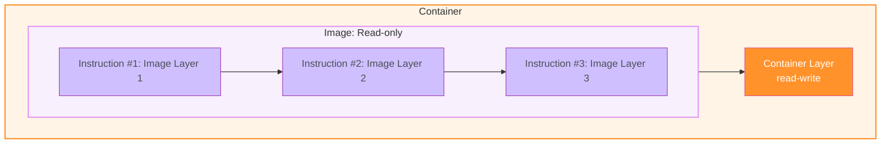
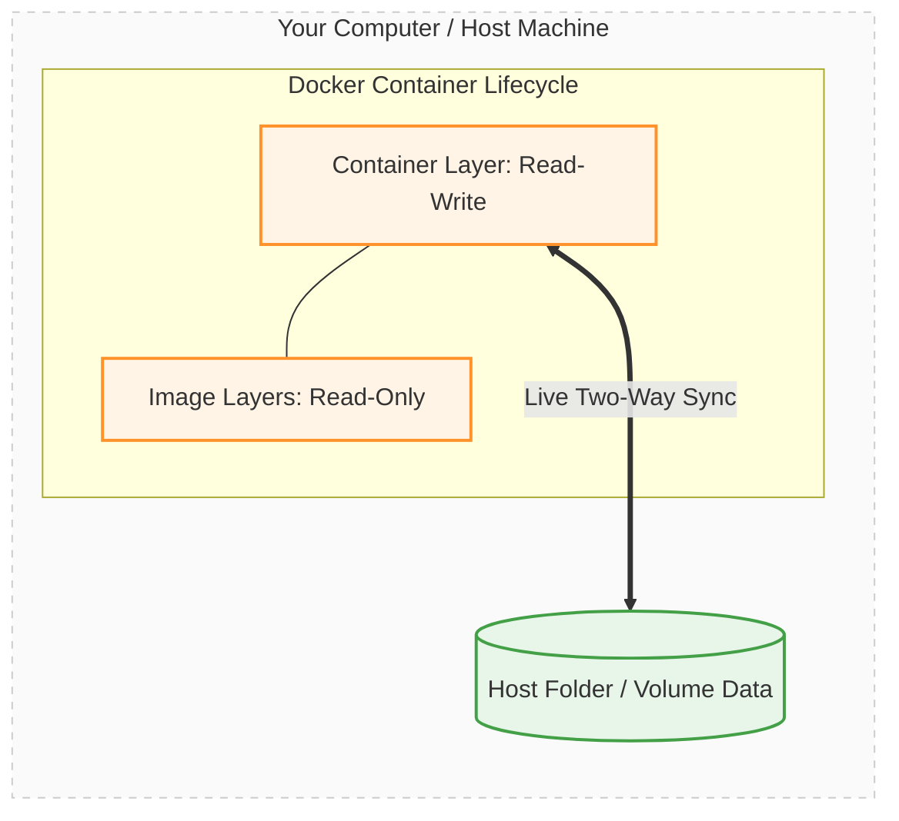

# Docker Persistence & Volumes
**Proejct structure**
```
feedback-node
│
├── feedback/
├── public/
├── pages/
│   ├──example.html
│   ├──feeback.html
├── temp/
└── Temporary files
```
**Dockerfile**
```
FROM node:14

WORKDIR /app

COPY package.json .

RUN npm install

COPY . .

EXPOSE 80

CMD [ "node", "server.js" ]
```

## 1. Build the image
```
docker build -t feedback-node.
```
## 2. Create the container. added --rm to automatically removed the container when it's stopped
```
docker run -p 3000:80 -d --name feedback-app --rm feedback-node
```
#### Understanding COPY . .
Using:
```
COPY . .
```
we copy our local folder into the Docker image, and the container is then based on that image.

This means that the image, and therefore also the container, has its own file system based on our local folder because we copied the files into the image.

However, after the image is built, there is no ongoing connection between our local folder and the image's internal file system.

In other words:
```
Local Folder
     │
     │ COPY . .
     │
     ▼
Docker Image
     │
     ▼
Container
```
The COPY instruction creates a snapshot of our local files at image-build time.

After that:
```
Local Folder  ❌──────❌ Image
                         │
                         ▼
                     Container
```
Changes made to the local folder are not automatically reflected inside the image or the running container.

Similarly, changes made inside the container are not automatically reflected back into the original local folder.

#### Docker Container Isolation

And that's how it's intended to work. The containers should be isolated, after all.

It would be pretty bad if files were created inside of the container and suddenly ended up somewhere on our hard drive, on our host machine.

That's not the idea behind Docker at all.

And that's, by the way, when we changed something in our source code locally on our host machine and the change wasn't reflected in the running Docker container.

Wwe had to rebuild the image to copy in the changed code, create a new image based on it, and then containers running based on that changed image would have our code changes.

For the same reason, we copy code into an image. It then is in a special file system inside of the image. It's locked in; there is no connection to the host folder or to the host machine.

And the container, therefore, also has this isolated file system where only this snapshot was copied in when we built the image — this snapshot of our local folder in this case.

That's all something we covered already, but it is important to always keep this in mind:

> **There is no connection between your container or your image and your local file system.**

You just initialized this image once. You can copy in a snapshot of your local folders and files, but thereafter, that's it.

There is no connection.

And that's why we don't see the text file in the `feedback` folder here on our hosting machine, in this folder.

We only have it available inside of the running Docker container.

There, we can access it. There, it exists.

So, that's how this application works.

Let me go back here.

And if I now submit the same feedback again, so with the same title, I mean, I would actually see this **"Exists already"** page, and the file would not be stored in the `feedback` folder.

If I visit `awesome.txt`, we still see the old text in there, so it was not overwritten.

And it is not overwritten because, in the Node code, I have the logic for creating a temporary file first and only copying it into the final folder, into the `feedback` folder, if the file doesn't exist there yet.

That's the logic I have here in my Node app.

So that's why we're not overwriting existing files.

#### Key Concept

The important Docker concept here is:

```text
Host Machine
┌─────────────────────────────┐
│ Local source code           │
│ feedback/                   │
└──────────────┬──────────────┘
               │
               │ COPY . .
               │
               ▼
       Docker Image
┌─────────────────────────────┐
│ Snapshot of local files     │
│                             │
│ No ongoing connection       │
└──────────────┬──────────────┘
               │
               ▼
          Container
┌─────────────────────────────┐
│ Isolated filesystem         │
│                             │
│ feedback/awesome.txt        │
└─────────────────────────────┘
```

#### Remember

**`COPY` = one-time snapshot**

```text
Local Folder
     │
     │ COPY during build
     ▼
Docker Image
     │
     ▼
Container
```

After the image is built, there is **no live synchronization** between the host folder and the image/container filesystem.

This isolation is intentional and is a fundamental part of Docker's container model.

## 3. Stop the container & run again this container without --rm.
```
docker stop feedback-app
```
```
docker run -p 3000:80 -d --name feedback-app feedback-node
```
Now reload the app and it works. But you'll notice that if I try to view feedbackawesome.txt, this file doesn't exist. It fails to get this file. And of course, this worked a couple of minutes ago.

**Because we deleted the container when we stopped it the first time.**

Now add again feedbackawesome.txt in the newly started container, we can view feedbackawesome.txt.

## 4. Stop the container again
```
docker stop feedback-app
```
And if I now stop this container feedback app again and keep in mind that now feedbackawesome.txt will not be removed because we did not add --rm on the Docker run command.

## 5. Restart the container again
```
docker start feedback-app
```
I restart the container again. You will notice that now if I reload, the feedbackawesome.txt is still there.

> **Now feedbackawesome.txt file is not lost because we didn't write the --rm at container creation 2nd time to remove the conatiner**

## 6. Docker Container Read-Write Layer

And when we then launch a Docker container based on the image, that container is added as an extra thin **read-write layer** on top of this image.

So it basically has access to this image file system, and it's able to read and write there without manipulating the image, though.

But it's able to read and write there.

It has its own copy of that, you could say, managed in a very efficient way, though.

So that makes all sense that we can read and write in there.

But the problem is that the file system is inside of the container.

So if we stop it and restart it, everything is fine because the container never changed.

And just because it was stopped does not mean that its file system is cleared or erased.

If that would be the case, our application code would be gone as well, right?

So that's not happening.

But if we remove a container, then that's different.

Then all the data in the container is cleared because the container overall is cleared and deleted.

And if we then run a new container, even if it's based on the same image, all the data that was created and stored in the previous container is lost because the image is read-only.

So the container, when a file is generated in the container, does not write this file into the image.

It writes it in its own read-write layer, which is added on top.

Therefore, if the container is removed, we're just left with the image, which was never changed.

So when we then start a new container, well, that starts with the same basic file system again, without the changes made by the previous container, which might have been executed on the same image.

And that's a core idea of Docker: **multiple containers based on the same image are totally isolated from each other.**

But here, of course, that's a problem.

It means that we lose this text file if we stop the container and remove it thereafter.

And in many applications, this behavior is a problem because here, for example, we want to keep those feedback text files around even if a container is deleted.

We would have a comparable scenario if we would be dealing with user accounts or with product data submitted by users, or any other kind of data which shouldn't be disappearing suddenly but which instead should survive containers being deleted.

Because in reality, you're going to remove containers quite a bit.

If we change something about our code and we build a new image and start a new container, we will not restart the old container.

We want to use the new container, which uses the latest code snapshot.

So therefore, in that case, we would be losing all the data.

And that's exactly the problem I've been describing over the last minutes.

So now that we know the problem really well, and that we know that containers are able to write data but that this data is lost when the container is removed, now that we know all of that, what is the solution?



### Docker Volumes

Now we know the problem.

What's the solution?

Docker has a built-in feature called **volumes**.

And volumes help us with persisting data and solving the problem I outlined in the last lecture.

Now, how do we utilize volumes in our application?

In this Docker application, for example.

First of all, we have to understand what exactly volumes are and how they work.

**Volumes are folders on your host machine, so not in the container, not in the image, but on your host machine's hard drive, which are mounted, which basically means made available or mapped, into containers.**

So volumes are folders on your host machine, on your computer, which you make Docker aware of and which are then mapped to folders inside of a Docker container.

Now, that might sound a bit like the `COPY` instruction from the Dockerfile.

But keep in mind that this instruction really just takes a snapshot of the path and files you would tell it to copy, and then it copies these files and folders into the image, and that's it.

There's no ongoing relation or connection. It's just a one-time snapshot, which is copied into the image.

With volumes, that's different.

Here, you can really connect a folder inside of the container to a folder outside of the container, on your host machine.

And changes in either folder will be reflected in the other one.

So, if you add a file on your host machine, it is accessible inside of the container, and if the container adds a file in that mapped path, it is available outside of the container, in the host machine as well.

And therefore, because of this mechanism, volumes allow you to persist data.

Volumes persist and continue to exist even if a container is shut down.

That's important.

If you add a volume to a container, the volume will not be removed when a container is removed.

It survives, and therefore, the data in a volume survives.

And containers can both read and write data from and to a volume.

And that's, of course, a powerful feature, which we can use for folders which we want to access from outside our container, and/or simply for data that should survive container shutdown and the removal of a container.

Because if the data is also saved outside of the container, of course, it survives the removal of the container.

### Visualizing How Volumes Bypass the Container Lifecycle
Below is a diagram showing how the Read-Write layer syncs directly out to your host machine's physical hardware:



### Core concept
```
COPY
────
Host Folder
     │
     │  COPY during image build
     ▼
Docker Image
     │
     ▼
Container

One-time snapshot
No ongoing connection
```
```
VOLUME
──────
Host / Docker Volume
         ↕
     Container

Ongoing connection
Read + Write
Persistent data
```

### Most important distinction

| `COPY`                                   | Volume                                                |
| ---------------------------------------- | ----------------------------------------------------- |
| Copies files into the image              | Maps persistent storage to the container              |
| Happens during image build               | Used at container runtime                             |
| One-time snapshot                        | Ongoing connection                                    |
| No synchronization                       | Changes can be reflected between the mapped locations |
| Data becomes part of the image           | Data lives outside the container's writable layer     |
| Doesn't solve container data persistence | Designed for persistent data                          |

> **COPY gives the container a snapshot. A volume gives the container persistent storage that survives container removal.**

## 7. Updated Dockerfile by adding Volume

```dockerfile
FROM node:14

WORKDIR /app

COPY package.json .

RUN npm install

COPY . .

EXPOSE 80

VOLUME [ "/app/feedback" ]

CMD [ "node", "server.js" ]
```

### What Changed?

The important addition is:

```dockerfile
VOLUME [ "/app/feedback" ]
```

This tells Docker that:

> [!WARNING]
> **`/app/feedback` is intended to be used for persistent data and should be treated as a volume mount point.**

The application stores feedback files inside:

```text
/app/feedback
```

Instead of allowing those files to exist only in the container's writable layer, Docker can use a volume for this directory.

### Dockerfile Flow

```text
Dockerfile
    │
    ├── FROM node:14
    │       ↓
    │   Node.js base image
    │
    ├── WORKDIR /app
    │       ↓
    │   Working directory
    │
    ├── COPY package.json .
    │       ↓
    │   Copy dependency definition
    │
    ├── RUN npm install
    │       ↓
    │   Install dependencies
    │
    ├── COPY . .
    │       ↓
    │   Copy application source
    │
    ├── EXPOSE 80
    │       ↓
    │   Document container port
    │
    ├── VOLUME ["/app/feedback"]
    │       ↓
    │   Persistent storage location
    │
    └── CMD ["node", "server.js"]
            ↓
        Start application
```

### Before `VOLUME`

```text
Container
└── /app
    └── feedback
        └── feedbackawesome.txt

Container deleted
        ↓
feedbackawesome.txt ❌
```

### With `VOLUME`

```text
Container
└── /app
    └── feedback
          │
          │ mounted to volume
          ▼
      Docker Volume
          │
          └── feedbackawesome.txt
```

Now:

```text
Container deleted
        ↓
Container writable layer ❌
        ↓
Volume ✅
        ↓
feedbackawesome.txt remains
```

### Important Point

`VOLUME ["/app/feedback"]` **does not mean that `/app/feedback` becomes part of the Docker image's persistent filesystem**.

Instead, it declares that this directory should be treated as a volume mount point.

So the architecture becomes:

```text
             Docker Image
          ┌───────────────┐
          │ Node.js       │
          │ Application   │
          │ Dependencies  │
          └───────┬───────┘
                  │
                  ▼
             Container
          ┌───────────────┐
          │ /app          │
          │               │
          │ /feedback ────┼──────► Volume
          └───────────────┘         │
                                    ▼
                              Persistent Data
```

### Key takeaway

> **`VOLUME ["/app/feedback"]` tells Docker that `/app/feedback` should be backed by a volume so that data stored there can survive the lifecycle of the container.**

### ⚠️ The Catch: This creates an "Anonymous" Volume
Using the VOLUME instruction inside a Dockerfile creates an Anonymous Volume. This has a few major limitations you should be aware of:
- **Docker chooses the host path:** Docker creates a folder with a long, random hash name hidden deep inside its internal storage directory on your computer (e.g., /var/lib/docker/volumes/...). You cannot easily see or access it outside of Docker.
- **It does not survive container removal (docker rm):** If you stop the container, the data stays. However, if you remove the container and start a brand-new one using docker run, a new, empty anonymous volume will be generated. The new container will not automatically hook back up to the old data.

## 8. Docker build again with Anonymous Volume
```dockerfile
FROM node:14

WORKDIR /app

COPY package.json .

RUN npm install

COPY . .

EXPOSE 80

VOLUME [ "/app/feedback" ]

CMD [ "node", "server.js" ]
```
**At first, Stop the container first if it is running & also remove the container**
```
docker stop feedback-app
docker rm feedback-app
```
**Now I give it a special volumes edition, you could say, which is the same image as before, but with this extra volume feature.**
```
docker build -t feedback-node:volumes.
```
This image is created and tagged.

**So, I'll run it in detached mode, I'll publish the internal port 80 to my host port 3000. And we can also add the --rm flect to remove that container if we stop it, because thanks to volumes, this should now not be a problem anymore.**
```
docker run -d -p 3000:80 --rm --name feedback-app feedback-node:volumes
```
**check the container**
```
docker ps
```
Now try to save feedbackawesome.txt file using a feedback form submit. It will work.


**Now stop the container & Rerun the container**
```
docker stop feedback-app
docker run -d -p 3000:80 --rm --name feedback-app feedback-node:volumes
```
no, this feedbackawesome.txt file is still not there.


## 9. Docker Named Volumes resolve the issue

> **Docker actually has three primary data storage mechanisms. While volumes and bind mounts are the two most common ways to persist data onto your host machine's hard drive, there is a third option called tmpfs mounts.**

With Docker, we actually have multiple external data storage mechanisms, if we want to call them like this, two to be precise. And that would be volumes and bind mounts.

Now, we'll worry about bind mounts later. For the moment, we'll focus on volumes. And it looks like they don't fully work as we want them to. Currently, we're using anonymous volumes.

```
VOLUME ["/app/feedback"]
```
With this instruction in the Dockerfile, we add an anonymous volume to this image and data for the containers running based on that image. 

Now, we can also assign named volumes, and that's not something we're doing up to this point.

Now, in both cases, no matter if it's anonymous or named — however that works, we'll see it soon — in both cases, Docker sets up some folder and path on your host machine.
You don't know where. After all, here we only specified a path inside of the container, no path on our host machine. So we don't know where the folder is in which this is mirrored.

> [!WARNING]
> **It's somewhere managed by Docker, but we don't know where. And the only way for us to get access to these volumes is with the help of the docker volume command. And I can show this to you.**

List volumes:
```
docker volume ls
```
If we go back here to the terminal, we can run:
```
docker volume --help
```
to see our options.

And here it's:
```
docker volume ls
```
to list all volumes Docker is currently managing. And we see one volume here. Let me show it to you again.

We see one volume here with a very strange, cryptic name. This name is cryptic because it's an automatically generated name. Because it's an anonymous volume, we didn't assign any name to it. Hence, Docker automatically assigned one.

> [!WARNING]
> **Now here's the gotcha. If we stop our feedback app container, and therefore for we shut down this application, if we inspect our volumes again this anonymous volume is gone. It doesn't exist anymore.**
> **Now as I said, it's managed by Docker. And because it's anonymous, it actually only exists as long as our container exists. And that doesn't help us at all with the problem I outlined, which was that our data disappears if we shut down a container.**

```
docker-complete $ docker volume ls
DRIVER          VOLUME NAME
local           fe6167c8122faf45dacbeff8aa8888912f3d44bd7ab83cdd2ba21a8f40376fd7
docker-complete $ docker stop feedback-app
feedback-app
docker-complete $ docker volume ls
DRIVER          VOLUME NAME
docker-complete $ 
```

### ⚠️ The Anonymous Volume "Gotcha"
If you define a volume inside a Dockerfile like this:
```
dockerfile

VOLUME ["/app/feedback"]
```
1. At Runtime: Docker spins up the container and assigns a random, cryptic name to this volume. You can see it by running docker volume ls.
2. On Shutdown: The moment you stop or remove the container (especially when using the --rm flag), the anonymous volume is permanently deleted.
3. The Problem: It completely fails to solve data persistence issues across container restarts.

### With named volumes, volumes will survive container's shutdown.
The folders on your hard drive will survive. And therefore, if you start new containers thereafter, the volumes will be back, the folder will be back, and all the data stored in that folder will still be available.

So named volumes are great for data which should be persistent, and that's important, which you don't need to edit or view directly, because you don't really have access
to that folder on your host machine.

And we can't create named volumes inside of a Docker file, hence we can remove this instruction actually.
```
VOLUME ["/app/feedback"]
```
Instead we have to create a named volume when we run a container.

**First remove already created docker volume**
```
# 1. Remove the existing image tag
docker rmi feedback-node:volumes

# 2. Rebuild the image with the correct docker command syntax
docker build -t feedback-node:volumes .
```
**I will now once again restart my container based on that image with the Docker run command. now I add another flag, another option to this command. And that's the -V option, which stands for volume, which allows me to add a volume to this container. But unlike in the Docker file, not just an anonymous volume but actually a named volume.**
We still specify the path inside of the container file system which we wanna save. And in our case, that's `app/feedback`. But in front of this path `/app/feedback`, we now provide any name of our choice. For example, feedback. We then add a colon to separate our name from that path.
```
docker run -d -p 3000:80 --rm --name feedback-app -v feedback:/app/feedback feedback-node:volumes
```
It will now store app feedback in a managed volume. So it will create a folder on our hosting machine and connect it to this folder inside of the container, but it will store this volume under a name chosen by us.

> **The key difference to anonymous volumes is that named volumes will not be deleted by Docker when the container shuts down.**
> **Anonymous volumes are deleted because they are recreated whenever a container is created. And therefore, keeping them around after a container was removed makes no sense. Anonymous volumes are closely attached to one specific container.**
> **Named volumes are not attached to a container.**

I can go back to local host 3000, add another feedback or another message here, save this. And of course, visit feedback/awesome.txt. And see that.


Now Docker stop feedback app & this will remove the container because of the -- rm flag at docker run time.
```
docker stop feedback-app
```
**Our volume will still be there. And hence, if we restart a new container with the same volume, our data will still be there. 
So let's first check for the volume with**
```
docker-complete $ docker volume ls
DRIVER          VOLUME NAME
local           feedback
docker-complete $ docker run -d -p 3000:80 --rm --name feedback-app -v feedback:/app/feedback feedback-node:volumes
96532444cc8ec8697ad01d268c319d79297b5b1b5bae1164295e9567f179d7c
docker-complete $ 
```
**Now check localhost:300/feedback/awesome.txt in the browser. it's still there even though the container was stopped.** 


**So finally we managed to persist data with the help of volumes, to be precise, with the help of named volumes.**

> [!NOTE]
> **Anonymous volumes are automatically named by Docker, while named volumes are explicitly named by you. Both are Docker-managed volumes, but named volumes are much easier to identify and reuse.**

> [!NOTE]
> **bunch of unused anonymous volumes - you can clear them via `docker volume rm VOL_NAME` or `docker volume prune`.**

## 10. Docker Bind Mounts can help us with application refresh issue

So now we learn about volumes, and specifically, named volumes are useful.

Anonymous volumes, I would say, their use is not entirely clear yet. I'll come back to those.

But I actually now want to dive into **bind mounts** first, before we have a look at anonymous volumes again.

### The Problem During Development

Here is the kind of problem we might be facing.

Whenever we change anything in our source code, be that in the `server.js` file or in any HTML file here, those changes are **not reflected in the running container unless we rebuild the image**.

I mean, we do have a running application here.

And if I go back to `localhost:3000`, it's actually the feedback HTML file which is loaded.

But if I add "please" here after "your feedback" and save this file, if I reload here, we don't see "please" on the page.

And it should be clear why this is happening.

I emphasized this a lot in the last module and this module:

We only copy a **snapshot** of this folder into the Docker image when it's created.

Subsequent changes to anything in that folder will therefore not be reflected in the image and, therefore, also not in the container.

But of course, during development, if we're using Docker, it would be pretty important to us that such changes are reflected.

Because otherwise, we always have to rebuild the entire image and restart a container whenever we change anything.

And of course, during development, we tend to change a lot.

So restarting everything all the time is pretty cumbersome.

That's where **bind mounts** can help us.

### What Is a Bind Mount?

Bind mounts have some similarities with volumes, but there is one key difference.

Where volumes are managed by Docker and we don't really know where on our host machine's file system they are, for bind mounts, **we do know it**.

Because for bind mounts, we, as a developer, set the path to which the container-internal path should be mapped on our host machine.

So here, we're fully aware of the path on our local machine.

And since that is the case, and containers cannot just write to volumes but also read from there, of course we could put our source code into such a bind mount.

And if we do that, we could then make sure that the container is aware of that, and that the source code is actually not used from that copied-in snapshot, but instead from that bind mount.

So, from that connection to some folder on our host machine.

And therefore, the container would always have access to the **latest code** and not just to the snapshot we put into our image when it was created at the beginning.

### Why Bind Mounts Are Useful

So bind mounts are therefore perfect for **persistent and editable data**.

And that's the difference to normal volumes.

A named volume can help us with persistent data, but editing is not really possible since we don't know where it's stored on our host machine.

### Adding a Bind Mount

So how can we then add such a bind mount?

Again, it's not something we can do from inside the Dockerfile.

Because it's actually specific to a **container which you run**, not to the image.

It doesn't affect the image; it just affects the container.

And therefore, we have to set up a bind mount from inside the terminal when we run our container.

So for that, first of all, I'll stop my currently running container with:

```bash
docker stop feedback-app
```

And once this is stopped, I will rerun it.

I will create a new container in the same way by using `docker run`.

But now I'll add more than one volume — not just this one named volume, but a second volume — simply by again adding `-v`.

So:

```bash
-v
```

And then again, a volume as we added it before.

But now here's the key difference.

The folder to which I want to map it inside of the container is just:

```text
/app
```

So just `/app`, because I'm also copying all my source code into just `/app` here.

I want to control the entire `app` folder now.

But that's the difference.

The name which I now assign in front of the colon is not `app` or anything like that.

Instead, it is a **path to the folder on my host machine** where I have all the code and all the content that should go into this mapped folder.

And this must be an **absolute path**, not a relative one.

### Getting the Absolute Path

You can get such a path here in Visual Studio Code by right-clicking on `server.js`, for example, and choosing **Copy Path**.

Choose that and add it in front of the colon.

Yes, it's quite long, but that is what we need.

Make sure you remove the file at the end, though.

It should just be the path to your **project folder**.

So your project folder name should be the last thing here.

In this case, at least, you can also bind a single file in case you just want to share a single file with a container.

You can bind a file to a file.

But here, when I want to bind to a folder, and therefore I want to bind a complete folder on my host machine to this `app` folder in the container, that's why we're removing the file name at the end.

Because I don't just want to share the file; I want to share the **complete folder**.

### Bind Mount Syntax

The basic syntax is:

```text
-v <host-path>:<container-path>
```

For example:

```bash
-v "C:\path\to\project:/app"
```

You might also want to consider putting this into quotes — this entire statement here.

So your absolute path, the colon, and the map path, to ensure that it doesn't break in case your path includes special characters or whitespace.

Mine doesn't, except for the slashes, which are okay.

But if your path has some blanks in it or anything like that, simply wrap everything here — the entire volume mapping — with quotes.

### Docker File Sharing Permissions

Now, one important note about bind mounts and mounting folders, which you know, into containers:

You should make sure that **Docker has access to the folder** which you're sharing as a bind mount.

And you can do this by accessing the preferences of Docker, by using that running Docker service — this Docker process you started.

And there, make sure that under:

**Resources → File Sharing**

your folder which you are sharing right now is listed here.

It doesn't have to be the full folder, but it should be a **parent folder** of the folder you're sharing.

If you don't have this file-sharing area under Resources, you are most likely on Windows and there you don't have this option; you don't have this area in the settings.

If you are running Docker with the help of the **WSL integration**, you might remember the setup lecture from the first course section.

Well, if that option is missing, that's no problem.

It's missing because you won't have any problems with file sharing anyway, with the setup you're using, so you're fine.

Now, if you should be using **Docker Toolbox** to run Docker, then by default your users folder will be shared, and attached you find a link to an article which explains how you can share other folders as well.

So that is what you should do then, if you are using Docker Toolbox, to ensure that Docker is able to really write to your local machine for the given folder you want to use as a volume in your container.

So the attached link is for you if you are using Docker Toolbox.

In my case, for example, the project I'm sharing is in some subfolder of my users directory.

And that will be accessible by Docker because it's listed here under File Sharing Resources.

Now, if your project is in some folder which is not a subfolder of one of the resources specified here, you should make sure that you add your project folder, or a parent folder of it, even better, as a shareable resource in this list in your Docker preferences.

That's important.

### Starting the Container with the Bind Mount

And if we now hit Enter, this starts the container again.

And now our entire folders here will be mounted as a volume into the `app` folder inside of the container.

Nonetheless, you'll notice if you reload that it crashes.

And if we inspect our running and shutdown containers thereafter, we see this container is nowhere to be found.

And we don't find it in the closed containers, in the stopped containers, because we remove all containers which are shut down.

But this, of course, also means that it seems to shut down immediately.

So something seems to be very wrong here.

### Investigating the Error

And to find out what's wrong, I'll restart it again.

But now without:

```bash
--rm
```

to not automatically remove it when it shuts down.

And thereafter we see it here under stopped containers.

And we can now use:

```bash
docker logs
```

to look into our container, to see the error that was thrown.

And we see that the problem is that it fails to find the module:

```text
Express
```

And that simply means that our Node code doesn't even start executing because an important dependency is missing.

Now, up to this point, it always worked, of course.

And after all, we are installing all dependencies with the `npm install` instruction in the Dockerfile.

So why is it missing now?

Well, that has something to do with our newly added **bind mount**.

With this bind mount that binds our entire project folder to the `app` folder.

And we'll see what's wrong and how to solve the problem in the next lecture.


