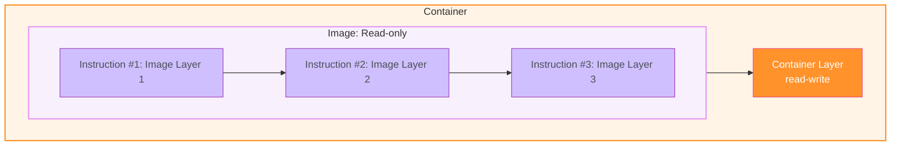
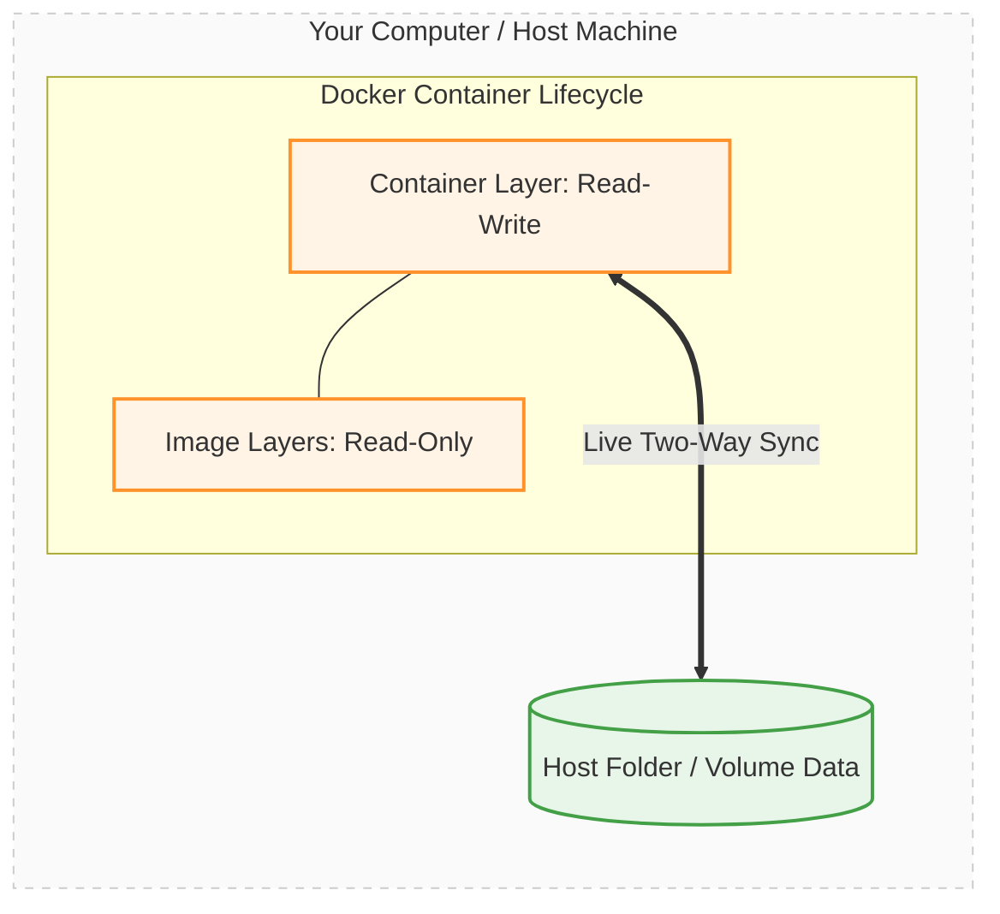

# Docker Persistence & Volumes
**Proejct structure**
```
feedback-node
│
├── feedback/
├── public/
├── pages/
│   ├──example.html
│   ├──feeback.html
├── temp/
└── Temporary files
```
**Dockerfile**
```
FROM node:14

WORKDIR /app

COPY package.json .

RUN npm install

COPY . .

EXPOSE 80

CMD [ "node", "server.js" ]
```

## 1. Build the image
```
docker build -t feedback-node.
```
## 2. Create the container. added --rm to automatically removed the container when it's stopped
```
docker run -p 3000:80 -d --name feedback-app --rm feedback-node
```
#### Understanding COPY . .
Using:
```
COPY . .
```
we copy our local folder into the Docker image, and the container is then based on that image.

This means that the image, and therefore also the container, has its own file system based on our local folder because we copied the files into the image.

However, after the image is built, there is no ongoing connection between our local folder and the image's internal file system.

In other words:
```
Local Folder
     │
     │ COPY . .
     │
     ▼
Docker Image
     │
     ▼
Container
```
The COPY instruction creates a snapshot of our local files at image-build time.

After that:
```
Local Folder  ❌──────❌ Image
                         │
                         ▼
                     Container
```
Changes made to the local folder are not automatically reflected inside the image or the running container.

Similarly, changes made inside the container are not automatically reflected back into the original local folder.

#### Docker Container Isolation

And that's how it's intended to work. The containers should be isolated, after all.

It would be pretty bad if files were created inside of the container and suddenly ended up somewhere on our hard drive, on our host machine.

That's not the idea behind Docker at all.

And that's, by the way, when we changed something in our source code locally on our host machine and the change wasn't reflected in the running Docker container.

Wwe had to rebuild the image to copy in the changed code, create a new image based on it, and then containers running based on that changed image would have our code changes.

For the same reason, we copy code into an image. It then is in a special file system inside of the image. It's locked in; there is no connection to the host folder or to the host machine.

And the container, therefore, also has this isolated file system where only this snapshot was copied in when we built the image — this snapshot of our local folder in this case.

That's all something we covered already, but it is important to always keep this in mind:

> **There is no connection between your container or your image and your local file system.**

You just initialized this image once. You can copy in a snapshot of your local folders and files, but thereafter, that's it.

There is no connection.

And that's why we don't see the text file in the `feedback` folder here on our hosting machine, in this folder.

We only have it available inside of the running Docker container.

There, we can access it. There, it exists.

So, that's how this application works.

Let me go back here.

And if I now submit the same feedback again, so with the same title, I mean, I would actually see this **"Exists already"** page, and the file would not be stored in the `feedback` folder.

If I visit `awesome.txt`, we still see the old text in there, so it was not overwritten.

And it is not overwritten because, in the Node code, I have the logic for creating a temporary file first and only copying it into the final folder, into the `feedback` folder, if the file doesn't exist there yet.

That's the logic I have here in my Node app.

So that's why we're not overwriting existing files.

#### Key Concept

The important Docker concept here is:

```text
Host Machine
┌─────────────────────────────┐
│ Local source code           │
│ feedback/                   │
└──────────────┬──────────────┘
               │
               │ COPY . .
               │
               ▼
       Docker Image
┌─────────────────────────────┐
│ Snapshot of local files     │
│                             │
│ No ongoing connection       │
└──────────────┬──────────────┘
               │
               ▼
          Container
┌─────────────────────────────┐
│ Isolated filesystem         │
│                             │
│ feedback/awesome.txt        │
└─────────────────────────────┘
```

#### Remember

**`COPY` = one-time snapshot**

```text
Local Folder
     │
     │ COPY during build
     ▼
Docker Image
     │
     ▼
Container
```

After the image is built, there is **no live synchronization** between the host folder and the image/container filesystem.

This isolation is intentional and is a fundamental part of Docker's container model.

## Stop the container & run again this container without --rm.
```
docker stop feedback-app
```
```
docker run -p 3000:80 -d --name feedback-app feedback-node
```
Now reload the app and it works. But you'll notice that if I try to view feedbackawesome.txt, this file doesn't exist. It fails to get this file. And of course, this worked a couple of minutes ago.

**Because we deleted the container when we stopped it the first time.**

Now add again feedbackawesome.txt in the newly started container, we can view feedbackawesome.txt.

## Stop the container again
```
docker stop feedback-app
```
And if I now stop this container feedback app again and keep in mind that now feedbackawesome.txt will not be removed because we did not add --rm on the Docker run command.

## Restart the container again
```
docker start feedback-app
```
I restart the container again. You will notice that now if I reload, the feedbackawesome.txt is still there.

> **Now feedbackawesome.txt file is not lost because we didn't write the --rm at container creation 2nd time to remove the conatiner**

## Docker Container Read-Write Layer

And when we then launch a Docker container based on the image, that container is added as an extra thin **read-write layer** on top of this image.

So it basically has access to this image file system, and it's able to read and write there without manipulating the image, though.

But it's able to read and write there.

It has its own copy of that, you could say, managed in a very efficient way, though.

So that makes all sense that we can read and write in there.

But the problem is that the file system is inside of the container.

So if we stop it and restart it, everything is fine because the container never changed.

And just because it was stopped does not mean that its file system is cleared or erased.

If that would be the case, our application code would be gone as well, right?

So that's not happening.

But if we remove a container, then that's different.

Then all the data in the container is cleared because the container overall is cleared and deleted.

And if we then run a new container, even if it's based on the same image, all the data that was created and stored in the previous container is lost because the image is read-only.

So the container, when a file is generated in the container, does not write this file into the image.

It writes it in its own read-write layer, which is added on top.

Therefore, if the container is removed, we're just left with the image, which was never changed.

So when we then start a new container, well, that starts with the same basic file system again, without the changes made by the previous container, which might have been executed on the same image.

And that's a core idea of Docker: **multiple containers based on the same image are totally isolated from each other.**

But here, of course, that's a problem.

It means that we lose this text file if we stop the container and remove it thereafter.

And in many applications, this behavior is a problem because here, for example, we want to keep those feedback text files around even if a container is deleted.

We would have a comparable scenario if we would be dealing with user accounts or with product data submitted by users, or any other kind of data which shouldn't be disappearing suddenly but which instead should survive containers being deleted.

Because in reality, you're going to remove containers quite a bit.

If we change something about our code and we build a new image and start a new container, we will not restart the old container.

We want to use the new container, which uses the latest code snapshot.

So therefore, in that case, we would be losing all the data.

And that's exactly the problem I've been describing over the last minutes.

So now that we know the problem really well, and that we know that containers are able to write data but that this data is lost when the container is removed, now that we know all of that, what is the solution?



## Docker Volumes

Now we know the problem.

What's the solution?

Docker has a built-in feature called **volumes**.

And volumes help us with persisting data and solving the problem I outlined in the last lecture.

Now, how do we utilize volumes in our application?

In this Docker application, for example.

First of all, we have to understand what exactly volumes are and how they work.

Volumes are folders on your host machine, so not in the container, not in the image, but on your host machine's hard drive, which are mounted, which basically means made available or mapped, into containers.

So volumes are folders on your host machine, on your computer, which you make Docker aware of and which are then mapped to folders inside of a Docker container.

Now, that might sound a bit like the `COPY` instruction from the Dockerfile.

But keep in mind that this instruction really just takes a snapshot of the path and files you would tell it to copy, and then it copies these files and folders into the image, and that's it.

There's no ongoing relation or connection. It's just a one-time snapshot, which is copied into the image.

With volumes, that's different.

Here, you can really connect a folder inside of the container to a folder outside of the container, on your host machine.

And changes in either folder will be reflected in the other one.

So, if you add a file on your host machine, it is accessible inside of the container, and if the container adds a file in that mapped path, it is available outside of the container, in the host machine as well.

And therefore, because of this mechanism, volumes allow you to persist data.

Volumes persist and continue to exist even if a container is shut down.

That's important.

If you add a volume to a container, the volume will not be removed when a container is removed.

It survives, and therefore, the data in a volume survives.

And containers can both read and write data from and to a volume.

And that's, of course, a powerful feature, which we can use for folders which we want to access from outside our container, and/or simply for data that should survive container shutdown and the removal of a container.

Because if the data is also saved outside of the container, of course, it survives the removal of the container.

## Visualizing How Volumes Bypass the Container Lifecycle
Below is a diagram showing how the Read-Write layer syncs directly out to your host machine's physical hardware:



## Core concept
```
COPY
────
Host Folder
     │
     │  COPY during image build
     ▼
Docker Image
     │
     ▼
Container

One-time snapshot
No ongoing connection
```
```
VOLUME
──────
Host / Docker Volume
         ↕
     Container

Ongoing connection
Read + Write
Persistent data
```

## Most important distinction

| `COPY`                                   | Volume                                                |
| ---------------------------------------- | ----------------------------------------------------- |
| Copies files into the image              | Maps persistent storage to the container              |
| Happens during image build               | Used at container runtime                             |
| One-time snapshot                        | Ongoing connection                                    |
| No synchronization                       | Changes can be reflected between the mapped locations |
| Data becomes part of the image           | Data lives outside the container's writable layer     |
| Doesn't solve container data persistence | Designed for persistent data                          |

> **COPY gives the container a snapshot. A volume gives the container persistent storage that survives container removal.**

## Updated Dockerfile

```dockerfile
FROM node:14

WORKDIR /app

COPY package.json .

RUN npm install

COPY . .

EXPOSE 80

VOLUME [ "/app/feedback" ]

CMD [ "node", "server.js" ]
```

### What Changed?

The important addition is:

```dockerfile
VOLUME [ "/app/feedback" ]
```

This tells Docker that:

> **`/app/feedback` is intended to be used for persistent data and should be treated as a volume mount point.**

The application stores feedback files inside:

```text
/app/feedback
```

Instead of allowing those files to exist only in the container's writable layer, Docker can use a volume for this directory.

### Dockerfile Flow

```text
Dockerfile
    │
    ├── FROM node:14
    │       ↓
    │   Node.js base image
    │
    ├── WORKDIR /app
    │       ↓
    │   Working directory
    │
    ├── COPY package.json .
    │       ↓
    │   Copy dependency definition
    │
    ├── RUN npm install
    │       ↓
    │   Install dependencies
    │
    ├── COPY . .
    │       ↓
    │   Copy application source
    │
    ├── EXPOSE 80
    │       ↓
    │   Document container port
    │
    ├── VOLUME ["/app/feedback"]
    │       ↓
    │   Persistent storage location
    │
    └── CMD ["node", "server.js"]
            ↓
        Start application
```

### Before `VOLUME`

```text
Container
└── /app
    └── feedback
        └── feedbackawesome.txt

Container deleted
        ↓
feedbackawesome.txt ❌
```

### With `VOLUME`

```text
Container
└── /app
    └── feedback
          │
          │ mounted to volume
          ▼
      Docker Volume
          │
          └── feedbackawesome.txt
```

Now:

```text
Container deleted
        ↓
Container writable layer ❌
        ↓
Volume ✅
        ↓
feedbackawesome.txt remains
```

### Important Point

`VOLUME ["/app/feedback"]` **does not mean that `/app/feedback` becomes part of the Docker image's persistent filesystem**.

Instead, it declares that this directory should be treated as a volume mount point.

So the architecture becomes:

```text
             Docker Image
          ┌───────────────┐
          │ Node.js       │
          │ Application   │
          │ Dependencies  │
          └───────┬───────┘
                  │
                  ▼
             Container
          ┌───────────────┐
          │ /app          │
          │               │
          │ /feedback ────┼──────► Volume
          └───────────────┘         │
                                    ▼
                              Persistent Data
```

### Key takeaway

> **`VOLUME ["/app/feedback"]` tells Docker that `/app/feedback` should be backed by a volume so that data stored there can survive the lifecycle of the container.**


---

## 1. The Problem: Data Inside a Container

A Docker container has its own filesystem.

When a container is created from an image, Docker adds a **thin read-write layer** on top of the image.

```text
Docker Image
┌──────────────────────────────┐
│ Application code             │
│ Dependencies                 │
│ OS files                     │
│ Read-only                    │
└──────────────────────────────┘
              │
              ▼
Container
┌──────────────────────────────┐
│ Read-only image layers       │
├──────────────────────────────┤
│ Read-write container layer   │
│                              │
│ New files                    │
│ Modified files               │
└──────────────────────────────┘
```

The important point is:

> Files created by the application inside the container are written to the container's read-write layer, not back into the Docker image.

---

# 2. What Happens When We Stop a Container?

Stopping a container does **not** delete the container.

For example:

```bash
docker stop feedback-app
```

The container still exists.

Therefore, when we start it again:

```bash
docker start feedback-app
```

the container's filesystem and its read-write layer are still available.

```text
docker stop
     │
     ▼
Container stopped
     │
     ▼
Container still exists
     │
     ▼
Data still exists ✅
```

For example:

```text
feedbackawesome.txt
        │
        ▼
Container stopped
        │
        ▼
Container restarted
        │
        ▼
feedbackawesome.txt still exists ✅
```

---

# 3. What Happens When We Remove a Container?

Removing a container is different from stopping it.

```bash
docker rm feedback-app
```

When the container is removed:

```text
Container
    │
    ├── Read-only image layers
    │
    └── Read-write container layer
                    │
                    ▼
                  Deleted
```

Any data stored only in the container's read-write layer is lost.

For example:

```text
feedbackawesome.txt
        │
        ▼
Container read-write layer
        │
        ▼
docker rm
        │
        ▼
File deleted ❌
```

---

# 4. Why Doesn't the Data Go Into the Image?

This is an important Docker concept.

Suppose we have:

```text
Docker Image
      │
      ▼
Container
      │
      └── feedbackawesome.txt
```

The file created by the container does **not** modify the image.

The image remains unchanged and read-only.

Therefore:

```text
Image
┌─────────────────────┐
│ Application         │
│ Dependencies        │
│ Original files      │
└─────────────────────┘
          │
          │ creates
          ▼
Container
┌─────────────────────┐
│ Original image      │
│ +                   │
│ feedbackawesome.txt │
└─────────────────────┘
```

If the container is removed:

```text
Container ❌
     │
     ▼
feedbackawesome.txt ❌

Image ✅
     │
     ▼
Original state remains
```

When a new container is created from the same image, it starts from the original image state.

---

# 5. `--rm` Makes the Behavior Automatic

When you run:

```bash
docker run --rm ...
```

Docker automatically removes the container when it stops.

Therefore:

```text
docker run --rm
       │
       ▼
Container created
       │
       ▼
Application runs
       │
       ▼
docker stop
       │
       ▼
Container automatically removed
       │
       ▼
Container data ❌
```

Because the previous container has been deleted, you need to run `docker run` again to create a new container.

---

# 6. Why Is This a Problem in Real Applications?

In real applications, data often needs to survive container deletion.

Examples include:

* User accounts
* Product data
* Feedback files
* Uploaded files
* Application-generated data
* Business data
* Database data

For example:

```text
User submits feedback
        │
        ▼
feedbackawesome.txt
        │
        ▼
Container
        │
        ▼
Container deleted ❌
        │
        ▼
Feedback lost ❌
```

This is obviously undesirable.

---

# 7. Containers Are Disposable

One of the core ideas of Docker is that containers are often treated as **replaceable/disposable**.

For example:

```text
Old application code
        │
        ▼
Build new Docker image
        │
        ▼
Start new container
        │
        ▼
Use latest code
```

We don't necessarily want to keep modifying or restarting the old container.

Instead:

```text
Old Container
     ❌
     
New Image
     │
     ▼
New Container
     ✅
```

Therefore, important application data should not depend on the lifecycle of a particular container.

---

# 8. The Solution: Docker Volumes

Docker provides a built-in feature called:

> **Volumes**

Volumes solve the problem of persistent data.

A volume provides storage that exists outside the container's writable layer.

Conceptually:

```text
Container
┌─────────────────────┐
│ Application         │
│                     │
│ /app/feedback       │
└──────────┬──────────┘
           │
           │ mounted
           ▼
┌─────────────────────┐
│ Docker Volume       │
│                     │
│ feedback files      │
│ persistent data     │
└─────────────────────┘
```

---

# 9. What Is a Volume?

A volume is persistent storage managed by Docker and made available to a container through a mount.

The important concept is:

```text
Container
    │
    │ mount
    ▼
Volume
```

The application inside the container can read and write data through the mounted path.

---

# 10. How Volumes Solve the Problem

Without a volume:

```text
Container
    │
    └── feedbackawesome.txt

Container removed
    │
    ▼
File lost ❌
```

With a volume:

```text
Container
    │
    │ writes
    ▼
Volume
    │
    │ survives
    ▼
Container removed
    │
    ▼
Volume remains ✅
```

Then a new container can use the same volume:

```text
Old Container
      ❌
      │
      │ removed
      ▼
Volume
      │
      │ remains
      ▼
New Container
      ✅
```

The data is therefore available to the new container.

---

# 11. Volume = Ongoing Connection

A Dockerfile `COPY` instruction and a volume are fundamentally different.

## `COPY`

Example:

```dockerfile
COPY . /app
```

Conceptually:

```text
Host
 │
 │ one-time copy
 ▼
Image
```

It creates a snapshot during image building.

There is no ongoing connection between the original host files and the files copied into the image.

---

## Volume

A volume creates a persistent storage relationship:

```text
Container
    ↕
Volume
```

Data can be read and written through the mounted path.

---

# 12. `COPY` vs Volume

| Feature                            | `COPY`                           | Volume                      |
| ---------------------------------- | -------------------------------- | --------------------------- |
| Used during                        | Image build                      | Container runtime           |
| Copies data                        | Yes                              | No                          |
| Ongoing connection                 | ❌ No                             | ✅ Yes                       |
| Persistent after container removal | Image content remains            | Volume remains              |
| Container can write to it          | Only container layer             | ✅ Yes                       |
| Purpose                            | Put application files into image | Persist/manage runtime data |

## Updated Dockerfile

```dockerfile
FROM node:14

WORKDIR /app

COPY package.json .

RUN npm install

COPY . .

EXPOSE 80

VOLUME [ "/app/feedback" ]

CMD [ "node", "server.js" ]
```

### What Changed?

The important addition is:

```dockerfile
VOLUME [ "/app/feedback" ]
```

This tells Docker that:

> **`/app/feedback` is intended to be used for persistent data and should be treated as a volume mount point.**

The application stores feedback files inside:

```text
/app/feedback
```

Instead of allowing those files to exist only in the container's writable layer, Docker can use a volume for this directory.

### Dockerfile Flow

```text
Dockerfile
    │
    ├── FROM node:14
    │       ↓
    │   Node.js base image
    │
    ├── WORKDIR /app
    │       ↓
    │   Working directory
    │
    ├── COPY package.json .
    │       ↓
    │   Copy dependency definition
    │
    ├── RUN npm install
    │       ↓
    │   Install dependencies
    │
    ├── COPY . .
    │       ↓
    │   Copy application source
    │
    ├── EXPOSE 80
    │       ↓
    │   Document container port
    │
    ├── VOLUME ["/app/feedback"]
    │       ↓
    │   Persistent storage location
    │
    └── CMD ["node", "server.js"]
            ↓
        Start application
```

### Before `VOLUME`

```text
Container
└── /app
    └── feedback
        └── feedbackawesome.txt

Container deleted
        ↓
feedbackawesome.txt ❌
```

### With `VOLUME`

```text
Container
└── /app
    └── feedback
          │
          │ mounted to volume
          ▼
      Docker Volume
          │
          └── feedbackawesome.txt
```

Now:

```text
Container deleted
        ↓
Container writable layer ❌
        ↓
Volume ✅
        ↓
feedbackawesome.txt remains
```

### Important Point

`VOLUME ["/app/feedback"]` **does not mean that `/app/feedback` becomes part of the Docker image's persistent filesystem**.

Instead, it declares that this directory should be treated as a volume mount point.

So the architecture becomes:

```text
             Docker Image
          ┌───────────────┐
          │ Node.js       │
          │ Application   │
          │ Dependencies  │
          └───────┬───────┘
                  │
                  ▼
             Container
          ┌───────────────┐
          │ /app          │
          │               │
          │ /feedback ────┼──────► Volume
          └───────────────┘         │
                                    ▼
                              Persistent Data
```

### Key takeaway

> **`VOLUME ["/app/feedback"]` tells Docker that `/app/feedback` should be backed by a volume so that data stored there can survive the lifecycle of the container.**

## ⚙️ How VOLUME [ "/app/feedback" ] Works
By adding this instruction to your Dockerfile, you are telling Docker: "**Whenever a container is started from this image, map the internal directory /app/feedback to a folder managed by Docker on the host machine.**"
- **The Benefit:** Any feedback data generated by your Node.js application while running inside the container will now be automatically written to your host machine's hard drive instead of the ephemeral container layer.
- **The Result:** If the container stops or crashes, the data inside /app/feedback is safe and persists.


---

# 13. Bidirectional Data Flow

One powerful characteristic of a mounted volume is that data can flow in both directions.

```text
Host / Volume
      ↕
Container
```

For example:

### Container → Volume

```text
Container creates file
        │
        ▼
Volume
        │
        ▼
File persists
```

### Volume → Container

```text
Volume contains file
        │
        ▼
Container mounts volume
        │
        ▼
Application can access file
```

Therefore:

> Containers can read and write data from and to a volume.

---

# 14. Persistence

The most important property of a volume is **persistence**.

```text
Container running
       │
       ▼
Data written to volume
       │
       ▼
Container stopped
       │
       ▼
Volume remains ✅
       │
       ▼
Container removed
       │
       ▼
Volume remains ✅
       │
       ▼
New container
       │
       ▼
Same volume mounted
       │
       ▼
Data available ✅
```

---

# 15. Docker Storage Mental Model

Remember these three layers:

```text
                 Docker
                   │
        ┌──────────┴──────────┐
        │                     │
      IMAGE                CONTAINER
   Read-only             Read + Write
                              │
                              │ temporary
                              ▼
                       Container Layer
                              │
                              │
                              X
                        Deleted with
                         container


Persistent storage
        │
        ▼
      VOLUME
        │
        │ survives
        ▼
Container deletion
```

---

# 16. Image vs Container vs Volume

| Component       | Purpose              |          Writable? | Deleted with container? |
| --------------- | -------------------- | -----------------: | ----------------------: |
| Docker Image    | Application template | Normally read-only |                    ❌ No |
| Container layer | Runtime changes      |              ✅ Yes |                   ✅ Yes |
| Volume          | Persistent data      |              ✅ Yes |                    ❌ No |

---

# 17. The Most Important Rule

Remember this:

> **Containers are disposable; persistent data should live outside the container's writable layer.**

Or even simpler:

```text
Application code → Image
Runtime changes → Container
Persistent data → Volume
```

---

# 18. Enterprise Application Pattern

A typical application should separate application code from persistent data.

```text
                    Docker
                      │
             ┌────────┴────────┐
             │                 │
        Application         Persistent
           Code                Data
             │                 │
             ▼                 ▼
          Image             Volume /
                              Database /
                           Object Storage
```

For example:

```text
Frontend / API
      │
      ▼
Container
      │
      ├── Application code
      ├── Runtime state
      └── Temporary files
               
      │
      ▼
Persistent Storage
      │
      ├── Database
      ├── Uploaded files
      └── Business data
```

The important architectural principle is:

> **Do not couple important business data to the lifecycle of a container.**

---

# 19. Interview Questions

## Q1. What happens to data when a container is stopped?

The data in the container's writable layer remains because the container still exists.

---

## Q2. What happens when the container is removed?

The container's writable layer is deleted, so data stored only there is lost.

---

## Q3. Does modifying a container modify the Docker image?

No.

The image remains unchanged and read-only. Changes are stored in the container's writable layer.

---

## Q4. Why do we need Docker volumes?

Volumes provide persistent storage so that important data can survive container shutdown and container removal.

---

## Q5. Does `docker stop` delete a container?

No.

`docker stop` only stops it.

```bash
docker stop feedback-app
```

The container still exists.

---

## Q6. Does `docker rm` delete a container?

Yes.

```bash
docker rm feedback-app
```

The container and its writable layer are removed.

---

## Q7. What does `--rm` do?

It automatically removes the container when the container stops.

```bash
docker run --rm ...
```

---

## Q8. Does a volume get deleted when its container is deleted?

Normally, no.

The volume has an independent lifecycle from the container.

---

## Q9. What is the difference between `COPY` and a volume?

`COPY` copies files into the image during image building.

A volume provides persistent storage that can be mounted into a running container.

---

# 20. Final Mental Model

```text
                 DOCKER IMAGE
              ┌───────────────┐
              │ App code      │
              │ Dependencies  │
              │ Libraries     │
              └───────┬───────┘
                      │
                      ▼
                 CONTAINER
              ┌───────────────┐
              │ Image layers  │
              ├───────────────┤
              │ Writable      │
              │ layer         │
              └───────┬───────┘
                      │
                temporary data
                      │
                      X
             lost when container
                  is removed


              PERSISTENT DATA
                      │
                      ▼
                   VOLUME
              ┌───────────────┐
              │ Persistent    │
              │ data          │
              └───────┬───────┘
                      │
                      │ survives
                      ▼
               Container removal
```

### One-line summary

**Image = template, Container = running isolated instance, Container writable layer = temporary data, Volume = persistent data.**
