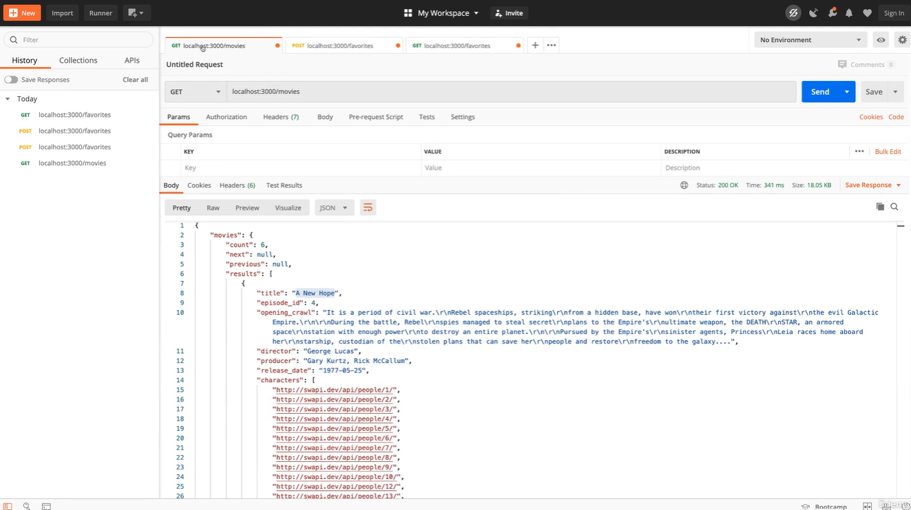

# Docker Networking-Cross Container Communication

## Container to WWW Communication (Container → Internet)
### 1. The architecture

Think of the flow like this:
```
┌───────────────────────────────┐
│       Docker Container        │
│                               │
│  ┌─────────────────────────┐  │
│  │ Node / Python / PHP App  │  │
│  └────────────┬────────────┘  │
└───────────────┼───────────────┘
                │
                │ HTTP GET
                ▼
        ┌──────────────────┐
        │   Internet       │
        │                  │
        │  swapi.dev       │
        │  Star Wars API   │
        └──────────────────┘
```
The important point is:
> **The application is running inside the container, but it needs to communicate with something outside the container.**

### Source Code Example
```
const express = require('express');
const bodyParser = require('body-parser');
const axios = require('axios').default;
const mongoose = require('mongoose');

const app = express();

app.use(bodyParser.json());

app.get('/movies', async (req, res) => {
  try {
    const response = await axios.get('https://swapi.dev/api/films');
    res.status(200).json({ movies: response.data });
  } catch (error) {
    res.status(500).json({ message: 'Something went wrong.' });
  }
});

app.listen(3000);

```
```
FROM node

WORKDIR /app

COPY package.json .

RUN npm install

COPY . .

EXPOSE 3000

CMD ["node", "app.js"]
```


### 2. What happens in your example?

**Your Node.js application uses Axios:**
```
axios.get('https://swapi.dev/api/films')
```

**The flow is:**
```
Node.js Application
       ↓
     Axios
       ↓
 HTTP GET Request
       ↓
Docker Container
       ↓
Docker Networking
       ↓
Internet
       ↓
swapi.dev
       ↓
HTTP Response
       ↓
Node.js Application
```
**The response could contain:**
```
{
  "title": "A New Hope",
  "episode_id": 4,
  "director": "George Lucas"
}
```
So Docker doesn't prevent your application from accessing the Internet.

### 3. Very important distinction

There are actually three different networking scenarios you'll encounter in Docker:

| Scenario                  | Example                  | Direction |
| ------------------------- | ------------------------ | --------- |
| **Container → Internet**  | Node → `swapi.dev`       | Outbound  |
| **Container → Container** | Angular → Node API       | Internal  |
| **Host → Container**      | Browser → Node container | Inbound   |

Your current lesson is focusing on the first one.
```
             INTERNET
                ▲
                │
                │ HTTP
                │
        ┌───────┴───────┐
        │   Container   │
        │               │
        │ Node.js App   │
        └───────────────┘
```

### 4. Why this matters in real applications

Imagine an enterprise application:
```
                    Internet
                       │
          ┌────────────┴────────────┐
          │                         │
     Payment API               Google API
          │                         │
          └────────────┬────────────┘
                       │
                Docker Container
                       │
                 Backend API
```
Your backend might need to communicate with:
- Payment providers
- OAuth/OIDC providers
- External REST APIs
- Email providers
- Maps APIs
- GitHub APIs
- Cloud services
- Third-party databases/services

All of these are examples of outbound container networking.

### 5. One important Docker concept

**A container has its own network namespace.**

That means the application inside the container does not simply behave as though it is running directly on your Windows host.

**Docker provides networking infrastructure that allows:**
```
Container
   ↓
Docker network
   ↓
Host/network gateway
   ↓
Internet
```
Docker handles the necessary networking/NAT so that an ordinary application can generally make outbound requests.

Therefore, your Node code usually doesn't need special Docker-specific code.

**You still write:**
```
axios.get('https://swapi.dev/api/films');
```
**not something like:**
```
axios.get('docker://internet/swapi.dev');
```
Docker handles the networking underneath.

### 6. The key takeaway

**A container is isolated, but it is not disconnected. It can communicate outside itself.**

**The important networking questions we'll eventually answer are:**
```
1. Container → Internet
   How does my container access external APIs?

2. Container → Container
   How does my backend talk to PostgreSQL/Redis/Qdrant/another API container?

3. Host → Container
   How does my browser/Postman access an application running inside Docker?

4. Container → Host
   How does a container communicate with something running directly on my machine?
```
For your current example, the answer is simply:

> **Node application inside Docker → Docker networking → Internet → Star Wars API → response back to container.**

---

## Container to Local Host Machine Communication (Container → Host Machine)
### 1. The architecture

**Previously:**
```
Docker Container
   │
   │ HTTP request
   ▼
Internet
   │
   ▼
Star Wars API
```
**Now we have:**
```
┌───────────────────────────────┐
│       Docker Container        │
│                               │
│   Node.js Application         │
│          │                    │
│          │ MongoDB request    │
└──────────┼────────────────────┘
           │
           │ Docker networking
           ▼
┌───────────────────────────────┐
│         Host Machine          │
│                               │
│       MongoDB Server          │
│       (NOT in Docker)         │
└───────────────────────────────┘
```
The important difference is that MongoDB is running directly on your host machine, not inside another container.

### 2. Your application now has two external communication paths

Your Node.js application may do both:
```
                    Node.js
                  Application
                 /           \
                /             \
               ▼               ▼
        Star Wars API       MongoDB
        Internet            Host Machine
```
So:

**Path 1 — Container → Internet**
```
Node.js
   ↓
Docker Container
   ↓
Internet
   ↓
swapi.dev
```
**Path 2 — Container → Host**
```
Node.js
   ↓
Docker Container
   ↓
Host Machine
   ↓
MongoDB
```

### 3. Why is Container → Host different?

This is where Docker networking becomes interesting.

**Suppose MongoDB is running on your Windows machine:**
```
Windows Host
└── MongoDB :27017
```
**Your Node application is running here:**
```
Docker Container
└── Node.js :3000
```
**Inside the container, localhost means:**
```
the container itself
```
It does not mean your Windows host.

This is a very important Docker concept.

**If your Node application tries:**
```
mongoose.connect(
  'mongodb://localhost:27017/swfavorites',
  { useNewUrlParser: true },
  (err) => {
    if (err) {
      console.log(err);
    } else {
      app.listen(3000);
    }
  }
);
```

**while running inside the container, Docker interprets localhost as:**
```
Container
   └── localhost
```
not:
```
Windows Host
   └── MongoDB
```
So the application won't automatically reach the MongoDB running on your host.

### 4. Think of localhost carefully

**This is one of the most important rules to remember:**
```
┌──────────────────────┐
│      HOST MACHINE    │
│                      │
│ localhost            │
│    ↓                 │
│ Host itself          │
└──────────────────────┘


┌──────────────────────┐
│    DOCKER CONTAINER  │
│                      │
│ localhost            │
│    ↓                 │
│ This container       │
└──────────────────────┘
```
Therefore:
> **localhost is relative to the machine/network namespace where the application is running.**

### 5. Real enterprise example

**Imagine you have:**
```
Windows Developer Machine
│
├── MongoDB
│   └── :27017
│
└── Docker
    └── Node.js API
```
**The Node API needs to access MongoDB:**
```
Node Container
      │
      │ MongoDB protocol
      ▼
Docker networking
      │
      ▼
Host Machine
      │
      ▼
MongoDB :27017
```
**This is completely different from:**
```
Node Container
      │
      ▼
Another Docker Container
      │
      ▼
MongoDB Container
```
The latter is Container → Container networking, which is the next important Docker networking concept.

### Source Code Example
```
const express = require('express');
const bodyParser = require('body-parser');
const axios = require('axios').default;
const mongoose = require('mongoose');

const app = express();

app.use(bodyParser.json());

app.get('/movies', async (req, res) => {
  try {
    const response = await axios.get('https://swapi.dev/api/films');
    res.status(200).json({ movies: response.data });
  } catch (error) {
    res.status(500).json({ message: 'Something went wrong.' });
  }
});

mongoose.connect(
  'mongodb://host.docker.internal:27017/swfavorites',
  { useNewUrlParser: true },
  (err) => {
    if (err) {
      console.log(err);
    } else {
      app.listen(3000);
    }
  }
);

```

### 6. Keep these three scenarios in your notes
| Scenario                  | Example                  | Important concept                         |
| ------------------------- | ------------------------ | ----------------------------------------- |
| **Container → Internet**  | Node → SWAPI             | External network access                   |
| **Container → Host**      | Node → Host MongoDB      | `localhost` ≠ host                        |
| **Container → Container** | Node → MongoDB container | Docker networks + service/container names |

**So your current lesson is building toward a very important mental model:**
```
                    ┌───────────────┐
                    │   Internet    │
                    │   SWAPI       │
                    └───────▲───────┘
                            │
                            │
┌───────────────────────────┼────────────────────┐
│                    Docker Container            │
│                                                │
│                 Node.js App                    │
│                    /   \                       │
└───────────────────┼─────┼──────────────────────┘
                    │     │
             Container    │
             → Host       │
                    │     │
                    ▼     ▼
              Host Mongo   Other
              Database     Containers
```
> **The big lesson: Docker isolation doesn't mean the container cannot communicate externally. Docker networking determines how the container reaches the Internet, the host, and other containers.**

---

## Container to Container Communication (Container → Container)
### 1. The three scenarios
```
                    ┌──────────────────┐
                    │     INTERNET     │
                    │   External API   │
                    └────────▲─────────┘
                             │
                             │
                    Container → Internet
                             │
                             ▼
┌─────────────────────────────────────────────────┐
│                 Docker Host                     │
│                                                 │
│  ┌─────────────────┐       ┌─────────────────┐  │
│  │   App Container │──────►│  DB Container   │  │
│  │   Node.js API   │       │  MongoDB / SQL  │  │
│  └────────┬────────┘       └─────────────────┘  │
│           │                                     │
└───────────┼─────────────────────────────────────┘
            │
            ▼
       Host Machine
```
So:
| Communication             | Example                                       |
| ------------------------- | --------------------------------------------- |
| **Container → Internet**  | Node → SWAPI                                  |
| **Container → Host**      | Node container → MongoDB installed on Windows |
| **Container → Container** | Node container → MongoDB container            |

### 2. Why use multiple containers?

This is a very important Docker principle:

One container should generally have one main responsibility.

**For example, don't create one giant container containing:**
```
Node.js
+
MongoDB
+
Redis
+
Nginx
```
**Instead:**
```
┌─────────────────────┐
│   Node API          │
│   Container         │
└──────────┬──────────┘
           │
           │ network
           ▼
┌─────────────────────┐
│   MongoDB            │
│   Container          │
└─────────────────────┘
```
**And potentially:**
```
                    ┌──────────────┐
                    │    Redis     │
                    │  Container   │
                    └──────▲───────┘
                           │
                           │
┌──────────────┐           │
│  Node API    │───────────┤
│  Container   │           │
└──────┬───────┘           │
       │                   │
       ▼                   │
┌──────────────┐           │
│   MongoDB    │───────────┘
│  Container   │
└──────────────┘
```
Each container has a focused responsibility.

### 3. Why is this better?

**Suppose your application has:**
```
Node.js API
MongoDB
Redis
```
**If everything is inside one container:**
```
One Container
├── Node.js
├── MongoDB
└── Redis
```
you tightly couple everything together.

Instead:
```
Container 1 → Node.js
Container 2 → MongoDB
Container 3 → Redis
```
**you can independently:**
- restart Node without restarting MongoDB
- update Node without rebuilding MongoDB
- scale Node separately
- replace MongoDB independently
- configure different resource limits
- monitor each component separately
- deploy components independently

This becomes especially important in enterprise applications.

### 4. But now we have a networking problem

Suppose:
```
Node container
      │
      │ needs MongoDB
      ▼
MongoDB container
```
**How does Node know where MongoDB is?**

You shouldn't rely on:
```
localhost:27017
```
because:
```
localhost
   ↓
Node container itself
```
MongoDB is in a different container.

Docker therefore needs to provide a networking mechanism that allows containers to discover and communicate with each other.

That's where Docker networks come in.

**Conceptually:**
```
┌─────────────────────────────────────┐
│          Docker Network             │
│                                     │
│  ┌──────────────┐   ┌────────────┐ │
│  │ Node API     │──►│ MongoDB    │ │
│  │ Container    │   │ Container  │ │
│  └──────────────┘   └────────────┘ │
│                                     │
└─────────────────────────────────────┘
```
And Docker can provide container/service name-based communication, so instead of thinking:
```
MongoDB's changing IP address
```
**you can conceptually use:**
```
mongodb:27017
```
where mongodb is the name/addressable identity of the MongoDB service on that Docker network.

### 5. This is where Docker Compose becomes very important

Once you have multiple containers, manually running:
```
docker run ...
docker run ...
docker run ...
```
becomes inconvenient.

For example:
```
Node
MongoDB
Redis
```
Docker Compose lets you define the whole application:

**services:**
```
  api:
    ...
    
  mongodb:
    ...

  redis:
    ...
```
Then Docker can create the required network and connect the services.

**Your architecture becomes:**
```
              Docker Compose
                    │
       ┌────────────┼────────────┐
       ▼            ▼            ▼
     API          MongoDB       Redis
   Container     Container     Container
       │            ▲            ▲
       └────────────┴────────────┘
              Docker Network
```

**The key mental model**

You have now learned the three fundamental Docker networking directions:
```
1. Container ──────────► Internet
                         │
                         └── External API


2. Container ──────────► Host
                         │
                         └── Host MongoDB


3. Container ──────────► Container
                         │
                         └── MongoDB/Redis/API container
```
And the third scenario is particularly important because real Dockerized applications are commonly multi-container applications.

---

## 


