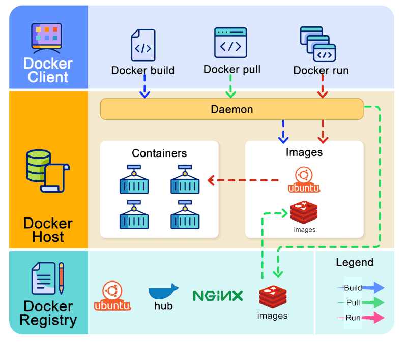

## 🐳 What is Docker (in simple words)?
Ans. Docker lets you run applications inside containers.

Think of a container as:
```
📦 A lightweight box that has everything an app needs
(OS libs + runtime + config + app)
```
So instead of:
  -  “It works on my machine 🤷‍♂️”
  -  Installing PostgreSQL manually
  -  Fighting with versions, ports, configs

You just say:
```
docker run postgres
```
…and PostgreSQL runs exactly the same everywhere.

**Key benefits**  
✅ No local installation mess  
✅ Same setup for DEV / QA / PROD  
✅ Easy to start / stop / delete  
✅ Multiple DB versions side-by-side  

**🧠 Docker vs VM**  
| Docker            | Virtual Machine  |
| ----------------- | ---------------- |
| Lightweight       | Heavy            |
| Starts in seconds | Takes minutes    |
| Shares host OS    | Own full OS      |
| Perfect for dev   | Mostly for infra |

## 🚀 Understanding How Docker Works — Simplified!!!



The image above perfectly illustrates the core workflow of Docker and how different components interact to build, pull, and run containers.

🔹 **Docker Client** : This is where everything begins. When you run commands like docker build, docker pull, or docker run, the client sends these instructions to the Docker Daemon.

🔹 **Docker Daemon (Engine)**
 - The heart of Docker!
  - It handles all the heavy lifting—building images, pulling them from registries, and creating/running containers.

🔹 **Images & Containers**
  - 🔸 Images are like blueprints (e.g., Ubuntu, Nginx).
  - 🔸Containers are running instances created from these images.

**The image also highlights how:**
  - 🔸 Build commands create images.
  - 🔸 Pull commands fetch images from the Docker Registry.
  - 🔸 Run commands start containers using these images.

🔹 **Docker Registry (Docker Hub)**
  - This is where all base and custom images are stored. Your daemon pulls images from here, and you can also push your own.

💡 **In short:**
  - Docker makes application deployment easy by packaging apps into lightweight, portable containers. This visual shows exactly how each part works together to streamline development and operations.


## Install Docker Desktop (Windows)

Prerequisites
  -  Windows 10/11 (64-bit)
  -  Enable WSL 2

Steps
  -  Download Docker Desktop 👉 https://www.docker.com/products/docker-desktop/
  -  Install → keep defaults
  -  Restart system
  -  Open Docker Desktop ✔️ Status should be Running

Verify:
```
docker --version
docker compose version
```


