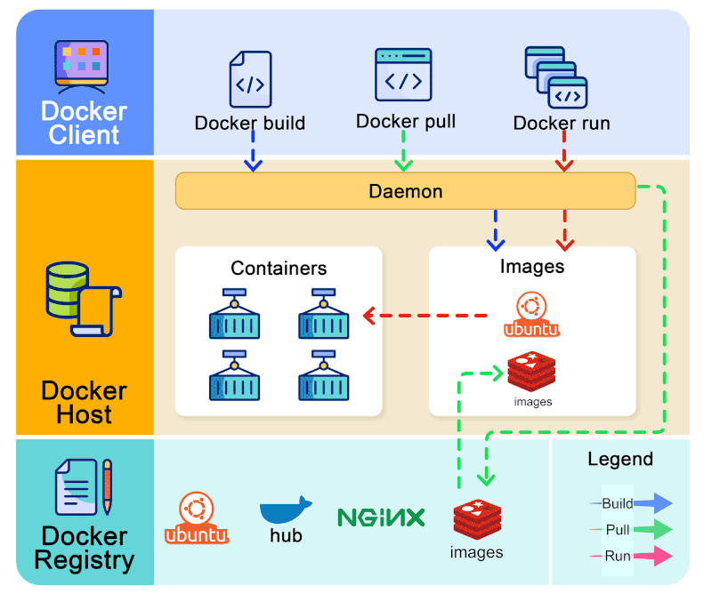

## 🐳 What is Docker (in simple words)?
Ans. Docker lets you run applications inside containers.

Think of a container as:
```
📦 A lightweight box that has everything an app needs
(OS libs + runtime + config + app)
```
So instead of:
  -  “It works on my machine 🤷‍♂️”
  -  Installing PostgreSQL manually
  -  Fighting with versions, ports, configs

You just say:
```
docker run postgres
```
…and PostgreSQL runs exactly the same everywhere.

**Key benefits**  
✅ No local installation mess  
✅ Same setup for DEV / QA / PROD  
✅ Easy to start / stop / delete  
✅ Multiple DB versions side-by-side  

**🧠 Docker vs VM**  
| Docker            | Virtual Machine  |
| ----------------- | ---------------- |
| Lightweight       | Heavy            |
| Starts in seconds | Takes minutes    |
| Shares host OS    | Own full OS      |
| Perfect for dev   | Mostly for infra |

## Docker containers

```
Docker containers need a Docker Engine (container runtime environment) to run. Docker Engine itself runs on a host OS; that host can be your laptop, a VM, or a physical/cloud server.
```
Docker ≠ server.  
Docker Engine runs on a host. 
Containers run through the Docker Engine. 

**Docker needs a Docker Engine, not necessarily a separate physical server**

On your Windows laptop:
```
┌───────────────────────────────────────┐
│           Your Laptop                 │
│                                       │
│  Windows Host OS                      │
│       │                               │
│       ↓                               │
│  Docker Desktop                       │
│       │                               │
│       ↓                               │
│  Docker Engine / Linux VM             │
│       │                               │
│       ├── Container: nginx            │
│       ├── Container: alpine           │
│       └── Container: your-app         │
│                                       │
└───────────────────────────────────────┘
```
So when you execute:
```
docker run nginx
```
Docker isn't magically running the container directly from the docker CLI.

The architecture is roughly:
```
docker CLI
    │
    │ API request
    ↓
Docker Engine (daemon)
    │
    ↓
Container
```

## Is your laptop a server?

It can act as the Docker host, but it doesn't have to be a traditional server machine.

For example, your Windows laptop can be:
```
Windows Laptop
      ↓
Docker Desktop
      ↓
Docker Engine
      ↓
Linux Containers
```
You don't need to rent an AWS/Azure server just to run Docker locally.

## In production

You commonly have an actual server/VM:
```
Cloud VM / Physical Server
          ↓
    Linux OS
          ↓
    Docker Engine
          ↓
   ┌──────┼──────┐
   ↓      ↓      ↓
 App    Redis   Nginx
```

## Docker Container Storage

> **Stopping a container does NOT delete its writable data. Removing/deleting the container does.**

Ephemeral storage loses all its data when a container is deleted, whereas persistent storage ensures data survives container deletion by saving it directly to the host filesystem.Here is a direct comparison of the two storage types shown in the diagram:

| **Storage Type**       | **Data after Container Stop** | **Data after Container Deletion** | **Implementation**            |
| ---------------------- | ----------------------------- | --------------------------------- | ----------------------------- |
| **Ephemeral Storage**  | ✅ Retained                    | ❌ **Lost**                        | Container writable layer      |
| **Persistent Storage** | ✅ Retained                    | ✅ **Saved**                       | Bind mounts or Docker volumes |

| Feature                | **Ephemeral Storage**                                                                                                                                              | **Persistent Storage**                                                                                                                |
| ---------------------- | ------------------------------------------------------------------------------------------------------------------------------------------------------------------ | ------------------------------------------------------------------------------------------------------------------------------------- |
| **Data Lifespan**      | Tied to the container lifecycle; data in the writable layer is lost when the container is deleted.                                                                 | Independent of the container lifecycle; data remains until the volume/mount is explicitly removed or deleted.                         |
| **Default Location**   | Container's writable layer, typically implemented using a storage driver such as `overlay2`; can also use **`tmpfs`** for explicitly configured in-memory storage. | Docker-managed **Volumes** or user-specified host paths via **Bind Mounts**.                                                          |
| **Performance**        | Writable layer can have copy-on-write/storage-driver overhead. **`tmpfs`** is very fast because it uses memory, but data is lost when the container stops.         | Depends on the underlying host storage. Volumes generally provide good performance and are preferred for persistent application data. |
| **Best Used For**      | Temporary files, caches, intermediate build artifacts, scratch data, and other disposable application data.                                                        | Databases such as PostgreSQL/MySQL, user uploads, application state, and important persistent data.                                   |
| **Container Deletion** | ❌ Data in the container writable layer is deleted with the container.                                                                                              | ✅ Data in a volume/bind mount normally survives container deletion.                                                                   |
| **Container Stop**     | ✅ Writable-layer data remains because the container still exists.                                                                                                  | ✅ Persistent data remains.                                                                                                            |
| **Backup / Migration** | More difficult and generally not intended for long-term storage.                                                                                                   | Easier to back up, migrate, and manage independently of containers.                                                                   |

**Think of Docker storage as:**
```
                    Docker Container
              ┌─────────────────────────┐
              │ Application             │
              │                         │
              │ Writable Layer          │
              │ ─────────────────────── │
              │ Ephemeral Data          │
              └───────────┬─────────────┘
                          │
                   container deleted
                          │
                          ▼
                       ❌ LOST


              ┌─────────────────────────┐
              │ Application             │
              └───────────┬─────────────┘
                          │
                    /var/lib/postgresql
                          │
                          ▼
              ┌─────────────────────────┐
              │ Docker Volume           │
              │                         │
              │ Persistent Data         │
              └─────────────────────────┘
                          │
                   container deleted
                          │
                          ▼
                       ✅ SAFE
```
```
Container writable layer
        │
        ├── docker stop  → ✅ remains
        └── docker rm    → ❌ lost


tmpfs
        │
        ├── docker stop  → ❌ lost
        └── docker rm    → ❌ lost
```
So tmpfs is actually more ephemeral than the normal writable layer.

**Enterprise rule of thumb**
```
Stateless application
        │
        ├── Temporary files ──► Writable layer / tmpfs
        │
        ├── Cache ────────────► Redis / cache / ephemeral storage
        │
        └── Logs ─────────────► Logging system


Stateful application
        │
        ├── PostgreSQL ───────► Docker Volume
        ├── MySQL ─────────────► Docker Volume
        ├── User uploads ──────► Volume / external storage
        └── Important files ───► Persistent storage
```

### Core Docker storage lifecycle
```
docker stop
     │
     ▼
Container still exists
     │
     ├── Writable layer ──► ✅ Data remains
     │
     └── Volume / Bind Mount ──► ✅ Data remains
     
     
docker rm
     │
     ▼
Container deleted
     │
     ├── Writable layer ──► ❌ Data lost
     │
     └── Volume / Bind Mount ──► ✅ Data remains
```

**Why?**

The important concept is ownership:
```
Container writable layer
        │
        └── Owned by container
                 │
            docker rm
                 ▼
              ❌ Gone
```
```
Docker Volume / Bind Mount
        │
        └── Independent of container
                 │
            docker rm
                 ▼
              ✅ Remains
```

**Example**

If you run:
```
docker run --name myapp alpine sh -c "echo hello > /data.txt"
```
The /data.txt file is inside the container's writable layer.
```
docker stop myapp
docker start myapp
```
➡️ data.txt is still there.

But:
```
docker rm myapp
```
➡️ data.txt is gone permanently.

**With a Docker volume**
```
docker volume create mydata

docker run --name myapp \
  -v mydata:/data \
  alpine sh -c "echo hello > /data/data.txt"
```
Now:
```
Container
┌─────────────────────────┐
│ Writable Layer          │ ← Ephemeral
│                         │
│ /data ──────────────────┼──────► Docker Volume
└─────────────────────────┘             │
                                        │
                                  Persistent Data
```
After:
```
docker rm myapp
```
the container disappears, but:
```
Docker Volume
    │
    └── data.txt ✅ remains
```
You can attach the same volume to a new container.

**"Persistent storage" doesn't mean the container itself persists.**

It means the data is stored outside the container's writable layer, so deleting the container doesn't delete that data.

**So the easiest rule to remember is:**
```
Container writable layer = tied to container → delete container → data lost
Volume / bind mount = outside container → delete container → data remains
```
Also, docker stop does not delete a container. It only stops it, which is why even ephemeral data remains until the container itself is removed.

### 1. Ephemeral storage

**When you create a container:**
```
Docker Image
    ↓
Container
    ↓
Writable container layer
```

**For example:**
```
docker run --name alpine alpine
```

If the application writes:
```
/app/data.txt
```
that data exists in the container's writable layer.

If you:
```
docker stop alpine
```
the container still exists, so the data is still there.

But if you:
```
docker rm alpine
```
the container and its writable layer are removed:
```
Container removed
      ↓
Writable layer removed
      ↓
Data LOST
```
So:
```
STOP container  → data remains
START container → data available
REMOVE container → data lost
```

### 2. Persistent storage

Persistent storage means the important data is stored outside the container's writable layer.

Docker commonly provides two approaches:
```
                 Persistent Storage
                        │
              ┌─────────┴─────────┐
              ↓                   ↓
         Bind Mount            Volume
              │                   │
        Host directory       Docker-managed
                              storage
```

**Bind mount**

Example:
```
docker run \
  -v $HOME/webdata:/usr/share/nginx/html \
  nginx
```
Conceptually:
```
Your Host
┌──────────────────────┐
│ ~/webdata            │
│                      │
│ index.html            │
└──────────┬───────────┘
           │
       bind mount
           │
           ↓
┌─────────────────────────┐
│ nginx container         │
│                         │
│ /usr/share/nginx/html   │
└─────────────────────────┘
```
Delete the container:
```
docker rm nginx
```
The host directory:
```
~/webdata
```
still exists.

### The key difference

A container's writable layer is ephemeral: its data survives a stop/restart but is lost when the container is removed. For data that must survive container replacement, use a Docker volume or bind mount.

Container storage is not the same thing as image storage. The image is the immutable template; the container gets its own writable layer on top of that image.

Think of a container like a temporary workspace:
```
              Container
          ┌───────────────┐
          │ Application   │
          │               │
          │ Temporary     │
          │ data          │
          └───────────────┘
                  │
             remove container
                  ↓
              DATA LOST
```
Persistent storage is like keeping your important files outside that workspace:
```
              Container
          ┌───────────────┐
          │ Application   │
          └───────┬───────┘
                  │
             mount/volume
                  │
                  ↓
        ┌───────────────────┐
        │ Persistent Data   │
        │                   │
        │ DB files          │
        │ uploads           │
        │ documents         │
        └───────────────────┘

        Container removed
               ↓
        Persistent data
          still exists
```

## 🚀 Understanding How Docker Works — Simplified!!!



The image above perfectly illustrates the core workflow of Docker and how different components interact to build, pull, and run containers.

🔹 **Docker Client** : This is where everything begins. When you run commands like docker build, docker pull, or docker run, the client sends these instructions to the Docker Daemon.

🔹 **Docker Daemon (Engine)**
 - The heart of Docker!
  - It handles all the heavy lifting—building images, pulling them from registries, and creating/running containers.

🔹 **Images & Containers**
  - 🔸 Images are like blueprints (e.g., Ubuntu, Nginx).
  - 🔸Containers are running instances created from these images.

**The image also highlights how:**
  - 🔸 Build commands create images.
  - 🔸 Pull commands fetch images from the Docker Registry.
  - 🔸 Run commands start containers using these images.

🔹 **Docker Registry (Docker Hub)**
  - This is where all base and custom images are stored. Your daemon pulls images from here, and you can also push your own.

💡 **In short:**
  - Docker makes application deployment easy by packaging apps into lightweight, portable containers. This visual shows exactly how each part works together to streamline development and operations.


## Install Docker Desktop (Windows)

Prerequisites
  -  Windows 10/11 (64-bit)
  -  Enable WSL 2

Steps
  -  Download Docker Desktop 👉 https://www.docker.com/products/docker-desktop/
  -  Install → keep defaults
  -  Restart system
  -  Open Docker Desktop ✔️ Status should be Running

Verify:
```
docker --version
docker compose version
```


