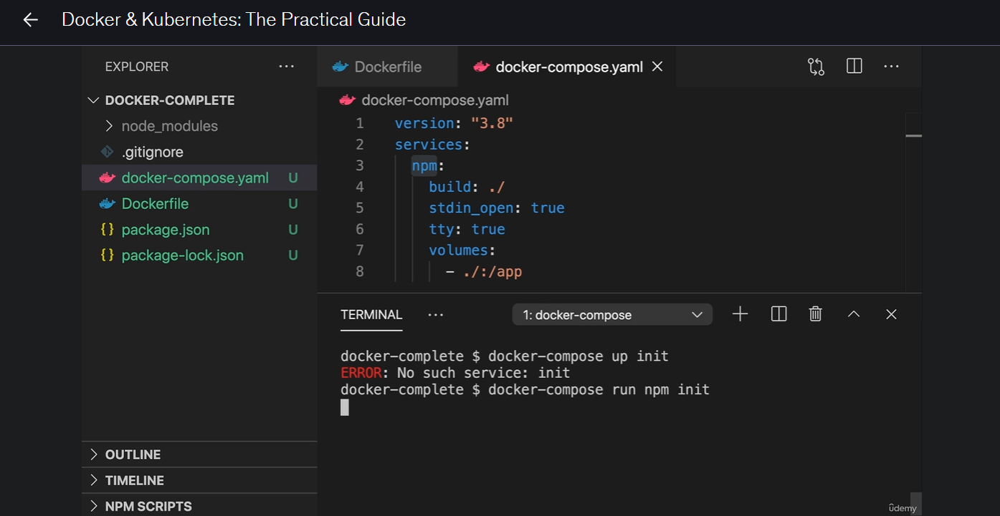

# Docker Utility Container with Docker-Compose
This section is essentially teaching how to replace a long docker run utility-container command with Docker Compose, and the important distinction is between up, exec, and run.

## 1. The original utility-container approach

**Previously, you might have something like:**
```
docker run -it --rm \
  -v "%cd%:/app" \
  node-util npm init
```

**There are several things to remember:**
- -it → interactive terminal
- --rm → remove container after command finishes
- -v "%cd%:/app" → bind-mount current project into /app
- node-util → your utility-container image
- npm init → command executed inside the container

For repeated usage, this can become cumbersome.

## 2. Docker Compose moves the configuration into YAML

**Create:**
```
my-project/
│
├── Dockerfile
├── compose.yaml
└── ...
```

**Dockerfile**
```
FROM node:14-alpine

WORKDIR /app

ENTRYPOINT ["npm"]
```

**docker-compose.yaml:**
```
services:
  npm:
    build: .
    stdin_open: true
    tty: true
    volumes:
      - ./:/app
```



## What happened

**You first ran:**
```
docker-compose up init
```
**and got:**
```
ERROR: No such service: init
```
That's because Compose interprets init as a service name.

**Your docker-compose.yaml has only one service:**
```
services:
  npm:
    build: .              # Build using Dockerfile
    stdin_open: true      # Equivalent to -i
    tty: true             # Equivalent to -t
    volumes:
      - ./:/app           # Bind mount
```

**So the only service name is:**
```
npm
```
There is no service called init.

## Why this works

**You then ran:**
```
docker-compose run npm init
```

**Here the syntax is:**
```
docker-compose run <service> <command>
                    │         │
                    │         └── init
                    └──────────── npm
```

**So Docker Compose understands:**
> **"Take the npm service and run the init command."**

**Dockerfile has:**
```
ENTRYPOINT ["npm"]
```

**then the final command effectively becomes:**
```
npm init
Think of it like this
docker-compose run npm init
                  │   │
                  │   └── command/argument
                  │
                  └────── service
```

**For a utility container, I'd recommend:**
```
docker-compose run --rm npm init
```
The --rm means:

Remove this temporary container after npm init finishes.

**So the lifecycle is:**
```
docker-compose run --rm npm init
              │
              ▼
       Create container
              │
              ▼
          npm init
              │
              ▼
       package.json
              │
              ▼
       command finishes
              │
              ▼
      container removed
```

## Your final mental model
```
docker-compose up init
        ❌
        │
        └── Looks for a SERVICE named "init"


docker-compose run npm init
        ✅
        │    │
        │    └── COMMAND
        └───── SERVICE
```

> **docker-compose up takes service names, whereas docker-compose run takes a service name followed by the command you want that service to execute.**

## Real-world architecture

You can actually mix application containers and utility containers in one Compose file.

**For example:**
```
services:

  frontend:
    build: ./frontend
    ports:
      - "4200:4200"

  backend:
    build: ./backend
    ports:
      - "8000:8000"

  postgres:
    image: postgres:16

  npm:
    build: ./utility
    stdin_open: true
    tty: true
    volumes:
      - ./frontend:/app
```

**Now you have:**
```
                 Docker Compose
                       │
       ┌───────────────┼────────────────┐
       │               │                │
       ▼               ▼                ▼
   frontend          backend         postgres
 application        application       database
  container          container        container
       │
       │
       ▼
      npm
    utility
    container
```

**You could start the application stack:**
```
docker compose up
```

**And separately execute a utility command:**
```
docker compose run --rm npm install
```
or:
```
docker compose run --rm npm init
```
or:
```
docker compose run --rm npm audit
```


