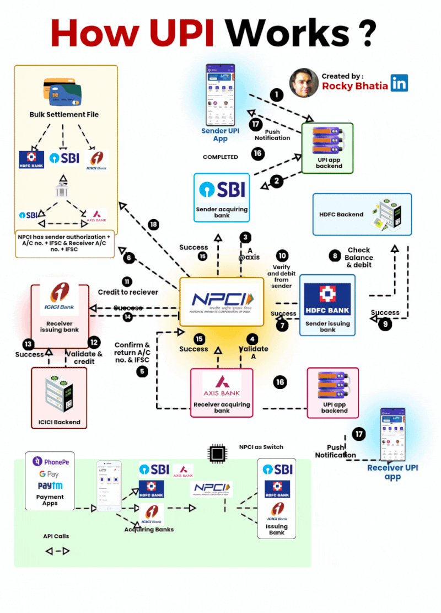

# How UPI Works

🔹 How UPI Works
 UPI links virtual payment addresses (VPAs) like rahul@hdfc directly to bank accounts, eliminating the need for IFSC codes. But what happens behind the scenes when you send money?

**Let’s break it down:**
- 1️⃣ Rahul (Sender) uses PhonePe to send ₹100 to Amit (Receiver).
- 2️⃣ He enters Amit’s UPI ID.
- 3️⃣ PhonePe encrypts the request and forwards it to its acquiring bank (SBI).
- 4️⃣ SBI sends it to NPCI, which validates Rahul’s account and fetches Amit’s bank details.
- 5️⃣ NPCI routes the request to Amit’s bank (ICICI) for validation.
- 6️⃣ ICICI confirms the details, and NPCI authorizes Rahul’s bank (HDFC) to debit ₹100.
- 7️⃣ HDFC checks balances, debits the amount, and confirms back to NPCI.
- 8️⃣ NPCI instructs ICICI to credit ₹100 to Amit’s account.
- 9️⃣ ICICI completes the credit and notifies NPCI.
- 🔟 NPCI ensures settlements between banks via RBI, completing the transaction.

All of this happens in seconds!

**💡 Why UPI Works So Well**
- ✅ Banks: Hold funds & process transactions
- ✅ Payment Apps: Link bank accounts & facilitate transactions
- ✅ NPCI: The trusted switch ensuring seamless routing & security

This blend of innovation and security has made UPI the backbone of India’s digital economy. 🌍

