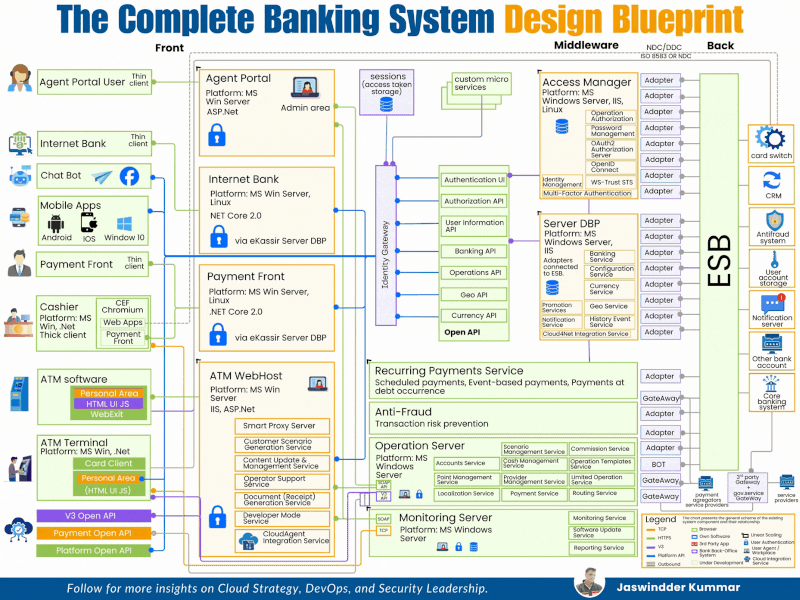

# 𝐃𝐞𝐬𝐢𝐠𝐧𝐢𝐧𝐠 𝐚 𝐁𝐚𝐧𝐤𝐢𝐧𝐠 𝐒𝐲𝐬𝐭𝐞𝐦?
𝐇𝐞𝐫𝐞'𝐬 𝐭𝐡𝐞 𝐀𝐫𝐜𝐡𝐢𝐭𝐞𝐜𝐭𝐮𝐫𝐞 𝐁𝐥𝐮𝐞𝐩𝐫𝐢𝐧𝐭 

After Architecting 5 Core Platforms handling billions in Transactions, I have Distilled Essential Components into this Design.

## 𝐓𝐡𝐞 𝐁𝐚𝐧𝐤𝐢𝐧𝐠 𝐒𝐲𝐬𝐭𝐞𝐦 𝐀𝐫𝐜𝐡𝐢𝐭𝐞𝐜𝐭𝐮𝐫𝐞:

𝟏. 𝐅𝐑𝐎𝐍𝐓-𝐄𝐍𝐃:
• Agent Portal: Employee admin access
• Internet Banking: Web customer portal
• Mobile Apps: Android, iOS, Windows
• Payment Front: Bill payments, transfers
• Cashier Terminals: Branch operations
• ATM Software: Cash dispensing
• Chat Bots: 24/7 customer support

𝟐. 𝐌𝐈𝐃𝐃𝐋𝐄𝐖𝐀𝐑𝐄 (𝐈𝐝𝐞𝐧𝐭𝐢𝐭𝐲 𝐆𝐚𝐭𝐞𝐰𝐚𝐲):
• Authentication & Authorization APIs
• Banking API for transactions
• Access Manager: OAuth2, MFA, SSO
• Server DBP: Core banking services
• Recurring Payments Service
• Anti-Fraud: Risk prevention
• Operation Server: Account management
• Monitoring Server: Health checks

𝟑. 𝐁𝐀𝐂𝐊𝐄𝐍𝐃 (𝐄𝐒𝐁 𝐈𝐧𝐭𝐞𝐠𝐫𝐚𝐭𝐢𝐨𝐧):
• Card switch, CRM, Antifraud systems
• Core banking, payment aggregators
• 3rd party gateways, service providers
• ISO 8583 compliance

𝟒. 𝐂𝐫𝐢𝐭𝐢𝐜𝐚𝐥 𝐏𝐫𝐢𝐧𝐜𝐢𝐩𝐥𝐞𝐬:
- Security: Multi-layer auth, encryption, PCI-DSS
- Scalability: Microservices, horizontal scaling
- Reliability: Redundancy, disaster recovery
- Compliance: Audit trails, KYC/AML
- Integration: Open APIs, ESB, adapters

## Common Mistakes:
• Monolithic architecture
• Weak authentication
• No fraud detection
• Tight coupling
• Missing audit trails

**Truth**: Banking systems are the most complex enterprise architectures. Every component must be secure, scalable, compliant.

